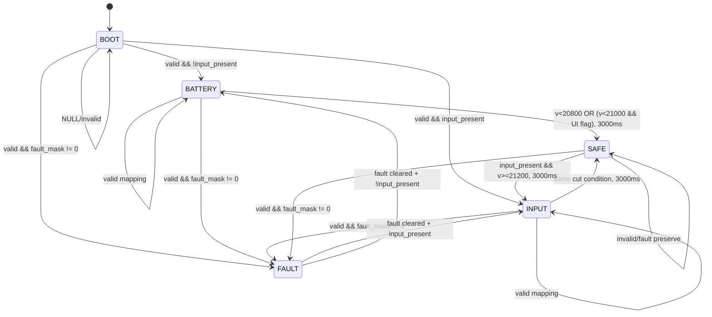

# ChangeOver State Machine

Open `System_State_Machine.drawio` in [diagrams.net](https://app.diagrams.net).

```mermaid
stateDiagram-v2
    [*] --> BOOT
    BOOT --> BATTERY: valid && !input_present
    BOOT --> INPUT: valid && input_present
    BOOT --> BOOT: NULL/invalid
    BATTERY --> SAFE: v<20800 OR (v<21000 && UI flag), 3000ms
    INPUT --> SAFE: same cut condition, 3000ms
    SAFE --> INPUT: input_present && v>=21200, 3000ms
    BATTERY --> BATTERY: valid mapping
    INPUT --> INPUT: valid mapping
    SAFE --> SAFE: invalid/fault preserve
    BOOT --> FAULT: valid && fault_mask != 0
    BATTERY --> FAULT: valid && fault_mask != 0
    INPUT --> FAULT: valid && fault_mask != 0
    SAFE --> FAULT: valid && fault_mask != 0
    FAULT --> INPUT: fault cleared + input_present
    FAULT --> BATTERY: fault cleared + !input_present
```
