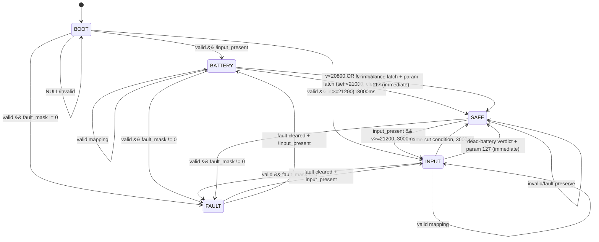

# ChangeOver State Machine

Open `System_State_Machine.drawio` in [diagrams.net](https://app.diagrams.net).

Every state of the whole program (system, charger channel, faults, UI faces,
imbalance, dead-battery verdict, MCU power path, ESP link) is tabulated in
`System_State_Machine.xlsx` - regenerate it with
`python3 tools/make_state_machine_xlsx.py`.

## نسخهٔ ماژول‌به‌ماژول (از ۲۰۲۶-۱۰-۰۶)

کتاب `Documentation/System_State_Machine.xlsx` نمای **سیستمی** است: همهٔ
حالت‌های برنامه در یک جا، مناسب مرور کلی. برای کار روی میز تست، هر ماژول حالا
کتاب کوچک خودش را دارد — فقط حالت‌های همان ماژول، با همان زبان رنگی و فونت
وزیرمتن:

| ماژول | فایل |
|---|---|
| تغییر مسیر | `Firmware/Modules/Changeover/Changeover_State_Machine.xlsx` |
| شارژر (+ سناریوی ۶) | `Firmware/Modules/Charger/Charger_State_Machine.xlsx` |
| خطا | `Firmware/Modules/Fault/Fault_State_Machine.xlsx` |
| نمایش و بوق | `Firmware/Modules/Ui/Ui_State_Machine.xlsx` |
| عدم‌توازن (سناریوی ۵) | `Firmware/Modules/Imbalance/Imbalance_State_Machine.xlsx` |
| مسیر تغذیهٔ میکرو | `Firmware/Modules/McuPowerPath/McuPowerPath_State_Machine.xlsx` |
| لینک ESP | `Firmware/Modules/EspLink/EspLink_State_Machine.xlsx` |
| جدول کالیبراسیون | `Firmware/Modules/CalLut/CalLut_State_Machine.xlsx` |
| جیتر | `Firmware/Modules/Jitter/Jitter_State_Machine.xlsx` |
| نگهبان اعتبار | `Firmware/Modules/Protection/Protection_State_Machine.xlsx` |
| اندازه‌گیری | `Firmware/Modules/Measurement/Measurement_State_Machine.xlsx` |

هر کدام یک برگهٔ «راهنما» دارد که فایل مرجع هر برگه را نام می‌برد و دو لینک
می‌دهد: به برگهٔ اعتبارسنجی همان ماژول و به همین کتاب سیستمی. در جهت عکس هم،
فایل اعتبارسنجی هر ماژول برگهٔ تازهٔ «ماشین حالت» گرفته که مستقیم به کتاب
ماشین حالت کنارش لینک می‌دهد.

بازتولید همه: `python3 tools/make_module_state_machines.py`
(بخش ۱۵ ممیزی `tools/audit_consistency.py` نبودِ هر کدام یا نبودِ لینک را
خطا می‌گیرد.)
