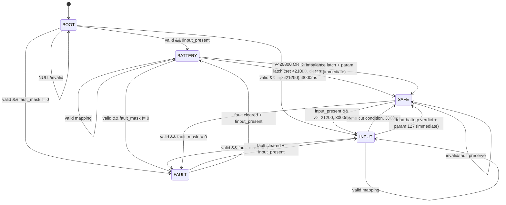

# ChangeOver State Machine

Open `System_State_Machine.drawio` in [diagrams.net](https://app.diagrams.net).

Every state of the whole program (system, charger channel, faults, UI faces,
imbalance, dead-battery verdict, MCU power path, ESP link) is tabulated in
`System_State_Machine.xlsx` - regenerate it with
`python3 tools/make_state_machine_xlsx.py`.

