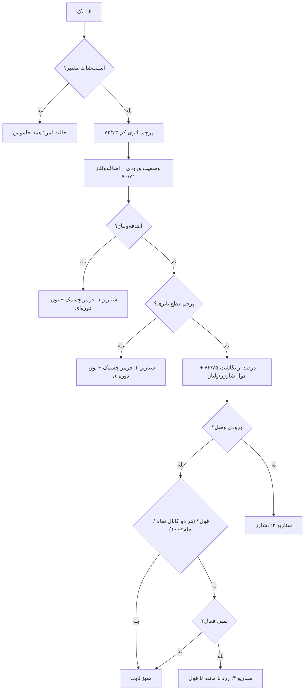
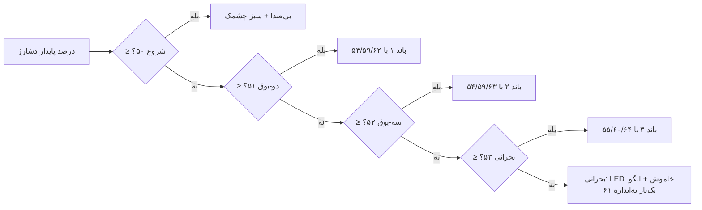

# ESP-Link Agent Spec — ESP Side Implementation Handoff

> این سند برای ماموری است که سمت ESP را می‌نویسد (دستور کاربر ۲۰۲۶-۰۹-۲۲).
> سمت STM32 کامل و push شده است؛ فقط فعال‌سازی نهایی `MODULE_ESP` مانده (پایین را ببینید).
> متن فنی عمداً انگلیسی است تا هیچ ابهامی در پروتکل نماند.
>
> v1.4 (2026-09-25): free filter sizes (ID 7 any 1..15, ID 8 any 1..100,
> boot defaults unchanged) + section 5.6 bench data capture to a text file
> on the ESP (three scenario tables, user-defined duty steps, user-gated
> advance, download endpoint; CSV v2 = every row self-contained with all
> 20 params + the full TLM state; DMM = whole-board input totals +
> per-battery output current/voltage) — the STM32 side is IMPLEMENTED
> and pushed. v1.7 panel (same day): simplified to two tabs (charts +
> wizard), CAL card / manual tests / correction tab removed, and the
> wizard latches the MCU statistics at the SUBMIT press (form-open
> resets the window; `sample_ms` = actual duration). v1.8 panel +
> firmware v1.6 (same day, second order): the wizard tab also carries a
> compact manual-duty control card (manual mode stays as a PERMANENT
> feature for current testing - section 5.6), and the STM32 corrects the
> V12 channel with the latched bench fit (static 140 mV + 0.47 ohm x I2
> - section 5.3). v1.9 (same day, third order): DMM currents accept
> negative values (battery discharge path, e.g. the zener), the average
> filter ceiling is 300 samples so the smoothing is VISIBLE at the 10 Hz
> TLM stream (audit verdict: the filters were correct but unobservable),
> the LUT point count became sizeof-derived for the denser next run, and
> the wizard's default duty list switched to 2% steps. v1.10 (same day,
> fourth order): manual-duty card moved into the PANEL tab with per-channel
> duty-ceiling inputs (IDs 13/14, 0..500 permille); chart sample count is
> user-settable (default 100); the wizard settle step REMOVED (capture is
> user-latched - the wait added nothing); pack-24V divider corrected with
> the user's exact factor and voltage offsets widened to +/-5000 mV.
> v1.11 (same day, fifth order): both calibrations refit from the DENSE
> 10-point SOLO2 run (2026-09-25T18:14, duty 2..20%, battery filling
> 12.0->13.65 V): the channel-2 LUT is now 11 anchors - interpolation
> error <= 0.7 mA on every point (the old 7-point table drifted to
> -48 mA at mid currents as the battery filled), and the V12 bench
> compensation static term is 150 mV (LSQ 149.8 mV + 472.5 mOhm over
> 0..764 mA; residual within +/-28 mV). The LUT stays keyed on the ADC
> chain current, NEVER on duty (user order: the same duty gives a
> different current as the battery fills). v1.12 (same day, sixth
> order): the charge profile became runtime-settable from a NEW third
> panel tab "تنظیمات شارژ" (params 20..26, shared by both channels,
> section 5.7), all three calibration tables moved into ONE separate
> file Firmware/Modules/Measurement/calibration.h (table 1 = ch1 LUT
> placeholder until SOLO1 data, table 2 = ch2 LUT, table 3 = the V12
> battery-voltage compensation), PARAMS_BULK grew to 27 params (payload
> limit 112 -> 144), the bench CSV carries the 7 profile params too
> (78 columns), and the wizard now CARRIES the input-voltage DMM
> reading into the next step (user order: Vin is quasi-static, one
> reading per run is enough). v1.14 (same day, eighth order - "the
> charger constants must be sent from the panel and survive power
> loss"): (1) every settable parameter except the transient test modes
> (15..19) now persists in the last two STM32 flash pages with
> CRC + sequence ping-pong (power-cut safe, ~1.5 s debounce, clamped
> replay at boot - section 5.8); application FLASH shrinks 64K -> 62K.
> (2) The charge tab gains a live SVG stage graph (threshold bands,
> BULK->ABSORB->FLOAT curve, reentry cycle, live battery markers,
> typed-value preview). v1.14b (same day, ninth order): graph recolored to
> the dark panel palette with bilingual FA+EN labels, the tab renamed
> "تنظیمات", and the median/average filter windows (params 7/8) moved into
> it under a "فیلتر جریان" section. v1.14c (tenth order, "show each
> battery's position and state; the white Bulk curve is confusing - are
> the zones not enough?"): the graph's V(t) curve and cycle arrow are
> removed; each battery gets a live position dot on its voltage column
> plus a bilingual state chip under the chart. No wire-format change.
> v1.14d (eleventh order, "stretch the graph downward, the zone borders
> are cramped; zones must follow the profile numbers and never overlap"):
> taller chart (H 330 -> 560), zones drawn from the APPLIED board values
> (never inverted - the board clamps) with dashed preview lines for
> typed-but-not-applied values, a collision-free label pass, and a panel
> guard mirroring Charger_ClampProfile (red warning + red field +
> confirm-before-send on invalid combos). Panel + preview-server only.
> v1.14e (twelfth order, "at least 50% taller; what is the zone between
> float and absorb - hatch the bulk zone lightly"): chart height 560 ->
> 840 (+50%), and the former grey filler between absorb-enter and float
> is now a labelled Bulk zone (FA+EN) with a light diagonal hatch.
> v1.15 (2026-09-26, thirteenth order - "an alarms tab: the number behind
> every alarm editable from the panel, stuck on the board MCU"): params
> 27..34 = fault supervision thresholds (runtime, persisted, set-clamped),
> 35..37 = charger safety ceilings (DOWN-ONLY, never above 950 mA /
> 15000 mV); an alarms SUB-TAB inside settings (v1.15b) with grouped
> cards, a flicker-free grouped status card with fault explanations,
> threshold bars, a combo guard (achk) mirroring the firmware clamps, a
> q2 pending mask in /t for ids 32..37, and JSON settings backup.
> PARAMS_BULK grows to 38 params (payload limit 144 -> 192), the NVM
> record to 38 slots (version 1 -> 2, old records fall back to defaults),
> the bench CSV to 89 columns - BOTH boards reflash together.
> v1.16 (2026-09-26, fourteenth order - "LEDs for every fault/alarm
> that really blink, a buzzer icon with a cross on mute, every alarm
> number editable"): params 38..76 = the 39 UI cadence numbers
> (fault LED/buzzer scenarios, BatteryRun bands, normal blink,
> voltage thresholds, panel-session mute); the frame length grows to u16
> LE (5-byte header, payload limit 192 -> 512); PARAMS_BULK grows to
> 77 params (386 bytes), the NVM record to 77 slots (version 2 -> 3),
> the bench CSV to 128 columns ([uicad]); /t gains the q3 mask for
> ids 64..76; the panel gains a board-rate LED/buzzer mirror + one
> LED per fault bit. BOTH boards reflash together (mixed versions
> never link).
> v1.13 (same day, seventh order - "the
> voltages are fixed but the currents you read are wrong"): audit of
> the whole current path confirmed the chain formula, the parse and the
> v1.11 anchors all matched the DMM to <= 0.7 mA on the calibration
> rows - but the table was a chain->CURRENT map, which physically embeds
> the battery voltage of the calibration run (12.0..13.65 V). The ch2
> LUT is now a chain->POWER table (mW; the DCM invariant) and the
> firmware divides by the LIVE battery-2 voltage (cached one pass
> earlier, clamped 8..15 V): at the same chain current the reading now
> falls ~7 percent per volt as the battery fills, exactly as the
> physics demands. Integer-math replay on the dense run: worst DMM
> error 6 mA. Wizard helper text about the input-current ratio
> corrected (it said ~0.7x; the truth is voltage- and load-dependent,
> ~2.5x at low charge down to ~0.95x at the top).
> v1.17 (2026-09-27, fifteenth order - "fix the coefficients so at least
> the currents read right"): the ch2 POWER LUT refit from the new SOLO2
> sweep (duty 1..19 step 1, off2=8/gain2=1303 unchanged, battery up to
> 14.85 V). The v1.13 table predicted the new run within 1% on 12 of 15
> positive points (DCM invariant confirmed) but read 2..5% low in the
> chain 236..353 hollow: 13 anchors now - new (20,0) noise gate, new
> (253,3180) + (312,4500), moved (283,3860) + (353,5280), rest verified
> and kept. D9 excluded (unsettled outlier), D16 DMM voltage corrected
> (12650 mV typo -> 13617 mV). Worst residual 8 mA = DMM accuracy; the
> panel LUT mirror follows (v1.16v). STM32 reflash for the new table.
> v1.18 (2026-09-27, sixteenth order - "look closer, there is still
> drift"): end-to-end fit of the SAME sweep against the EXACT integer
> pipeline. Program review verdict: the program is sound (PWM mid-ON sync
> sampling, median-3 + avg-10 on raw counts, fresh Vbat cache, V12 comp
> within +0.2%) - the -4..-8 mA drift at D10..D15 came from fitting v1.17
> to FLOAT chains while the firmware's truncating integer chain sits ~1.5
> mA left on the steep slopes. 14 anchors: added (390,6035), moved
> (236,2685) (253,3260) (283,3925) (312,4550) (353,5355). New run worst
> 3 mA with no systematic sign, old run worst 5 mA, i_130 = 658 mA.
> Methodology floor is now +-1 count = +-3 mA. Panel mirror v1.16w.
> v1.19 (2026-09-27, seventeenth order - "check the upper charger's data,
> it went past 15 V and never cut off"): TWO fixes. (1) SAFETY: the V24
> pack divider top 62400 -> 66200 - the old top read ~1.4 V low (bench
> truth 73.0k total over 6.8k; the input channel on the same ADC reads
> +29 mV steady, acquitting ADC/VREF), blinding the 15.0 V hard OV cut in
> manual mode (firmware saw 13.9 V at a true 15.22 V) and every
> 14.4/14.6/15.0 V supervision in auto mode. The corrected divisor is
> top-exact (+104 mV at 15.22 V: OV trips ~100 mV early, safe) and the
> residual mid-range hump (+461..+121 mV, likely R47 warming) is split
> minimax by the 66200 choice. (2) CALIBRATION: TABLE 1 (ch1) gets the
> SAME chain->POWER architecture as ch2 from the 18-row SOLO1 sweep
> (duty 1..18, off1=8/gain1=1046): 17 anchors (0,0) (5,0) (11,132)
> (31,440) (54,772) (81,1028) (114,1615) (148,2111) (189,2674)
> (231,3261) (277,3857) (330,4553) (382,5288) (444,6074) (504,6854)
> (567,7686) (640,8645); ceil-fitted so every DMM point replays EXACTLY
> (worst(new) 0 pure-LUT / 4 end-to-end, mixed sign; worst(old linear)
> 72 mA S-curve -29..+72). Gate (5,0): D1..D3 never exceed chain 1.
> D7's dip is the curve (kept); D5's DMM voltage is a +150 mV outlier
> (harmless at 36 mA). Panel mirror v1.16x. STM32 reflash for both.
> v1.21 (2026-09-27, nineteenth order - "after a full charge the blinking
> must be gone"): the charger declares completion itself - IsChargeComplete
> (every installed+enabled channel through ABSORB: taper <50 mA x 60 s or
> the 1 h ceiling; FLOAT entered from that one place only, so FLOAT means
> DONE); the UI + panel full face key on it (the 100/95 voltage latch
> stays a second path); the 1 h clock survives 14.3 V dips (anti-hunt -
> soak/taper still restart); the "idle charger" caption/flow/docs piece
> is gone. Panel v1.17b: full caption from enables 11/12 + TLM states,
> charging-card flow reworded, bench DMM form above the table (no
> horizontal scroll for entry). No wire change. STM32 + ESP flash together.
>
> v1.23 (2026-09-29, twentieth order - USER-ORDERED LOGIC CHANGE: "you have
> to remove that previous logic, it must be PID only for the charger now;
> and you calibrate it yourself from the tables for the first time so I can
> optimise it later; also the 650 mA limit and 14.8 V must be ACTIVE for
> them so the batteries are not damaged"): three separate things.
> (1) REMOVAL - the legacy fixed-step chain is deleted, not bypassed: 146
> lines of regulator plus CHG_REGULATE_LOW_MA, the up-step cadences and the
> fine-step constant are gone, and with them the v1.22 enable flag that
> selected between the two. There is no fallback path. Because that flag
> was id 83 and it never reached hardware, the PID block was renumbered
> down one to 83..97; ESPLINK_PARAM_COUNT 99 -> 98, PARAMS_BULK 496 -> 491
> bytes, NVM v6 -> v7 (98 slots, 800 B).
> (2) CALIBRATION - every coefficient was swept against the charge-profile
> table instead of hand-picked. Kp1 20->12, Ki1 800->1600 (the bulk band is
> reached in 545 s instead of 1373 s, still with zero duty reversals),
> Ki2 300->600 (kills an 8..13 mV steady-state offset), Kp3 300->150,
> Ki3 12000->18000 (overshoot 18.7 -> 13.5 mV, hold band 0.0 mV).
> (3) PROTECTION - two non-tunable backstops inside the PID shrink the duty
> ceiling in proportion to any excess over the live 650 mA profile limit or
> over 14.8 V. Auditing them exposed that they were NOT sufficient alone:
> the integral is rate-limited but the P term is not, so panel-maximum
> gains jumped the duty across its range in a single 100 ms pass and the
> pack saw 4475 mA. A SYMMETRIC 8 permille per-update cap fixes that
> (worst abuse now 704 mA, below the 950 mA hard fault) without touching
> normal charging, which never moves more than 3 permille per pass. A
> voltage prefilter was also added: the current chain is filtered upstream
> but the pack voltage is not, and ~7 mV of ADC step times Kp was putting
> tens of thousands of duty reversals into the output. (The exact "50913"
> figure first published here came from a deterministic sinusoidal noise
> model and was superseded in v1.24 by seeded-PRNG measurements - see 5.11.)
> Panel v1.23. STM32 + ESP flash together.
>
> v1.24 (2026-09-29, twenty-first order - USER-ORDERED LOGIC CHANGE: "if we
> do it with one PID over the whole path does it not work? do we have
> errors? it does not matter if it is slow, because the battery itself is
> slow; my goal is maximum accuracy by the simplest method"): the regulator
> is reduced to the simplest structure that still regulates both limits.
> Measured, not argued (Firmware/Modules/Charger/Tester/pid_tuning_sim.py, 10 h x 10 scenarios):
> ONE shared gain row FAILS (mV compared with mA in the min-select;
> 1408..84660 duty reversals per 10 h against 4), and ONE voltage PID with
> the 650 mA backstop as the only current limiter FAILS on the safety
> requirement itself (a backstop is reactive, so the current limit-cycles
> and peaks at 706.9 mA instead of sitting on 640; the only tune that
> stayed under the limit locked the charge at 351 mA). TWO rows - one PI
> per physical loop - is the floor, and the v1.23 THIRD row was measured to
> buy nothing: re-run with a seeded broadband PRNG instead of the original
> deterministic tone, two rows are equal on the clean plant and quieter at
> every noise level. So ids 93..97 are deleted (ESPLINK_PARAM_COUNT 98 ->
> 93, PARAMS_BULK 491 -> 466 B, NVM v7 -> v8 / 93 slots / 760 B, the q4
> pending mask is gone, bench CSV 149 -> 144 columns), the rows are renamed
> after the loops they tune (CHG_PID_CURRENT_* / CHG_PID_VOLTAGE_*), and
> the voltage row is re-tuned for the noise the panel cannot see: Kp_v
> 150 -> 50 with the prefilter N 16 -> 32, which cuts duty reversals under
> +/-7 mV noise from 744 to 62 with IDENTICAL overshoot, hold error
> (0.5 mV) and time-to-14.4 V (113 min). Ten numbers instead of fifteen.
> Panel v1.24. STM32 + ESP flash together.
>
> v1.22 (2026-09-28, nineteenth order - USER-ORDERED LOGIC CHANGE: "slow
> the absorb duty rise down, and instead of all that complexity write a
> three-stage PID - one gain set at the start, one in the middle, one in
> the last region - and expose it on the ESP panel"): the fixed-step
> bang-bang duty chain (0.5%/0.1% steps on 500/1000/2000 ms timers) is
> replaced by ONE positional PID doing a textbook CC/CV min-select.
> SIXTEEN new ids 83..98: enable (83) plus one complete
> (Kp, Ki, Kd, up-rate, down-rate) row per stage. A "stage" is a LOOP,
> not a voltage window: stage 1 = the current/bulk loop, stage 2 = the
> voltage loop below the absorb setpoint, stage 3 = the voltage loop on
> it and above. Each loop needs its own row because a volt of voltage
> error and an amp of current error are different units - with one
> shared Kp the min-select degenerates and the pack sails past 14.6 V.
> The slew limit sits on the INTEGRAL, not the output: an output limiter
> rectifies the P-term ripple that whole-permille duty quantisation
> creates into a downward ratchet (simulated, the loop stalled at 268 mA
> and never reached the 640 mA bulk band). Setting id 83 = 0 restores
> the legacy chain byte-for-byte. Every protection is untouched (OV
> cutoff, 950 mA hard fault, JIT, battery-valid, 500 permille DCM
> ceiling, FLOAT parks at zero) - the PID only picks the duty number
> inside the window they already allow. PARAMS_BULK 416 -> 496 bytes
> (still < 512); a FOURTH pending mask q4 carries ids 96..98; NVM record
> v5 -> v6 (93 persisted ids, 99 slots, 808 B - v5 records fall back to
> compiled defaults, so RE-TUNE ONCE after flashing); the bench CSV
> grows to 150 columns with a [pid] block; the panel gains a "PID شارژ"
> sub-tab with all 16 coefficients and its own combination guard.
> Panel v1.22. STM32 + ESP flash together.
>
> v1.20 (2026-09-27, eighteenth order - "the charge-scenario numbers must
> be panel-editable too"): protocol v1.17 appends SIX UI ids 77..82 (full
> latch enter/exit 100/95, charging stable hysteresis 5, run hysteresis
> 2, 0-exit 2, 1-exit 3) - the last hardcoded LED-scenario numbers; the
> panel gains fields + guards + mirror reads, the CSV [uicad] block grows
> to 134 columns. Yellow-min-ON default (69) 10 -> 150 ms so the
> end-of-charge blink stays visible until full/cutoff. NVM record v5
> (77 persisted ids, 83 slots, 680 B; v4 records fall back to defaults -
> re-tune once). PARAMS_BULK 386 -> 416 bytes (still < 512, q3 still one
> mask for 64..82). Panel v1.17. STM32 + ESP flash together.
>
> v1.3 (2026-09-24): CAL_REFERENCE command (type 0x03, section 5.4) + ETA
> conversion factors (ID 9/10 renamed CHG_ETA1/ETA2_PERMILLE, default 0 =
> identity; live `i_filtered x Vin x eta / (1000 x Vbat)` when set) — the
> STM32 side is IMPLEMENTED and pushed. With ETA = 0 nothing changes vs v1.2.
>
> v1.2 (2026-09-23): manual test mode (ID 19, section 5.2) — the STM32
> side is IMPLEMENTED and pushed (param 19, state 9, flags b5, dead-man,
> payload 112). Only the final `MODULE_ESP = 1` flip is left (section 9).

---

## 1. What exists already (STM32 side — DONE)

- Binary command protocol + periodic telemetry over **USART1, 921600 8N1**.
- DMA transport in both directions on the STM32 (circular 256-byte RX ring,
  zero CPU per byte; DMA-drained TX ring) - user order 2026-09-23.
- 20 runtime parameters (current-chain calibration, voltage offsets,
  current-filter sizes, per-channel ETA conversion factors (v1.3,
  CAL_REFERENCE-calibratable), per-channel
  charger enable/cut, per-channel PWM duty ceiling, fixed-duty mode, and
  the v1.2 global manual test mode - ID 19, section 5.2).
- Charger module cut/reconnect commands (param IDs 11/12).
- All parameter values are **clamped** by the STM32; the reply always returns
  the **actually applied** value.
- Parameters are **RAM-only on the STM32**: after an STM32 reset everything
  returns to the compiled defaults. The ESP must re-apply its tuned set
  (recommended: on link-up and whenever a PARAMS_BULK shows defaults).

## 2. Wiring / physical

| STM32 pin | Label | Connect to ESP | Notes |
|---|---|---|---|
| PA9 | `USART1_TX` | ESP **RX** | 3.3 V logic |
| PA10 | `USART1_RX` | ESP **TX** | 3.3 V logic |
| PA8 | `MCU_ESP_CHPD` | ESP enable (CH_PD/EN per schematic) | Driven by the STM32, goes HIGH when the link task starts. **Do not drive from the ESP side.** |
| — | GND | GND | Common ground required |
| — | 3V3 | ESP supply | Per board schematic |

UART settings: **921600 baud, 8 data bits, no parity, 1 stop bit** (the
STM32 retunes its 115200 Cube default to 921600 at link init - user order
2026-09-23). 921600 runs reliably on both ESP8266 and ESP32 UARTs.

High-speed / zero-CPU transport on the STM32 side (user order
2026-09-23): reception is a 256-byte **circular DMA** ring (zero CPU per
byte, no reception interrupt at all) and transmission is **DMA from a
256-byte software ring** (non-blocking, whole-frame writes; a couple of
lightweight completion interrupts per frame, together ~20-40 IRQ/s at
the 100 ms telemetry cadence). A full 96-byte frame is ~1 ms of wire
time. The ESP side needs nothing special - it just sees a normal 921600
UART.

ESP -> STM burst budget: the STM drains its RX ring once per 100 ms
comm tick, so keep each burst under ~250 bytes (a handful of frames);
anything more can overflow the ring. Normal panel traffic is far below
this.

Timing: the STM32 sends one telemetry frame every **100 ms**
(`APP_CONFIG.comm_period_ms`). Replies to commands are queued
immediately and drain within ~1 ms.

## 3. Frame format (both directions)

```text
[0xAA][0x55][ver:u8][type:u8][len_lo:u8][len_hi:u8][payload: len bytes][crc_lo:u8][crc_hi:u8]
```

**Frame v2 (2026-09-29).** Two changes, both because this link carries the
calibration campaign and a silently wrong number there is worse than no number:

- `crc` = **CRC-16/CCITT-FALSE** (poly 0x1021, init 0xFFFF, no reflection, no
  final xor), little-endian, computed over `ver`, `type`, both length bytes and
  the payload — everything after the SOF pair.
  It replaces the old XOR-8. Measured, not argued: XOR-8 is blind to ANY even
  number of bit flips in the same bit position, which is exactly the pattern a
  switching converter couples onto a UART. Over 200000 two-bit same-position
  corruptions of 64-byte frames, **XOR-8 missed 100 %** and **CRC-16 missed 0 %**.
  Verified against the standard check vector: `"123456789"` → `0x29B1`.
- `ver` = **2**. Before this there was no version field, so flashing one board
  and not the other produced no error of any kind: the receiver dropped every
  frame whose length it did not expect and the panel went blank, which is
  indistinguishable from an unplugged cable. Both receivers now count version
  mismatches and CRC rejections, `/t` reports them as `vm` and `ce`, and the
  panel says plainly that the two boards were flashed out of step.
- All multi-byte payload fields are **little-endian**.
- Max payload length = **512 bytes** (v1.16; was 192 in v1.15 -
  PARAMS_BULK grew with the UI cadence parameters; an 83-param bulk is
  1 + 83 x 5 = 416 payload bytes, which no longer fits one length
  byte, so `len` is u16 little-endian since v1.16). Longer `len` =
  invalid frame. The ESP parser must accept up to 512 regardless of
  STM firmware version. Both boards MUST flash together (a v1.15
  board reads len_hi as payload and drops every v1.16 frame).
- On CRC error, unknown version or unknown type: the frame is dropped and the
  parser resynchronizes on the next `AA 55`. Both sides do this, and both count
  the rejection so a noisy harness is measurable instead of merely feeling
  unreliable.

## 4. Message types

| Type | Direction | Name | Payload |
|---|---|---|---|
| 0x01 | ESP→STM | SET_PARAM | `[id:u8][value:u32 LE]` (5 bytes) |
| 0x02 | ESP→STM | GET_PARAMS | empty (len = 0) |
| 0x03 | — | *(reserved, not handled)* | Was a v1.3 one-shot calibration command. The panel stopped sending it in v1.7 and the STM32 handler was carried dead for six versions - 172 source lines - until it overflowed the 62 KB flash budget by 92 bytes and was removed. The id stays RESERVED: reusing it would make an older panel's frames silently misinterpreted instead of harmlessly ignored. Calibrate by reading the raw ADC counts in the telemetry and writing coefficients back as ordinary SET_PARAM. Old targets 0/1 = GAIN ch1/2, 2/3 = ETA ch1/2 (v1.3, section 5.4) |
| 0x10 | STM→ESP | TLM_LIVE | **104 bytes**, layout below (84 until v1.25; +5 u32 raw calibration fields) |
| 0x11 | STM→ESP | PARAM_REPORT | `[id:u8][value:u32 LE]` — the **applied** value (sent after every accepted SET_PARAM) |
| 0x12 | STM→ESP | PARAMS_BULK | `[count:u8]` then `count` × `[id:u8][value:u32 LE]` (answer to GET_PARAMS). **Since v1.28 the reply is CHUNKED into one or more frames:** 108 params would need 1 + 108×5 = 541 B against the 512 B ceiling, so each frame carries at most `(512−1)/5 = 102` items and the receiver merges whatever ids arrive, in any grouping (`func__Esp_StoreParamItem` is id-keyed, not index-keyed, so no ESP change was needed). 108 params = 2 frames (102 + 6). An empty trailing frame is never sent: it would read as "zero parameters known" |

Audit 2026-09-27: the 77-param growth had silently outgrown the STM32 256 B
TX ring, so every PARAMS_BULK reply was refused and a fresh panel never
learned the live values (it showed ESP-side defaults until each value was
touched). The ring is now 1024 B and the bulk payload is static - GET_PARAMS
is answered with the board truth again, and the manual-mode 1 s keepalive
bulk no longer burns ~900 B of the 1 KiB comm stack. v1.17 grows the
bulk to 83 params / 416 B, v1.23 to 98 params / 491 B and v1.24 back to
93 params / 466 B - still inside the
1024 B ring and the 512 frame ceiling (491 + 5 header + 1 xor = 497 B).
v1.28 is the first release that does **not** fit: the user-ordered limits
block takes the count to 108, so a single reply would need 541 B. Raising
`ESPLINK_FRAME_MAX_PAYLOAD` was rejected - that buffer is charged twice,
once on each side, and both sides are 20 KB parts. The reply is chunked
instead, at a bound DERIVED from the ceiling, so the two can never disagree.

Verified example frames (hex):

```text
SET_PARAM CUR1_GAIN_PERMILLE = 1200:
AA 55 01 05 00 02 B0 04 00 00 B2
                      └id=2  └value=1200 LE   checksum=B2

SET_PARAM CHG1_ENABLE = 0 (cut charger 1):
AA 55 01 05 00 0C 00 00 00 00 08

GET_PARAMS:
AA 55 02 00 00 02

PARAM_REPORT reply for id=2, applied=1200:
AA 55 11 05 00 02 B0 04 00 00 A2
```

## 5. Parameter table (IDs 0..18 = protocol v1.1, ID 19 = v1.2, IDs 20..26 = v1.12 append, IDs 27..37 = v1.15 append, IDs 38..76 = v1.16 append, IDs 77..82 = v1.17 append, IDs 83..92 = v1.24, IDs 93..107 = v1.28 charger limits & backstop gains — IDs are final, never renumbered)

| ID | Name | Type | Unit | Default | Range | What it changes |
|---|---|---|---|---|---|---|
| 0 | CUR1_OFFSET_COUNTS | u32 | ADC counts | 8 | 0..255 | Zero-current offset, current channel 1 (Trans1, upper battery) |
| 1 | CUR2_OFFSET_COUNTS | u32 | ADC counts | 8 | 0..255 | Same, channel 2 (Trans2, lower battery) |
| 2 | CUR1_GAIN_PERMILLE | u32 | permille | 1046 | 100..3000 | Bench gain trim, channel 1 |
| 3 | CUR2_GAIN_PERMILLE | u32 | permille | 1303 | 100..3000 | Same, channel 2 |
| 4 | VIN_OFFSET_MV | **i32** | mV | 0 | −5000..5000 | 24 V input voltage calibration (v1.10: range widened from 2000) |
| 5 | V24_OFFSET_MV | **i32** | mV | 0 | −5000..5000 | 24 V battery pack voltage calibration (v1.10: range widened from 2000) |
| 6 | V12_OFFSET_MV | **i32** | mV | 0 | −5000..5000 | 12 V (middle node) battery calibration (v1.10: range widened from 2000) |
| 7 | FILTER_MEDIAN_SIZE | u32 | samples | 3 | 1..15 | **v1.4: ANY value 1..15** - even sizes allowed, no more odd rounding. 1..2 = bypass, 3..15 = active median. Default 3. Filter state resets on change. |
| 8 | FILTER_AVERAGE_WINDOW | u32 | samples | 10 | 1..300 | **v1.4: ANY value; v1.9: ceiling raised 100 -> 300** - at the 1 ms cadence that is 1..300 ms of history. **1 = bypass.** Default 10 (unchanged). Filter state resets on change. WHY v1.9: TLM streams at 10 Hz, so at W <= 100 two consecutive panel samples share almost no filter history - the filter worked but was invisible on the panel; W = 200..300 spans 2..3 TLM frames and the smoothing becomes observable. CAVEAT: the auto-mode charger regulates at 100 Hz on this value - keep W <= ~50 in AUTO mode; large W is for MANUAL-duty bench watching. |
| 9 | CHG_ETA1_PERMILLE | u32 | permille | 0 | 0..999 | **v1.3**: charger 1 conversion factor. 0 = identity (default - `iest = i_filtered`; with the battery-calibrated gains the reading already is the battery current). Non-zero: `iest = i_filtered x Vin x eta / (1000 x Vbat)` with LIVE voltages, so the battery-current reading stays true while the battery charges. Set with CAL_REFERENCE (section 5.4), not by hand |
| 10 | CHG_ETA2_PERMILLE | u32 | permille | 0 | 0..999 | Same, charger 2 |
| 11 | CHG1_ENABLE | u32 | 0/1 | 1 | 0..1 | 0 = cut charger module 1 (PWM off, state OFF); 1 = reconnect (soft BULK restart from 1% duty) |
| 12 | CHG2_ENABLE | u32 | 0/1 | 1 | 0..1 | Same for charger module 2 |
| 13 | CHG1_DUTY_CEILING | u32 | permille | 500 | 0..500 | PWM duty cap, charger 1. EVERY applied duty (ramp, regulation, fixed mode) is clamped to min(compile max, this ceiling). |
| 14 | CHG2_DUTY_CEILING | u32 | permille | 500 | 0..500 | Same, charger 2 |
| 15 | CHG1_DUTY_FIXED_ON | u32 | 0/1 | 0 | 0..1 | Fixed-duty mode, charger 1: hold the PWM at ID 16's value instead of the regulation loop |
| 16 | CHG1_DUTY_FIXED_VAL | u32 | permille | 0 | 0..500 | Fixed duty value for charger 1 (effective only while ID 15 = 1; also respects the ID 13 ceiling on apply) |
| 17 | CHG2_DUTY_FIXED_ON | u32 | 0/1 | 0 | 0..1 | Fixed-duty mode, charger 2 |
| 18 | CHG2_DUTY_FIXED_VAL | u32 | permille | 0 | 0..500 | Fixed duty value for charger 2 (respects the ID 14 ceiling) |
| 19 | MANUAL_TEST_MODE | u32 | 0/1 | 0 | 0..1 | **v1.2, global manual test mode**: 1 = suspend the automatic charger completely and drive each channel directly at the ID 16/18 duty with every battery condition bypassed (only the hardware floor stays - see section 5.2) |
| 20 | CHG_PROFILE_ABSORB_MV | u32 | mV | 14400 | 11000..14600 | **v1.12 charge profile** (shared by both channels, section 5.7): absorb hold setpoint - the maximum battery voltage; switching stops above it |
| 21 | CHG_PROFILE_ABSORB_ENTER_MV | u32 | mV | 14300 | absorb−500..absorb−50 | Absorb entry threshold (fine 0.1% steps begin) |
| 22 | CHG_PROFILE_ABSORB_OVER_MV | u32 | mV | 14600 | absorb+100..min(absorb+400, 14750) | Overshoot ceiling - coarse 0.5% down-steps above it; capped 50 mV under the 14.8 V battery-disconnect fault |
| 23 | CHG_PROFILE_FLOAT_MV | u32 | mV | 13500 | 9000..absorb−300 | Float hold voltage after the charge completes |
| 24 | CHG_PROFILE_REENTRY_MV | u32 | mV | 12800 | 8000..float−300 | Float→bulk reentry voltage (battery sagged below this = recharge) |
| 25 | CHG_PROFILE_BULK_CURRENT_MAX_MA | u32 | mA | 650 | 100..900 | Maximum charge current - top of the regulation band (bottom = this − 20, hard limit = this + 25 < the 950 mA fault) |
| 26 | CHG_PROFILE_TAPER_CURRENT_MA | u32 | mA | 50 | 10..min(300, imax) | Float-entry taper current - absorb ends when the tail current stays below it for 60 s |
| 27 | FAULT_ALARM_DISCONNECT_MV | u32 | mV | 14800 | max(14000, over+50)..min(15000, OV−100) | **v1.15 alarms tab** (section 5.9): battery-wire-cut threshold - a half pumped above this while ITS OWN charger channel is charging = wire cut (latch). v1.21 (user order 2026-09-28): armed PER HALF - a parked channel has no pump, so its half is not judged (kills the repeating false 3-beep cycle during charge; the derived vhigh = V24 − V12 moves with the other channel's load) |
| 28 | FAULT_ALARM_DISCONNECT_DEB_MS | u32 | ms | 150 | 50..1000 | Cut-condition debounce before the latch |
| 29 | FAULT_ALARM_ABSENT_MV | u32 | mV | 6000 | 3000..8000, < back−500 | Battery-absent threshold (either half below = no battery, input-gated) |
| 30 | FAULT_ALARM_BACK_MV | u32 | mV | 7000 | 4000..9000, > absent+500 | Battery-back threshold (both halves above = healthy again) |
| 31 | FAULT_ALARM_ABSENT_DEB_MS | u32 | ms | 1000 | 100..5000 | Absent-condition debounce |
| 32 | FAULT_ALARM_RECOVER_DEB_MS | u32 | ms | 1000 | 100..5000 | Healthy-condition debounce before the latch clears |
| 33 | FAULT_ALARM_INPUT_MIN_MV | u32 | mV | 21000 | 18000..24000, < max−1000 | Input-present window floor |
| 34 | FAULT_ALARM_INPUT_MAX_MV | u32 | mV | 28000 | 24000..30000, > min+1000 | Input-present window ceiling |
| 35 | CHG_ALARM_HARD_CURRENT_MA | u32 | mA | 950 | imax+50..950, **down-only** | Hard over-current fault - channel reset+stop above this; can be LOWERED from the panel, never raised above 950 |
| 36 | CHG_ALARM_OV_CUTOFF_MV | u32 | mV | 15000 | max(14000, over+150)..15000, **down-only** | Overvoltage cutoff - battery invalid + switching stops above this (also the manual-mode floor); never above 15000 |
| 37 | CHG_ALARM_VALID_FLOOR_MV | u32 | mV | 2000 | 0..8000 | Battery-validity floor - sense below this = invalid battery |
| 38 | UI_OV_LED_PERIOD_MS | u32 | ms | 1000 | 100..10000 | **v1.16 UI cadence** (section 5.10): input-overvoltage red-blink period |
| 39 | UI_OV_LED_DUTY_PCT | u32 | % | 50 | 0..100 | Red ON share of the OV period |
| 40 | UI_OV_BEEP_PERIOD_MS | u32 | ms | 10000 | 0=off else 1000..600000 | OV beep pattern period |
| 41 | UI_OV_BEEP_DUR_MS | u32 | ms | 1000 | 0..600000, must fit 40 | Per-beep length (dur x count + gaps must fit the period, else silent) |
| 42 | UI_OV_BEEP_COUNT | u32 | n | 1 | 0..10 | Beeps per OV period (0 = silent) |
| 43 | UI_OV_BEEP_GAP_MS | u32 | ms | 0 | 0..5000, >=100 if count>1 | Gap between OV beeps |
| 44 | UI_BL_LED_PERIOD_MS | u32 | ms | 1000 | 100..10000 | Battery-lost red-blink period |
| 45 | UI_BL_LED_DUTY_PCT | u32 | % | 50 | 0..100 | Red ON share of the battery-lost period |
| 46 | UI_BL_BEEP_PERIOD_MS | u32 | ms | 3000 | 0=off else 1000..600000 | Battery-lost beep period |
| 47 | UI_BL_BEEP_DUR_MS | u32 | ms | 233 | 0..600000, must fit 46 | Per-beep length (the legacy 900 ms window = 3x233 + 2x100) |
| 48 | UI_BL_BEEP_COUNT | u32 | n | 3 | 0..10 | Beeps per battery-lost period |
| 49 | UI_BL_BEEP_GAP_MS | u32 | ms | 100 | 0..5000, >=100 if count>1 | Gap between battery-lost beeps |
| 50 | UI_RUN_BEEP_START_PCT | u32 | % | 40 | 0..100, >= 51 | BatteryRun: beeping starts below this pack percent |
| 51 | UI_RUN_BEEP_DOUBLE_PCT | u32 | % | 20 | 0..100, <= 50, >= 52 | Double-beep band ceiling |
| 52 | UI_RUN_BEEP_TRIPLE_PCT | u32 | % | 10 | 0..100, <= 51, >= 53 | Triple-beep band ceiling |
| 53 | UI_RUN_BEEP_CRIT_PCT | u32 | % | 1 | 0..100, <= 52 | Critical band ceiling (one-shot beep, LEDs off) |
| 54 | UI_RUN_STD_INTERVAL_MS | u32 | ms | 60000 | 0=off else 1000..600000 | 1/2-beep band interval |
| 55 | UI_RUN_TRI_INTERVAL_MS | u32 | ms | 20000 | 0=off else 1000..600000 | 3-beep band interval |
| 56 | UI_RUN_CRIT_PERIOD_MS | u32 | ms | 10000 | 0=off else 1000..600000 | Critical one-shot pattern period |
| 57 | UI_RUN_CRIT_DUTY_PCT | u32 | % | 100 | 0..100 | Critical pattern duty |
| 58 | UI_RUN_CRIT_COUNT | u32 | n | 1 | 0..10 | Critical pattern beep count |
| 59 | UI_RUN_STD_DUR_MS | u32 | ms | 1000 | 0..600000, must fit 54 | Per-beep length, 1/2-beep bands (shared, fits the wider count) |
| 60 | UI_RUN_TRI_DUR_MS | u32 | ms | 2000 | 0..600000, must fit 55 | Per-beep length, 3-beep band |
| 61 | UI_RUN_CRIT_DUR_MS | u32 | ms | 10000 | 0..120000 | Critical one-shot length (then silent until recovery) |
| 62 | UI_RUN_STD_COUNT | u32 | n | 1 | 0..10 | Beep count, band 1 |
| 63 | UI_RUN_DOUBLE_COUNT | u32 | n | 2 | 0..10 | Beep count, band 2 |
| 64 | UI_RUN_TRI_COUNT | u32 | n | 3 | 0..10 | Beep count, band 3 |
| 65 | UI_RUN_GAP_MS | u32 | ms | 100 | 0..5000, >=100 if any count>1 | Shared BatteryRun beep gap |
| 66 | UI_GREEN_PERIOD_MS | u32 | ms | 1000 | 100..10000 | BatteryRun green-blink period |
| 67 | UI_GREEN_MIN_OFF_MS | u32 | ms | 10 | 0..period 66 | Green OFF floor (visible blink even near full) |
| 68 | UI_YELLOW_PERIOD_MS | u32 | ms | 1000 | 100..10000 | Charging yellow-blink period |
| 69 | UI_YELLOW_MIN_ON_MS | u32 | ms | 150 | 0..period 68 | Yellow ON floor (visible blink near full; v1.17: 10->150) |
| 70 | UI_OV_THRESH_MV | u32 | mV | 28000 | 24000..32000 | Input-overvoltage latch threshold |
| 71 | UI_OV_HYST_MV | u32 | mV | 1000 | 0..2000 | OV clear level = 70 minus 71 |
| 72 | UI_LOWBAT_THRESH_MV | u32 | mV | 21000 | 15000..24000, <= 73 | Low-battery alarm sets below this pack voltage |
| 73 | UI_LOWBAT_CLEAR_MV | u32 | mV | 21200 | 15000..24000, >= 72 | Alarm clears at/above this |
| 74 | UI_PCT_VMIN_MV | u32 | mV | 21000 | 15000..25000, <= 75-100 | Pack voltage mapped to 0% |
| 75 | UI_PCT_VMAX_MV | u32 | mV | 29000 | 25000..32000, >= 74+100 | Pack voltage mapped to 100% (also clamps the input) |
| 76 | UI_BUZZER_MUTE | u32 | 0/1 | 0 | 0..1 | **Panel-session** mute (v1.16b: RAM-only, never persisted or backed up - a reboot unmutes): 1 silences scenario beeps (LEDs keep blinking); the boot wiring-test beep still sounds |
| 77 | UI_CHG_FULL_ENTER_PCT | u32 | % | 100 | 1..100, enter authoritative | **v1.17:** raw percent that latches the Full (green-steady) face; exit is pulled to enter−1 |
| 78 | UI_CHG_FULL_EXIT_PCT | u32 | % | 95 | 0..100, < 77 after clamp | **v1.17:** Full unlatches when raw falls below this |
| 79 | UI_CHG_HYST_PCT | u32 | % | 5 | 0..50 | **v1.17:** charging stable-percent hysteresis (0 = follow raw every pass) |
| 80 | UI_RUN_HYST_PCT | u32 | % | 2 | 0..50 | **v1.17:** BatteryRun stable-percent hysteresis (0 = follow raw every pass) |
| 81 | UI_RUN_ZERO_EXIT | u32 | % | 2 | 0..100 | **v1.17:** raw percent that moves stable 0% → 1% in BatteryRun |
| 82 | UI_RUN_ONE_EXIT | u32 | % | 3 | 0..100 | **v1.17:** raw percent that moves stable 1% → 2% in BatteryRun (raw 0 always drops to 0) |
| 83 | CHG_PID_CURRENT_KP | u32 | ‰/A | 12 | 0..20000 | **The CURRENT (CC/bulk) loop.** Permille of duty per amp of current error. Swept: 8..15 is a flat optimum, above 20 the loop reaches the band more slowly and above ~45 the 7 mA-per-permille plant quantisation makes it chatter |
| 84 | CHG_PID_CURRENT_KI | u32 | — | 1600 | 0..20000 | Integral rate = Ki × error / 1000 milli-permille per second. 1600 reaches the 640 mA band in 545 s from a flat pack with **zero** duty reversals; 800 took 1373 s and held a looser 617..640 mA; 3000 took 350 s but cost 44 reversals |
| 85 | CHG_PID_CURRENT_KD | u32 | — | 0 | 0..20000 | Derivative. 0 by default: a derivative on a noisy sensor is duty jitter |
| 86 | CHG_PID_CURRENT_UP_RATE | u32 | m‰/s | 1000 | 10..20000 | Ceiling on how fast the integral may CLIMB in the current loop |
| 87 | CHG_PID_CURRENT_DOWN_RATE | u32 | m‰/s | 1000 | 10..20000 | Ceiling on how fast it may FALL (1000 = 1 permille/s) |
| 88 | CHG_PID_VOLTAGE_KP | u32 | ‰/V | 50 | 0..20000 | **The VOLTAGE (CV/absorb) loop**, used at every pack voltage — v1.24 removed the setpoint split. This gain is the loop's **noise gain**: the pack voltage has no upstream filter, so Kp multiplies raw ADC noise onto the duty. At ±7 mV broadband noise, Kp=150 gives 744 duty reversals per 10 h and Kp=50 gives **62**, with identical overshoot, identical 0.5 mV hold error and the same 113 min to 14.4 V. Stability bound is ~300 |
| 89 | CHG_PID_VOLTAGE_KI | u32 | — | 18000 | 0..20000 | The setpoint region needs authority: the duty must fall from ~190 to ~56 permille as the pack stops accepting current. Least overshoot of the whole sweep (13.5 mV over setpoint versus 18.7 at 12000 and 33.6 at 6000) with a 0.5 mV hold band; the stability bound is ~37000 |
| 90 | CHG_PID_VOLTAGE_KD | u32 | — | 0 | 0..20000 | Derivative, off by default |
| 91 | CHG_PID_VOLTAGE_UP_RATE | u32 | m‰/s | 10 | 10..20000 | **The "slow the absorb rise" knob (the original user order).** Now the only voltage up-rate, so it governs the whole climb: 10 m‰/s = 0.01 permille/s versus the legacy chain's 0.1 permille / 2000 ms = 0.05 permille/s |
| 92 | CHG_PID_VOLTAGE_DOWN_RATE | u32 | m‰/s | 1000 | 10..20000 | Fall ceiling in the voltage loop |

Notes:
- Signed values (4..6) travel as two's-complement u32 on the wire.
- `Iest = I_filtered` by default (identity since 2026-09-24: the sense
  chain is battery-side per the user - the measured voltage IS the battery
  current). v1.3 makes the conversion EXPLICIT and optional: with ETA
  (ID 9/10) = 0 (compile default) the estimate stays the identity; a
  CAL_REFERENCE command (section 5.4) - or a manual ID 9/10 write - turns
  on the live `i_filtered x Vin x eta / (1000 x Vbat)` conversion so the
  reading tracks the battery voltage during a charge. The OFFSET/GAIN/
  FILTER parameters change the measured current the charger regulates on.
- **Fixed-duty mode safety wrapper** (identical to the proven compile-time
  bench-test mode): switching STOPS when the battery reaches the absorb
  voltage (no overcharge with regulation off), the hardware JIT
  over-current comparator stays armed, and the input/battery/ESP-cut gates
  remain active. State shows BULK while held. The state machine is NOT
  bypassed — fixed mode sits inside the normal regulation path.
  Do NOT confuse it with manual test mode (section 5.2): fixed-duty is the
  auto-gated hold, manual mode is the gate-free bench mode.
- **v1.12: the charge setpoints ARE exposed now** (params 20..26, section
  5.7) - the compile-time macros remain as BOOT DEFAULTS only.
- **v1.15: the supervision numbers ARE exposed now** (params 27..37,
  section 5.9) - the FAULT_*/CHG_* macros remain as BOOT DEFAULTS only.
  Safety direction is DOWN ONLY for the hard stack: the 950 mA hard
  current fault and the 15.0 V overvoltage cutoff can be LOWERED from the
  panel but NEVER raised above the compile maxima. Still compile-time and
  unreachable: the JIT trip (3 trips / 3000 ms lockout).
- **v1.16: the UI cadence numbers ARE exposed now** (params 38..76,
  section 5.10) - the UI_* macros remain as BOOT DEFAULTS only. The
  beep-window rule is strict: dur x count + gap x (count-1) must fit
  the period or that pattern stays SILENT (the panel guard warns
  before sending).
- **v1.2 dual use of IDs 16/18:** while ID 19 = 1 the ID 16/18 values act as
  the MANUAL duty command (applied immediately, no ramp); IDs 15/17 are
  ignored in that state. With ID 19 = 0 the v1.1 fixed-duty semantics of
  15..18 are unchanged.
- A latched FINAL_FAULT charger state is **never** released by CHGx_ENABLE
  or by manual mode; only a reboot clears it.

### 5.1 UI descriptions (show under each control - user order 2026-09-23)

Render the Persian line under (or beside) each control in the panel; the
English line is for the agent/maintainers.

| ID | English (label + hint) | توضیح فارسی برای نمایش زیر کنترل |
|---|---|---|
| 0 | Ch1 zero offset (ADC counts) - subtracted inside the mA formula: mA ≈ (raw − offset) × 0.8776 × gain/1000 | آفست جریان صفر کانال ۱ (شمارش ADC)؛ داخل فرمول mA کم می‌شود: mA ≈ (raw − آفست) × 0.8776 × گین/1000 |
| 1 | Ch2 zero offset (ADC counts) - same formula as channel 1 | آفست جریان صفر کانال ۲؛ همان فرمول کانال ۱ برای زنجیرهٔ دوم: mA ≈ (raw − آفست) × 0.8776 × گین/1000 |
| 2 | Ch1 gain trim (permille) - final scale of the mA conversion: mA ≈ (raw − offset) × 0.8776 × gain/1000; 1046 = bench value (bench 2026-09-24) | ضریب گین تبدیل جریان کانال ۱ (پرمیل)؛ فرمول: mA ≈ (raw − آفست) × 0.8776 × گین/۱۰۰۰ — مقدار بنچ ۱۰۴۶ (۲۰۲۶-۰۹-۲۴؛ پیش‌فرض ≈ ×۰٫۹۱۸۰ به‌ازای هر count) |
| 3 | Ch2 gain trim (permille) - same formula as channel 1 | ضریب گین تبدیل جریان کانال ۲ (پرمیل)؛ فرمول: mA ≈ (raw − آفست) × 0.8776 × گین/۱۰۰۰ |
| 4 | VIN offset (mV, signed) - adder in: Vin_mV ≈ counts × 9.007 + offset (68K+1.2K over 6.8K) | آفست کالیبراسیون ولتاژ ورودی ۲۴V بر حسب mV (علامت‌دار)؛ فرمول: Vin ≈ counts × 9.007 + آفست (مقسم 69.2k/6.8k) |
| 5 | V24 offset (mV, signed) - adder in: V24_mV ≈ counts × 9.007 + offset | آفست کالیبراسیون ولتاژ پک ۲۴V بر حسب mV (علامت‌دار)؛ فرمول: V24 ≈ counts × 9.007 + آفست |
| 6 | V12 offset (mV, signed) - adder in: V12_mV ≈ counts × 4.859 + offset; Vhigh = V24 − V12 | آفست کالیبراسیون ولتاژ باتری ۱۲V (نود میانی) بر حسب mV (علامت‌دار)؛ فرمول: V12 ≈ counts × 4.859 + آفست و Vhigh = V24 − V12 |
| 7 | Median window - ANY value 1..15 (v1.4: even sizes allowed, no rounding); 1..2 = off, 3 = default, bigger = stronger spike rejection with more lag | پنجرهٔ مدین - هر مقدار ۱..۱۵ (v1.4: زوج هم مجاز، بدون گردکردن)؛ ۱..۲ = خاموش، ۳ = پیش‌فرض، بزرگ‌تر = حذف پالس قوی‌تر با تأخیر بیشتر |
| 8 | Average window - ANY value 1..300 (v1.4; raised in v1.9; 1 ms cadence = 1..300 ms of history); 1 = off, 10 = default; the panel shows the live effective span (median + average in ms) | پنجرهٔ میانگین - هر مقدار ۱..۳۰۰ (v1.4؛ بالا رفتن در 1.9؛ کادانس ۱ms یعنی ۱..۳۰۰ms تاریخچه)؛ ۱ = خاموش، ۱۰ = پیش‌فرض؛ پنل طول مؤثر فیلتر را زنده به ms نشان می‌دهد |
| 9 | Ch1 conversion factor ETA1 (permille, v1.3) - 0 = identity (default: the reading already is the battery current); non-zero = `iest = i_filtered x Vin x eta / (1000 x Vbat)` with live voltages. Calibrate with the CAL_REFERENCE button (type the battery-side DMM mA), never by hand | ضریب تبدیل کانال ۱ (پرمیل، v1.3) — صفر = همانی (پیش‌فرض: عدد خودش جریان باتری است)؛ غیرصفر = iest = i_فیلترشده × Vin × η ÷ (۱۰۰۰ × Vbat) با ولتاژهای زنده. با دکمهٔ CAL_REFERENCE کالیبره کنید (عدد مولتی‌متر سمت باتری را بدهید)، نه دستی |
| 10 | Ch2 conversion factor ETA2 (permille, v1.3) - same as ID 9, charger 2 | ضریب تبدیل کانال ۲ (پرمیل، v1.3) — مانند ID 9، برای کانال ۲ |
| 11 | Charger 1 on/off - 0 cuts the PWM immediately (battery keeps its charge), 1 resumes with a soft ramp | کلید قطع/وصل شارژر ۱؛ صفر فوراً PWM را قطع می‌کند و یک شارژ را با رمپ نرم ادامه می‌دهد |
| 12 | Charger 2 on/off - same for charger 2 | کلید قطع/وصل شارژر ۲ |
| 13 | Ch1 duty ceiling (permille) - hard cap on the PWM of charger 1 (ramp, regulation and fixed mode all respect it) | سقف duty ی PWM شارژر ۱ (پرمیل)؛ رمپ، تنظیم و مود فیکس همه به آن احترام می‌گذارند |
| 14 | Ch2 duty ceiling (permille) - hard cap on the PWM of charger 2 | سقف duty ی PWM شارژر ۲ (پرمیل) |
| 15 | Ch1 fixed-duty mode - hold the PWM at ID 16 instead of the regulation loop (switching still stops at the absorb voltage) | مود duty فیکس شارژر ۱؛ PWM روی مقدار شناسهٔ ۱۶ قفل می‌شود به‌جای حلقهٔ تنظیم (سوئیچینگ بالای ولتاژ ابزورب همچنان متوقف می‌شود) |
| 16 | Ch1 fixed duty value (permille) - the number to hold while ID 15 is on | مقدار duty فیکس شارژر ۱ (پرمیل)؛ عددی که در مود فیکس نگه داشته می‌شود |
| 17 | Ch2 fixed-duty mode - hold the PWM at ID 18 | مود duty فیکس شارژر ۲ |
| 18 | Ch2 fixed duty value (permille) | مقدار duty فیکس شارژر ۲ (پرمیل) |
| 193)

`MANUAL_TEST_MODE` (ID 19) is a **global bench/test switch**. While it is 1
the automatic charger is fully suspended and the human at the panel owns the
PWM. Purpose: calibration and filter tuning - set a duty, watch the raw ->
shunt -> unfiltered -> filtered current chain, adjust offsets/gains/filter
sizes, with or without a battery in the loop.

**Bypassed while ID 19 = 1** (this is the point of the mode):

- the whole automatic state machine (BULK/ABSORB/FLOAT, JIT auto-retry,
  ramps) and the 15 s battery-settle wait;
- every battery condition: the battery-validity window, BAT_LOST detection
  and its alarm/buzzer, and the 14.4 V absorb stop. Running with no
  battery, an electronic load, or odd voltages is allowed.

**Commanded by the user:**

- per-channel duty = the existing ID 16 (ch1) / ID 18 (ch2) values, applied
  immediately (next control cycle, no soft ramp). 0 = channel off.
- IDs 15/17 (fixed-duty ON) are ignored while manual mode is on.

**Stays active - the non-negotiable hardware floor:**

1. **24 V input presence** (Vin >= 22 V). Below it the PWM is 0 and the
   channel state shows INPUT_WAIT; when input returns the commanded duty
   reapplies immediately.
2. **Hardware JIT over-current trip** (the LM393 transformer-saturation
   guard): a trip cuts that channel's PWM instantly. There is NO auto-retry
   in manual mode - re-send the duty value (any SET_PARAM of ID 16/18) to
   re-arm the channel. The 3rd trip still latches FINAL_FAULT (reboot-only).
3. **Hard overvoltage cutoff at 15.0 V per channel** (reuses the firmware
   constant `CHG_MAX_VALID_BATTERY_MV`): duty 0 while the channel voltage
   is >= 15000 mV, automatic resume below it. This protects the output
   stage when no battery clamps the voltage.
4. **Duty ceilings**: every applied duty is still clamped to
   min(compile-time 500 permille, runtime ceiling ID 13/14).
5. **Channel cut IDs 11/12** still force that channel's duty to 0.
6. **FINAL_FAULT** is never released by anything but a reboot.

**Link-loss dead-man (REQUIRED):** while ID 19 = 1 the STM32 expects at
least one valid frame every **3 s** (any SET_PARAM or GET_PARAMS counts).
The panel MUST send a keepalive (e.g. GET_PARAMS) every **1 s** while
manual mode is on, from every tab and in the background. On watchdog
expiry the STM32 sets both duties to 0, exits manual mode and returns to
the autonomous charger. Rationale: a crashed browser or a closed tab must
never leave a battery connected to an unregulated fixed duty. Panel
behavior as shipped (2026-09-23): a throttled desktop background tab
still polls about once per second, so the keepalive continues; a fully
closed or frozen panel (e.g. phone screen off) actively sends ID 19 = 0
after its own 10 s no-browser guard, so an absent operator never leaves
an unregulated duty running. A periodic GET_PARAMS refresh (e.g. every
30 s) is allowed and expected so the parameter table stays truthful even
across an undetected STM32 reboot near the sequence wrap window.

**State reporting while manual:** priority FINAL_FAULT (7) > JIT_RETRY_WAIT
(5) > INPUT_WAIT (6) > MANUAL (9); with none of those active the state
field shows the new value **9 = MANUAL**. TLM flags bit 5 = manual mode
active. On exiting manual mode both channels restart the autonomous
charger from OFF (the normal 15 s settle applies again).

### 5.3 Conversion formulas - display them in the panel (user order 2026-09-23)

The panel must SHOW these formulas in its UI - under the calibration
controls on the Settings tab and next to each step of the live current
chain - with the live parameter values substituted. They are copied
verbatim from the firmware (one stage per schematic element); the TLM
fields of section 6 are exactly these formulas' outputs.

Current chain (per channel; offset = ID 0/1, gain = ID 2/3):

```text
shunt_uV = raw_counts x 3300/4095 x 11/10 x 1000/101   (= raw x 8.7756 uV)
           |_counts->pin mV_| |_R41/R42_| |_LM358 gain_|
           pure hardware value - BEFORE any offset/trim (TLM: shuntX_uv)

mA_unfiltered = max(raw_counts - offset, 0)
                x 3300/4095 x 11/10 x 1000/(101 x 10) x gain/1000
                (= (raw - offset) x 0.8776 x gain/1000 mA;
                   defaults offset=8; gain ch1=1046 -> x 0.9180, ch2=1303 -> x 1.1436 mA per count)
                (TLM: maX_unfiltered)

counts_filtered = average_W( median_N( raw_counts ) )
                filters run on the RAW ADC counts (user order 2026-09-27),
                THEN the chain formula below converts to mA; first median
                (N = ID 7, any 1..15 since v1.4), then moving average
                (W = ID 8, any 1..300 since v1.9) - this is what
                the charger decides on
                (TLM: iX_filtered_ma)
                (median/average of 12-bit counts cannot exceed 4095, so the
                conversion cast is airtight; the unfiltered sample stays for
                TLM maX_unfiltered and the V12 bench compensation)
```

Output-current estimate (TLM: iestX_ma) - v1.3, two modes (ETA = ID 9/10):

```text
ETA = 0 (default):  iest_ma = i_filtered_ma
          (identity: with the battery-calibrated gains the filtered reading
           already is the battery current - user bench fact 2026-09-24)

ETA > 0:    iest_ma = i_filtered_ma x Vin_mv x eta / (1000 x Vbat_mv)
          with the LIVE Vin (TLM offset 60) and the channel battery voltage
          (ch1 = Vhigh = offset 76, ch2 = Vlow = offset 72), so the reading
          stays true while the battery voltage moves during a charge. eta
          comes from the CAL_REFERENCE command (section 5.4) - the panel
          must not hand-compute it.
```

Channel-2 bench LUT (user order 2026-09-25, firmware v1.5; refit v1.11;
POWER form v1.13; refit v1.17; end-to-end fit v1.18): the SOLO2 bench runs
proved the channel-2 chain non-linear
vs the true battery current (about 2x too high at 5% duty,
0.85x too low at 15..17%; best single gain still leaves +101%/-7%). Channel
2 therefore converts as `I_bat = LUT_P((raw - off2) * 0.8776 * gain2/1000) /
Vlow_live` with a 13-point piecewise-linear table whose input is the ADC
CHAIN CURRENT (never the duty - user order 2026-09-25) and whose OUTPUT IS
THE BATTERY-2 POWER in mW. WHY POWER (v1.13, user order 2026-09-25 "voltages
are fixed but the currents you read are wrong"): in DCM the mid-ON chain
sample tracks the energy per cycle, which is battery-voltage independent,
while the battery CURRENT is P/Vbat. The v1.11 chain->current table silently
embedded the battery voltage of its calibration run (the dense run's battery
rose 12.0->13.65 V), so once the battery filled it overread by roughly 7
percent per volt. The firmware now divides the table's power by the LIVE
battery-2 terminal voltage (cached one 1 ms pass earlier, after the median-5
filter, clamped 8.0..15.0 V, boot default 12.0 V). Anchors from the DENSE
2026-09-25T18:14 run (10 DMM points, duty 2..20% step 2, off2=8 /
gain2=1303; P = DMM_I2 x DMM_V2; chain mA -> battery mW), refit v1.17/v1.18
with the 2026-09-27 SOLO2 sweep (duty 1..19 step 1, same off2/gain2): (0,0)
(20,0) (37,109) (106,751) (189,1581) (236,2685) (253,3260) (283,3925)
(312,4550) (353,5355) (390,6035) (441,6817) (557,8573) (707,10429). Exact
integer-math replay of the firmware on BOTH runs: worst DMM error 5 mA on
the old run, 3 mA on the new run with no systematic sign (D9 unsettled
outlier excluded, D16 DMM voltage typo corrected 12650 -> 13617 mV).
Above the last anchor the last
slope (12.37 mW per chain-mA) extends. The 1..3%-duty points measure a true
battery current of -15..-5 mA (backfeed through the idle converter at low
duty, discharge through the zener path) - power cannot go negative on this
axis, so the table floors it to 0 (the (20,0) noise gate; error <= 15 mA
only at the very bottom). Unfiltered, filtered and iest all become true
battery mA; raw counts and shunt uV are untouched.
`CAL_CURRENT2_LUT_ENABLE = 0`
restores the old linear behaviour. Channel 1 got its own power table in
v1.19 from the 18-row 2026-09-27 SOLO1 sweep (duty 1..18 step 1, off1=8 /
gain1=1046; P = ceil(DMM_I1 x DMM_V1 / 1000); chain mA -> battery mW):
(0,0) (5,0) (11,132) (31,440) (54,772) (81,1028) (114,1615) (148,2111)
(189,2674) (231,3261) (277,3857) (330,4553) (382,5288) (444,6074)
(504,6854) (567,7686) (640,8645), divided at runtime by the LIVE vhigh =
V24 - V12 (cached one 1 ms pass earlier, clamped 8.0..15.0 V). Exact
integer-math replay: every DMM point reads EXACTLY (worst 0 pure-LUT, 4
end-to-end with the corrected divisor, mixed sign; old linear S-curve
-29..+72 mA). Gate (5,0): D1..D3 never exceed chain 1. D7's dip is the
curve (kept); D5's DMM voltage is a +150 mV outlier (harmless at 36 mA).
Above the last anchor the last slope (13.14 mW per chain-mA) extends.
The wire protocol is unchanged. v1.12 (same day): all three
calibration tables moved to ONE separate file,
`Firmware/Modules/Measurement/calibration.h` (user order: one file named
after the calibration, next to the module files, easy to amend) - table 1 =
the channel-1 LUT above, table 2 =
the channel-2 LUT above, table 3 = the V12 battery-voltage compensation;
missing points get appended later for higher accuracy, and every edit is a
pure initializer change. v1.9 (same day): the anchor
tables size themselves from their initializers and the point count is
sizeof-derived, so the next DENSER run (more duty points for higher accuracy)
is a pure initializer edit - both lists must keep the same length (host test
enforces it).

Voltage chain (offsets = IDs 4/5/6, saturating add, never below 0 mV):

```text
Vin_mV  = raw x 3300/4095 x 74800/6800 + VIN_OFFSET  (R46 68K over R12 6.8K; = raw x 8.864)
V24_mV  = raw x 3300/4095 x 74800/6800 + V24_OFFSET  (R47 68K over R14 6.8K - the SAME network as the input net; = raw x 8.864)
V12_mV  = raw x 3300/4095 x 41198/6800 + V12_OFFSET  (measured on the board; = raw x 4.882)

#### Voltage sense dividers - read them off the schematic, never tune them

USER-ORDERED CORRECTION, 2026-09-29. All three sense nets have the SAME
shape: **two resistors in series** into the ADC pin, and **one resistor from
that pin to ground**.

| Net | series (power sheet) | series (MCU sheet) | to GND | total | mV / count |
|---|---|---|---|---|---|
| `ADC_MICRO_+24V_INPUT` | R46 = 68K | R11 = 1.2K | R12 = 6.8K | 76.0k | 9.007 |
| `ADC_MICRO_+24V_BAT` | R47 = 68K | R13 = 1.2K | R14 = 6.8K | 76.0k | 9.007 |
| `ADC_MICRO_+24V_BAT_COM` | R48 = 33K | R15 = 1.2K | R16 = 6.8K | 41.0k | 4.859 |

The two 24 V nets are **electrically identical**, so their coefficients must
be identical; the firmware now literally defines the pack divider as the
input divider so they cannot drift apart again.

**Why this had to be corrected.** The pack net carried `TOP = 66200`, which
is not a resistor on this board. It was invented to make one bench reading
line up, and it was the reason the pack voltage never calibrated. A wrong
divider is a **gain** error: it can only be right at a single point, it is
wrong everywhere else, and it silently corrupts every consumer of the value -
the charge PID, the OV cut, the panel, the bench CSV and the half-pack
balance. Worse, the channel-1 power LUT was fitted *through* that wrong
voltage, so it absorbed the error; `I = P/V` then looked right only because
both terms were wrong by the same factor.

**Evidence that the schematic model is the correct one.** The same
two-series-plus-shunt model, applied to the two nets that have a DMM
reference in `bench/solo2_dense.csv` (10 points, 2026-09-25):

| Net | model total | error vs DMM |
|---|---|---|
| V12 | 41.0k | **-0.05 % .. +0.40 %** |
| VIN | 76.0k | **+1.02 % .. +1.19 %** (inside a 1 % resistor stack) |

and replaying that CSV's pack samples, the honest divider puts the idle half
at **12.94 V** while the old fudge put it at **10.70 V** - a voltage that
would mean a ruined battery, which the bench operator would have noticed.

**The rule.** Read the voltage honestly. If a decision has to happen sooner,
move the **threshold** - that is what `CHG_OV_DECIDE_EARLY_MV` (150 mV below
`CHG_MAX_VALID_BATTERY_MV`) is for - never the scale. Residual per-board
error belongs in the runtime offsets (params 4/5/6), which are an **adder**
and therefore cannot bend the slope.

**Independent confirmation.** `Firmware/Bsp/README.md` had already recorded
the symptom that started this whole thread: *"the real battery reached
~16.4 V without cutting off"*. Replaying that same SOLO1 row D18 with the
honest divider gives **16453 mV** - the schematic divider reads exactly what
the operator physically observed, while the 66200 fudge reported 15324 mV and
made a runaway look safe. The fudge did not just mis-scale the display; it
hid the very fault it was introduced to catch.
V12_mV -= 150 mV + 0.47 ohm x I2_bat_mA              (bench compensation, clamp at 0 - v1.11 refit)
Vlow_mV = V12_mV        Vhigh_mV = V24_mV - V12_mV (clamped at 0)
```

Pack-24V divider (v1.10, user order 2026-09-25): the battery-pack sense
path does NOT share the input net's divider - the user gave the exact net
attenuation to the MCU pin: 0.09826589595375722543352601156069
(= 6.8 k / 69.2 k; besides the 68 k there are a 1.2 k and a 6.8 k in the
path), so the conversion uses total 69.2 k over the 6.8 k bottom. The old
shared 76 k assumption made the panel overread the PACK by 9.8 percent
(~2.3 V at 24 V - beyond the old +/-2 V offset range, which is why the
pack read wrong and the offset could not fix it). The INPUT net keeps
76 k: bench-verified within +1.2 percent (23889 vs 23600 mV). The runtime
voltage offsets (IDs 4..6) are now clamped to +/-5000 mV (was 2000).

V12 bench compensation (user order 2026-09-25, firmware v1.6; refit v1.11):
the SOLO2 runs compare the V12 channel against a DMM on the battery-2
terminals - a static divider error plus the charge-path wire drop (the board
sense point sits above the battery terminal while charging). The dense
2026-09-25T18:14 run (10 DMM points, 0..764 mA) gives the LSQ fit
`150 mV + 0.47 ohm x I2` (149.8 mV + 472.5 mOhm, rounded; residual within
+/-28 mV = 0.23 percent; the 20%-duty point rides a fast-rising battery, so
its window average lags the submit-time DMM reading). The firmware subtracts
`150 mV + 0.47 ohm x I2`
from V12 AFTER the runtime V12_OFFSET, using the post-LUT channel-2
current, BEFORE Vlow/Vhigh are derived - so the panel, the charger's own
decisions and the bench log all describe the TRUE battery-2 terminal
voltage. Vhigh = V24 - V12 shifts up by the same amount, which is the
physically correct direction (an overreading V12 used to underread
Vhigh). `MEASUREMENT_BATTERY12_BENCH_COMP_ENABLE = 0` restores the
uncompensated reading. Vin keeps its own static offset (~+270 mV, growing
slightly under load): NOT firmware-corrected - remove it with the
panel-side voltage helper against a DMM. The battery-1 path (Vhigh) is
not yet DMM-verified: fill `dmm_vbat1_mv` (and the DMM Vin/V24 fields) in
the next bench runs so it can be fitted the same way.

Fixed hardware constants (NOT parameters - never editable): 12-bit ADC,
3300 mV reference, full scale 4095; R41/R42 = 1 k / 10 k MCU-input divider
on the current nets; LM358 non-inverting gain 101; shunt 10 mOhm; voltage
dividers: input-24V net 69.2 k / 6.8 k (total 76 k), battery-PACK-24V net
effective total 69.2 k (user factor 0.09827, v1.10), 12 V net 34.2 k / 6.8 k.

### 5.4 Panel calibration command CAL_REFERENCE (v1.3 — user order 2026-09-24)

One command calibrates the whole current chain from the panel: the user
types the multimeter reading, the STM32 computes and applies the parameter
on its own live snapshot - the panel never needs the raw math. This is the
"send and receive every calibration number via the ESP" workflow.

Frame (ESP→STM, type 0x03, payload 5 bytes):

```text
(CAL_REFERENCE 0x03 is reserved and no longer handled - see section 4)
```

| target | meaning | DMM placement | firmware computes | replies |
|---|---|---|---|---|
| 0 | GAIN ch1 | in series with whatever current the displayed reading should equal (battery side for a battery-reading gain; the channel 24 V input for a physical shunt-current gain) | `gain = gain x ref / i_filtered` (setter clamps 100..3000) | PARAM_REPORT ID 2, then PARAM_REPORT ID 9 = 0 |
| 1 | GAIN ch2 | same, charger 2 | same | PARAM_REPORT ID 3, then PARAM_REPORT ID 10 = 0 |
| 2 | ETA ch1 | in series with the BATTERY of charger 1 | `eta = ref x Vbat x 1000 / (i_filtered x Vin)` from the live snapshot (setter clamps 0..999) | PARAM_REPORT ID 9 |
| 3 | ETA ch2 | in series with the BATTERY of charger 2 | same | PARAM_REPORT ID 10 |

Why GAIN resets ETA: the old ETA absorbed the old gain's error, so after a
gain calibration it is stale by definition - the second report (ID 9/10 =
0) tells the panel to show identity again until the user reruns target
2/3. The recommended order is therefore: GAIN first (if at all), ETA last.

Rejection (NO reply frame at all - show a "رد شد: جریان/شرایط ناکافی"
message in the UI): snapshot invalid, ref outside 50..5000 mA, live
filtered current below 50 mA, or (ETA only) Vin < 10 V / Vbat < 5 V. Tell
the user to raise the channel current above 50 mA first (e.g. manual mode
at a small duty).

Verified example frames (hex):

```text
CAL ETA ch1, ref 425 mA:   AA 55 03 05 00 02 A9 01 00 00 AC
CAL GAIN ch1, ref 300 mA:  AA 55 03 05 00 00 2C 01 00 00 2B
```

Recommended UI: a "کالیبراسیون جریان" card with one mA number input and
four buttons (گین کانال۱ / گین کانال۲ / η کانال۱ / η کانال۲). After a
successful ETA calibration show the applied eta next to the button (it
arrives in the PARAM_REPORT). Include IDs 9 and 10 in the session cache
that is re-sent after a detected STM32 reset (all parameters are RAM-only
on the STM32).

Bench procedure (also in ESP_BENCH_MANUAL.md, گام ۵ب): with the channel
running above 50 mA (e.g. manual duty 15%):
1. DMM in series with the battery → type its mA → target 2 (or 3). iest now
   equals the DMM at this operating point AND keeps tracking the battery
   voltage as it rises during the charge (identity mode would drift by
   Vbat_cal/Vbat, about 10% across a full charge).
2. Optional, physical shunt-current gain: DMM in series with the channel
   input → target 0 (or 1) → then repeat step 1 (mandatory after a GAIN).

### 5.5 Panel-driven bench tests (v1.3 tooling — user order 2026-09-24)

The panel is the bench instrument: it drives the charger through the
EXISTING protocol (no new firmware messages needed), logs the telemetry,
and shows every result as a COPYABLE plain-text block so the numbers can
be handed to the firmware engineer. The user supplies the multimeter
readings; the panel does everything else. The panel must NOT auto-apply
any calibration from these tests - the numbers go to the firmware
engineer first (single gain / two-point / lookup-table is his verdict).

Common rules:
- Keep the v1.2 manual-mode keepalive running during every test (3 s of
  silence drops both duties to zero).
- Cut the neighbor channel (ID 11/12 = 0) unless the test IS the
  cross-talk test.
- TLM fields used: rawX_counts (offset 4 / 32), iX_filtered_ma (16 / 44),
  iestX_ma (20 / 48), dutyX_permille (24 / 52), v_in_mv (60),
  v_bat_low_mv (72), v_bat_high_mv (76).
- Every result block: one header line (test name, channel, date-time),
  then one line per sample/step.

Test A - Current linearity (the calibration data collector):
  1. UI preconditions: "neighbor channel cut; DMM in series with the 24 V
     INPUT of the tested channel" + optional second DMM in series with
     the battery.
  2. For each duty in {5, 10, 15, 20}% (editable list):
     a. ID 19 = 1 (manual), tested channel duty = duty x 10 (ID 16/18),
        neighbor duty = 0.
     b. (v1.10: the settle step was REMOVED - capture is user-latched;
        the window opens with the form and is read at the submit press.)
     c. Record raw avg/min/max, i_filtered avg, Vin, Vbat of the tested
        channel.
     d. Open an input field for the INPUT-side DMM mA (mandatory) and the
        BATTERY-side DMM mA (optional); store both with the row.
  3. Result table (one per channel):
     duty% | raw avg (min..max) | panel mA | DMM_in | ratio panel/DMM_in |
     DMM_bat | Vin | Vbat
     Show the ratio column but do not judge it - linear / affine / curved
     is read from it by the firmware engineer.

Test B - Zero + cross-talk:
  1. Both duties 0 (manual on): 5 s raw average per channel = the true
     zero (compare against ID 0/1 offsets).
  2. CH1 running at 10/15/20% with CH2 parked: record CH2 raw average per
     step; then swap roles (the documented coupling is one-way).
  3. Result: neighbor_duty% | parked_raw | parked mA equivalent.

Test C - Stability / drift:
  Hold the tested channel at one duty (default 15%) for 60 s; log raw +
  i_filtered every 1 s. Result: first, last, min, max, trend of
  i_filtered (a steady rise = thermal drift, not curvature).

Test D - Performance / regulation:
  1. Leave manual mode (ID 19 = 0, both enables 1) and log iest1/iest2,
     duty1/duty2, Vhigh/Vlow, Vin every 1 s for 60 s.
  2. Result: settled iest per channel, settling time, peak-to-peak
     oscillation, PASS/FAIL against the 630-650 band.
  3. Optional sweep: manual duty 5 -> 20% in 10 s steps, logging
     i_filtered vs duty; with Test A's DMM columns this doubles as the
     converter performance curve.

Test E - the v1.3 CAL card (section 5.4) stays the one-button path once
the verdict from A-C says a single gain (or a gain + eta) is enough.

### 5.6 Bench data capture to file (v1.4 panel tooling — user order 2026-09-25)

Purpose: the panel records EVERYTHING the STM32 sees (raw ADC counts
included, so the engineer knows what the chain reads BEFORE any filter)
plus the typed multimeter readings into ONE text file on the ESP flash.
The user hands that file to the firmware engineer, who alone decides the
correction method (single gain / two-point / lookup table). No calibration
is ever applied automatically by the panel.

Manual-duty control card (panel v1.8, user order 2026-09-25): the wizard
tab also carries a compact manual-duty card - the manual-mode toggle
(parameter 19, with the v1.7 banner `#mb` still warning while it is on),
a duty field per channel (sent as SET_PARAM permille, clamped to the
channel ceiling p13/p14, re-sending the duty re-arms after a JIT trip)
and a both-to-zero button. It exists so current bench tests can run
without re-adding the engineer tab; the safety contract of section 5.2
applies unchanged (10 s dead-man if the panel closes).

Storage: LittleFS (the sketch currently has no flash storage - add it; a
~256 KB partition is plenty). One append-only file: `/benchlog.csv`.
Endpoints:
- `GET /benchlog`  -> serve the file as text/csv (download)
- `POST /benchlog/clear` -> truncate it
- Cap at ~100 KB: stop appending when full and warn in the UI.
- Duty source (v1.16h, user order 2026-09-27): the wizard offers an auto
  sweep (default ON, from..to with a fixed 1% step) besides the manual
  comma-separated duty list; every step still waits for the typed DMM
  readings and locks the /m window at submit.
- Resume (v1.16h): if /benchlog.csv is non-empty at start, the panel asks:
  download the old file and append to it (default) or clear first and
  start fresh; the choice replaces the generic start confirmation.

CSV format (v2, user order 2026-09-25: EVERY row is SELF-CONTAINED - the
full parameter set AND the full TLM state of the sample window are inside
every row, so no decision can ever be disrupted by a missing context).
One header row at file creation, one `# run` line per capture run, then
one row per recorded step. `-` means "not entered".

```text
# cols:
#  [id]     scenario,step,duty_permille,settle_ms,sample_ms,browser_ts
#  [params] off1,off2,gain1,gain2,voff_in,voff_24,voff_12,med,avg,
#           eta1,eta2,en1,en2,ceil1,ceil2,fixon1,fix1,fixon2,fix2,manual
#  [profile] chg_absorb_mv,chg_absorb_enter_mv,chg_absorb_over_mv,
#            chg_float_mv,chg_reentry_mv,chg_bulk_imax_ma,chg_taper_ma
#  [alarms]  alm_disc_mv,alm_disc_deb_ms,alm_absent_mv,alm_back_mv,
#            alm_absent_deb_ms,alm_recover_ms,alm_in_min_mv,alm_in_max_mv,
#            alm_hard_ma,alm_ov_mv,alm_floor_mv
#  [ch1]    raw1,raw1_min,raw1_max,shunt1_uv,unf1,unf1_min,unf1_max,
#           filt1,filt1_min,filt1_max,iest1,iest1_min,iest1_max,duty1,state1
#  [ch2]    raw2,raw2_min,raw2_max,shunt2_uv,unf2,unf2_min,unf2_max,
#           filt2,filt2_min,filt2_max,iest2,iest2_min,iest2_max,duty2,state2
#  [glob]   seq,flags,vin_mv,v24_mv,v12_mv,vlow_mv,vhigh_mv,faults_or
#  [dmm]    dmm_i_in_ma,dmm_vin_mv,dmm_i_bat1_ma,dmm_vbat1_mv,
#           dmm_i_bat2_ma,dmm_vbat2_mv,note
# run <n> browser_ts=<ISO from the panel page> scenario=<BAT1|BAT2|BOTH>
#  duty_list=<...>
```

89 columns (v1.12: +7 charge-profile params; v1.15: +11 alarm params). Window semantics: every numeric TLM field is averaged over
the statistics window (= the time the DMM form was open, v1.7); the
current-chain signals (raw/unf/filt/iest, both channels) additionally
carry min and max; `duty`/`state`/`seq`/`flags` are the LAST frame's
value; `faults_or` is the bitwise OR of the fault mask across the whole
window; `browser_ts` is the browser's wall clock (the ESP has none)
taken at the submit press; `sample_ms` is the actual window duration.
v1.12 (user order 2026-09-25): the wizard CARRIES the input-voltage DMM
reading into the next step's form (Vin is quasi-static - one reading per
run is enough; the panel's own Vin channel tracks the load sag
continuously, the DMM value only anchors the absolute calibration).
Overwrite it any time the supply is adjusted; clear it to submit `-`.

Field sources - TLM offsets: seq 0, flags 2, raw 4/32, shunt_uv 8/36,
unfiltered 12/40, filtered 16/44, iest 20/48, duty 24/52, state 28/56,
Vin 60, V24 64, V12 68, Vlow 72, Vhigh 76, faults 80. `raw` is the
pre-offset ADC count (the unfiltered truth); `unf` is post offset+gain;
`filt` is what the charger regulates on; `iest` is the battery estimate.

Panel duties per step: refresh GET_PARAMS once right before the form
opens (the [params] columns must be the values that were actually live
during the window) and track EVERY TLM field in the /m stats window
(`seq`/`flags` track last, `faults` tracks OR). v1.7 flow: POST /m
(reset) at form open, GET /m at the submit press.

Capture wizard (this REPLACED the old copy-block Test A; the v1.7
simplification, user order 2026-09-25, reduced the panel to TWO tabs -
the main chart panel and this wizard - and REMOVED the CAL card, the
manual tests B/C/D and the correction/analysis tab; the wire protocol
SET_PARAM / GET_PARAMS / TLM is unchanged and still two-way, and the
STM32 CAL handler stays in the firmware, unused):
1. The user FREELY defines the duty step list (e.g. "5,10,15,20" in
   percent; any values, any count; the panel converts to permille x 10
   and clamps to the ID 13/14 ceilings) and the settle window (default
   3 s, editable). There is no separate sample-window input anymore
   (v1.7): the window IS the time the form stays open.
2. THREE scenarios, in this order, one table each:
   - `BAT1` ("only battery 1" on the panel): charger 1 runs, charger 2
     cut (ID 12 = 0)
   - `BAT2` ("only battery 2"): charger 2 runs, charger 1 cut (ID 11 = 0)
   - `BOTH` ("both batteries"): both enabled, both driven at the SAME duty
     step (the one-battery vs both comparison is what quantifies the
     cross-talk). Renamed from SOLO1/SOLO2 on 2026-10-05 by user order -
     the tag in older CSV files is still SOLO1/SOLO2.
3. Per step: set manual mode (ID 19 = 1) + duty (ID 16 and/or 18), keep
   the v1.2 keepalive, wait the settle window, RESET the /m statistics
   window, then STOP and show the DMM entry form with LIVE panel numbers
   (v1.7 latch, user order 2026-09-25: the values used to be sampled
   BEFORE the form and went stale while the user typed, while the battery
   kept charging - the user demanded capture at the submit moment).
   NO auto-advance: a step is recorded ONLY when the user submits the
   form. When "ثبت و مرحلهٔ بعد" is PRESSED, the panel reads the /m
   window AT THAT INSTANT and builds the row from it: the MCU numbers
   and the typed meters now describe the same moment. The CSV
   `sample_ms` column is the ACTUAL window duration (form open ->
   submit). Buttons: "ثبت و مرحلهٔ بعد" / "تکرار همین مرحله" / "پایان".
   DMM fields (v4, user order 2026-09-25 - what the user can actually
   meter): INPUT of the WHOLE BOARD (one common supply feed, no
   per-channel input meters): total input ammeter (mA) + input
   voltmeter (V, recommended). OUTPUT, per battery: battery-1 ammeter
   (mA, the charge lead of channel 1) + battery-1 voltmeter (V);
   battery-2 ammeter + voltmeter likewise. Mandatory per step: the
   total input current AND the ammeter of every ACTIVE battery (in
   SOLO1 only battery 1, in SOLO2 only battery 2, in BOTH both); the
   voltmeters are optional but recommended. Volt fields accept decimal
   volts; the panel converts to mV. Free-text note (optional).
   UI hint under the form: the BATTERY ammeter is the calibration
   reference and should sit close to the panel number (their gap IS
   the calibration error); the total input current is expected to be
   about 0.7x the panel sum (converter ratio) - both numbers are
   needed per row on purpose.
4. On submit: append the CSV row, go to the next step. At scenario end:
   restore the pre-test parameters (as the current tests do) and
   continue with the next scenario.
5. At the very end show "فایل آماده است" with the download link and a
   "پاک کردن فایل" button.

Free filter sizes (v1.4 firmware, already pushed; ID 8 ceiling raised to
300 in v1.9): the ID 7 / ID 8 input fields must accept any value in
1..15 / 1..300 (no more 1/3/5 and 1..10 restrictions in the UI); the
firmware clamps by itself. The filter card additionally shows the LIVE
effective span (median N x 1 ms + average W x 1 ms) so the timing is
explicit: filters run at 1 kHz but TLM streams at 10 Hz.

v1.9 (user order 2026-09-25): (a) DMM current fields accept NEGATIVE
values - with the charger off the battery itself discharges into other
loads (e.g. the zener) and the ammeter reads minus; the validation only
checks "not empty", never the sign. (b) The wizard's default duty list
is denser (2% steps: 2,4,6,8,10,12,14,16,18,20) because the next bench
run takes a denser LUT point set for higher accuracy. (c) The panel-side
ID 8 clamp follows the new 1..300 ceiling.

### 5.7 Charge profile tab (v1.12 — user order 2026-09-25)

A THIRD panel tab "تنظیمات" (v1.14b, was "تنظیمات شارژ") exposes the
automatic-charge profile AND (since v1.14b, user order 2026-09-26) the
current-filter windows (params 7 median / 8 average) under their own
"فیلتر جریان" section - the controls moved out of the panel tab, which
keeps only the live filter status line and the chart-sample count:
params 20..26 (shared by BOTH channels - one profile for both batteries).
Each field carries a Persian description in the tab; the applied value
reported back by the STM32 is shown next to the field, so a clamped write
is visible immediately. A "بازگردانی پیش‌فرض کارخانه" button restores all
seven defaults. v1.14 adds a live SVG STAGE GRAPH at the top of the tab: voltage
threshold bands (hard 15 V cutoff, absorb-over, absorb, absorb-enter,
float, reentry) plus a dashed PREVIEW of any typed-but-not-yet-applied
value. v1.14b: the graph uses the dark panel palette and every zone,
threshold and stage carries its English name beside the Persian one
(Bulk / Absorb / Float / Reentry / Over / Cutoff). v1.14c (user order
2026-09-26, "show each battery's position and state; the white Bulk curve
is confusing - are the zones not enough?"): the V(t) curve and the
reentry cycle arrow are REMOVED - the zones alone tell the story - and
each battery instead gets a live POSITION DOT on its own voltage column
(ch2 -> battery-low t[17]/state t[13]/current t[10], ch1 ->
battery-high t[18]/state t[6]/current t[3]) with a colored state chip
under the chart (voltage, current, bilingual state: خاموش/Off,
بالک/Bulk, ابزورب/Absorb, شناور/Float, faults red). v1.14d (user order
2026-09-26, "stretch the graph downward, the zone borders are cramped;
zones must follow the profile numbers and never overlap"): the chart is
taller (H 330 -> 560) with a collision-free label pass; zones are drawn
from the APPLIED board values (so they track every profile write within
a poll and can never invert or overlap - the firmware clamps the set),
while typed-but-not-applied values show as dashed preview lines only;
a panel-side guard (qchk) mirrors Charger_ClampProfile and raises a red
warning above the chart, paints the offending field red, and asks for
confirmation before sending any combo the board would clamp. v1.14e
(user order 2026-09-26, "at least 50% taller; what is the zone between
float and absorb?"): chart height 560 -> 840 (+50%); the band between
absorb-enter and float - where a non-full battery climbs at constant
current - is now an explicit Bulk zone with a light diagonal hatch and
a bilingual label, instead of the old nameless grey filler.

- Boot defaults equal the old compile-time setpoints (14400 / 14300 /
  14600 / 13500 / 12800 / 650 / 50) - a reflash changes no behavior.
- v1.14 (user order 2026-09-25, "must survive power loss"): every applied
  value is persisted to STM32 flash ~1.5 s after the last change (section
  5.8) - power cycles keep the profile; the factory button re-sends AND
  re-persists the defaults.
- Every write re-clamps the WHOLE set (Charger_ClampProfile): enter in
  [absorb−500, absorb−50], over in [absorb+100, min(absorb+400, 14750)],
  float in [9000, absorb−300], reentry in [8000, float−300], imax in
  [100, 900], taper in [10, min(300, imax)]; derived: regulation band
  bottom = imax−20, active current limit = imax+25.
- v1.15 (section 5.9): the hard current fault, the OV cutoff and the
  battery-validity floor ARE reachable from the alarms tab (ids 35..37)
  but DOWN-ONLY - never above 950 mA / 15000 mV. Still compile-time and
  unreachable: the JIT trip.
- Manual test mode (5.2) ignores the profile - manual duty is the user's
  own responsibility, only the hardware floor applies.

### 5.8 Parameter persistence in STM32 flash (v1.14 — user order 2026-09-25)

User order: "I want to send the constants from the panel to the board and,
once sent, they must stay there and survive power loss." Scope: EVERY
settable parameter EXCEPT the transient test modes - that is ids 0..14
(offsets, gains, filters, eta, charger enables, duty ceilings), 20..26
(charge profile), 27..37 (alarms, since v1.15) and 38..75 (UI cadence,
since v1.16). The fixed-duty ids
15..18, manual test id 19 and the panel-session mute 76 (since v1.16b)
are NEVER persisted: after any reboot the charger is guaranteed to be in
its automatic mode and the buzzer unmuted.

- v1.66 (user order 2026-10-05): a SECOND, independent block of two 1 KiB
  pages (0x0800F000 / 0x0800F400) holds the bench calibration LUT pushed
  from the panel (module `Firmware/Modules/CalLut`, messages 0x04..0x07 and
  the 0x13 acknowledgement). It shares nothing with the parameter records
  but the flash driver, so a table transfer can never endanger the saved
  settings; application FLASH is 60K from that release on. A valid record
  overrides the compiled tables in calibration.h, which remain the fallback
  and remain pasteable by hand - both routes stay supported.
- Layout: the last two 1 KiB flash pages of the STM32F103C8 (0x0800F800 /
  0x0800FC00); the linker script shrinks application FLASH 64K -> 60K (62K
  before v1.66) and
  adds an NVM region, so an oversized image fails AT BUILD, not by
  overwriting records. Driver: `Firmware/Bsp/Src/bsp_flash.c` (direct
  RM0008 FPEC register sequences - no HAL flash sources needed).
- Record (esp_link_nvm.c): magic "CHO1" + version + wrap-around u16
  sequence + up to 77 {id, value} slots + CRC32 over everything before it.
  A record containing any non-persisted id is rejected WHOLE. v1.15 bumps
  the version 1 -> 2, v1.16 bumps it 2 -> 3, v1.16b bumps it 3 -> 4
  (id 76 turns transient, so v3 records may carry it): upgrading LOSES
  a set saved by the previous version - both boards reflash together
  and the panel re-sends the set.
- Power-cut safety (ping-pong): each save erases the page that does NOT
  hold the newest record, then programs the new record there and verifies
  by read-back. A cut during erase or program can never destroy the
  previous good record; boot picks the CRC-valid record with the newest
  sequence (int16 difference, wrap-safe).
- Charger suspension (audit 2026-09-27, user order: "idle the charger,
  save, restart it"): ~1.5 s after the last edit the comm task sets the
  suspension flag, waits (<= 200 ms) until both PWM compares read 0, and
  only then erases/programs - so NO switching happens inside the
  ~30..50 ms CPU-wide flash stall (F1 single bank, no read-while-write:
  SysTick time jumps, EXTI/UART ISRs go latent, in-flight UART bytes
  overrun into CRC retries). Charge state, soak and settle are untouched
  and resume seamlessly; the one stretched comm pass delays a single
  TLM_LIVE frame by ~0.2 s.
- Boot: `func__App_Init` (pre-scheduler, under MODULE_ESP) replays the
  record through the SAME `func__EspLink_ApplyParam` clamped setters the
  panel path uses - a stale or hostile record can only land inside the
  compiled safety windows; module Init functions reset channel state,
  never the settable statics, so the loaded values survive them. Both
  records invalid (fresh board / corruption) = compiled defaults, nothing
  applied.
- Save path: a successful SET_PARAM of a persisted id arms a dirty flag;
  `func__EspLink_Run` calls `func__EspLink_NvmTick` every comm period and
  saves ~1.5 s (15 runs) after the LAST change - one page erase + program
  per burst, not per keystroke. A failed verify retries up to 3 times,
  then gives up until the next change (no erase loop on a worn page).
- Cost note: an F1 page erase stalls ALL flash instruction fetches for
  typ. 20..40 ms - the measurement/charger loops hiccup once per save
  (rare event); one UART frame may be lost around a save (the parser
  resyncs, the panel polls).
- Wire protocol: UNCHANGED. The panel reads the persisted values back
  through the existing GET_PARAMS / PARAMS_BULK path after a reboot.
- Host verification: the exact flash-state code is compiled against a
  RAM-emulated flash with fault injection (cut during erase, cut during
  program, bit-flip corruption, hostile record, out-of-window value,
  sequence wrap, transient-id rejection) - see host_test_charger.py
  v1.14 (test_charger_persistence_v114).

### 5.9 Alarms tab (v1.15 — user order 2026-09-26)

User order: "an alarms tab - the number behind every alarm must be
editable from the ESP panel and stick on the board MCU." An "آلارم‌ها"
SUB-TAB inside the settings tab (v1.15b - the user moved it in from a
fourth top-level tab) exposes params 27..37 in three grouped cards,
each field with a Persian description and the APPLIED board value
beside it, plus a "بازگردانی پیش‌فرض کارخانهٔ آلارم‌ها" button:

- Battery supervision (27..32): wire-cut threshold + debounce (27/28),
  absent/back thresholds + debounces (29..32). Boot defaults are the old
  FAULT_* macros (14800 / 150 / 6000 / 7000 / 1000 / 1000).
- Input window (33/34): the "input present" range (default 21..28 V).
- Charger safety ceilings (35..37): hard current fault (950), OV cutoff
  (15000), validity floor (2000) - DOWN-ONLY from the panel, never above
  the compile maxima.

A live status card (v1.16d: at the end of the main panel tab, not in settings) shows five grouped boxes (input, battery low/high,
one filtered-current box per channel: big live value + threshold line +
status pill) plus a fault box with a per-bit EXPLANATION of every
latched fault bit and what to do; four threshold bars (input window,
batteries vs absent/back/cut, one current bar per channel vs hard
fault) sit below (v1.16c - no more max-of-both merge). v1.15b builds the skeleton ONCE and
updates text/color per poll (no rebuild flicker). A panel-side guard
(achk) mirrors Fault_ClampAlarms + Charger_ClampAlarms: red warning +
red field + confirm-before-send on invalid combos. Because 38 params no
longer fit one u32, /t carries a second pending mask `q2` for ids 32..37
alongside `q` for 0..31. A single backup card in its own settings
sub-tab (v1.16d - ONE backup for the whole settings, not per tab;
v1.16c had it at settings-tab level) exports/imports ALL 77 persisted
values (0..14, 20..75, 77..97) as a JSON file (`changeover-settings.json`).

Firmware clamps (every write re-clamps the whole cascade - profile ->
charger alarms -> fault alarms, so a profile write can re-float a
lowered OV or disconnect threshold):

- 27 in [max(14000, over+50), min(15000, OV−100)] (floor wins a transient
  empty range - no false trips; the OV cutoff still protects);
- 28 in 50..1000; 29 in 3000..8000 and <= back−500; 30 in 4000..9000 and
  >= absent+500; 31/32 in 100..5000; 33 in 18000..24000 and <= max−1000;
  34 in 24000..30000 and >= min+1000; 35 in [imax+50, 950]; 36 in
  [max(14000, over+150), 15000]; 37 in 0..8000.
- Boot defaults equal the old compile-time numbers - a reflash with an
  unreadable (v1) NVM record changes no behavior; applied values persist
  ~1.5 s after the last change (section 5.8).

### 5.10 UI LED/buzzer mirror (v1.16 — user order 2026-09-26; v1.17 appends 77..82)

User order: "draw the LEDs for every fault/alarm so they really blink;
show the buzzer with an icon that gets a cross on mute; every alarm
number editable - ranges, beep times, beep counts and the like." Params
38..82 (table above) are the 45 UI cadence numbers in one live struct
(`UI_ALARM_T__G__Alarm`), set-clamped on every write and persisted like
the rest (section 5.8). Boot defaults equal the old UI_* macros - a
reflash with an unreadable (v2) NVM record changes no behavior or sound.

- Fault scenarios (38..49): input-overvoltage (red blink + beep,
  priority 1) and battery-lost (red blink + beep while the fault bit is
  latched, priority 2); green stays solid in both because the input is
  present.
- BatteryRun bands (50..65): four pack-percent bands (always start >=
  double >= triple >= crit); band beeps while the input is absent; below
  crit every LED turns off and the critical pattern (56/57/58/65) plays
  once for the latch length (61 - defaults: one 10 s beep), then silence
  until the battery recovers. Every scenario beep carries its own count
  + gap + period/duration (v1.16e): OV 40/41/42/43, BatLost 46/47/48/49,
  band1 54/59/62, band2 54/59/63, band3 55/60/64, crit 56/57/58/61, gap 65
  shared by all run bands; the board clamps each window to fit (crit
  pulls its COUNT down) and the panel warns before sending.
- Beep audibility floor (audit 2026-09-27, user decision: keep behavior +
  document): the UI task samples every pattern at a fixed 10 ms cadence,
  so a beep duration of 1..9 ms can fall between two samples and sound
  short or never sound at all (0 = deterministic off; >= 10 ms always
  renders). All compiled defaults are >= 100 ms; only a hand-typed 1..9 ms
  duration is affected. The panel shows durations as sent - prefer
  >= 10 ms for an audible beep.
- Normal blink (66..69): green (BatteryRun: OFF time = remaining x
  period/100) and yellow (charging: ON time = remaining x period/100,
  only while a channel is really charging; full = steady green).
  v1.20 (user order 2026-09-28: "even at 1% the yellow must blink once -
  say it never goes below 2%; fully dark only when the charger is cut"):
  the remaining-to-full is floored at 2% (compiled constant
  UI_CHARGING_YELLOW_MIN_REMAINING_PERCENT, no new wire id) and a 100%
  reading mid-charge no longer darks the yellow - while any channel is
  pumping the Charging face keeps blinking (the id 69 ON floor keeps the
  blip visible); the full face yields to it until the charger is cut
  (charge complete / no active channel).
- Thresholds (70..75): the runtime OV latch, the continuous low-battery
  flag (72/73), and the pack-voltage-to-percent map (74/75, strictly
  positive range).
- Mute (76): panel-session only (v1.16b - user order: "mute lives only
  while I work with the panel; after a board reset it must be back in
  its own scenario"): RAM-only, never flashed, excluded from the JSON
  backup; silences the scenario beeps only - LEDs keep blinking and
  the boot wiring-test beep still sounds.

The settings sub-tabs are (v1.16d): s1 scenarios - the mirror + ONE
selectable card per scenario (v1.16b - a picker row: overvoltage /
battery-lost / BatteryRun / normal charging / battery thresholds;
each card only its own numbers, e.g. scenario 1 carries its voltage
ceiling 70/71 together with its blink/beep timing 38..43) + its own
guard readout (aw2) + its own factory-defaults button (sdef, 38..82);
s2 supervision & safety - the 27..37 threshold cards + their guard
readout (aw) + their defaults button (adef, 27..37 only); s3 backup.
The guard (achk) covers the whole set (window fits, band order,
threshold order) and each sub-tab shows only its own warnings, and a
third pending mask `q3` in /t covers ids 64..82. ONE sticky mirror header stays pinned above everything: the 3
board LEDs blinking at the board's APPLIED period/duty (panel-side
phase), the buzzer icon (dim = silent, bright = beeping now, cross
overlay = muted), the active scenario name, a live readout of the
effective timing (period/duty/beep counts/thresholds, straight from the
applied board values), and the mute toggle (76 = hidden field). The
fault box adds one LED per fault bit (blinking while latched). The
bench CSV gains the [uicad] block (134 columns since v1.17).

Scenario flow (v1.16e - one scenario wins per tick, top priority first;
each scenario resets the foreign blink/beep states so patterns never mix):





Beep anatomy (every pattern = period + duty window + count + gap;
`w = dur*count + gap*(count-1)` must fit the window):

```
دوره (40 / 46 / 54 / 55 / 56)
|<————— پنجره = دوره × دیوتی٪ —————>|<—— سکوت tail ——>|
[ بوق ][گپ][ بوق ] … [ بوق ]
 مدت   گپ   مدت       مدت
```

OV / BatLost / band beeps derive the duty from their typed duration
(the board pulls the DURATION down to fit); the critical beep takes
its duty (57) directly and the board pulls its COUNT (58) down to fit
(v1.16e - an unfit crit window would otherwise go INVALID = dark AND
silent on a dying battery). Zero period / duty / count is always a
valid intentional silence.

Wire change (BREAKING - both boards reflash together): the frame length
is now u16 little-endian (`AA 55 type len_lo len_hi payload xor`,
6-byte header incl. the version byte, 512 ceiling, CRC-16 over everything after the SOF pair) because the
77-param bulk (1 + 77 x 5 = 386 bytes) no longer fits one length byte.
A v1.15 parser reads len_hi as the first payload byte and drops every
frame - mixed versions NEVER link.

### 5.11 Two-loop CC/CV charge PID — the only charge regulator (v1.24)

Two user orders built this section. 2026-09-28: *"slow the absorb duty rise
down, and instead of all that complexity write a three-stage PID — one gain
set at the start, one in the middle, one in the last region — and expose it
on the ESP panel."* 2026-09-29: *"you have to remove that previous logic, it
must be PID only for the charger now; and you calibrate it yourself from the
tables for the first time so I can optimise it later; also the 650 mA limit
and 14.8 V must be ACTIVE so the batteries are not damaged."* 2026-09-29
(second): *"if we do it with one PID over the whole path does it not work?
do we have errors? it does not matter if it is slow, because the battery
itself is slow; my goal is maximum accuracy by the simplest method."*

#### What was removed

The old regulator was a chain of fixed steps on fixed timers: in ABSORB,
+0.1 permille every 2000 ms below the target, −0.1 every 1000 ms above it,
−0.5 every 500 ms above the over-voltage ceiling; in BULK, ±0.5 permille on
a 20 mA-wide current band. v1.22 bypassed it behind an enable flag; **v1.23
deletes it** — 146 lines of regulator, plus `CHG_REGULATE_LOW_MA`, the two
up-step cadences, the absorb cadences and the fine-step constant. The enable
flag (v1.22 id 83) went with it, since there is no longer anything to select
between; the PID block therefore renumbered down one to 83..97 (and v1.24
reduced it again to **83..92**). That
renumbering is safe precisely because v1.22 was never flashed. A host test
now fails if any of those symbols reappear.

#### The loop

One positional PID per channel, updated every `CHG_PID_PERIOD_MS` (100 ms =
one current-filter window), running a textbook CC/CV **min-select**:

| Branch | Error | Gain row |
|---|---|---|
| Current (CC) | `bulk_imax − 10 mA − I` | the **current** row (ids 83..87) |
| Voltage (CV) | `setpoint − Vbat` | the **voltage** row (ids 88..92) |

Both branches are evaluated every pass and **the one asking for the smaller
duty wins**; the winner alone drives the shared integrator and its own slew
limits. Neither row is selected by the pack voltage — each row belongs to a
physical loop, permanently.

#### How TWO loops drive ONE duty (there is no second output)

A fair question when reading the parameter table: ten numbers, two rows —
so where does the second duty go? **There is no second duty.** There is one
output, one integrator, and two loops that take turns driving it.

Picture two people standing over a *single* knob. The rule is one line:
**whichever of them wants the knob lower gets to turn it**, and the other is
ignored entirely for that pass — not averaged, not summed. One says "don't
let the current pass 640 mA", the other says "don't let the voltage pass
14.4 V".

Real trace from `Firmware/Modules/Charger/Tester/pid_tuning_sim.py`, factory tune, nominal pack
(the two "wants" are P+D terms in milli-permille):

| Minute | V (mV) | I (mA) | Current loop wants | Voltage loop wants | Winner | Duty |
|---|---|---|---|---|---|---|
| 0.0 | 12200 | 6 | **+7608** | +110000 | current | 18 |
| 5.0 | 12327 | 553 | **+1044** | +103650 | current | 172 |
| 50.0 | 13198 | 637 | **+36** | +60100 | current | 191 |
| 113.35 | **14400** | 640 | +0 | **+0** | **voltage** ← handover | 200 |
| 115.0 | 14413 | 541 | +1188 | **−650** | voltage | 184 |
| 130.0 | 14402 | 54 | +7032 | **−100** | voltage | 58 |
| 240.0 | 14400 | 50 | +7080 | **+0** | voltage | 56 |

Early on the pack is flat, so the voltage loop has enormous headroom and
would happily add 110 permille; the current loop only wants 7.6. The
smaller number wins, so the current loop drives — that *is* CC. At minute
113 the pack reaches 14.4 V, the voltage loop's number goes **negative**
("pull down"), and it takes the knob — that *is* CV. Over a whole charge
the handover happens exactly **once**.

**Why the handover does not bump.** Look at the 113.35 row: the integrator
reads 199511 before and after, and the duty stays at 200. Zero jump. That
is precisely because the integrator is **shared**. If each loop owned a
private integral, the idle one would have drifted somewhere else and the
duty would jump the moment control changed hands.

```c
bool__useVoltage = ((termPv + termDv) <= (termPi + termDi));
if (useVoltage) { error = errorVoltage; gainI = voltageKi; ... }
else            { error = errorCurrent; gainI = currentKi; ... }
/* from here on ONE path: one rate, one pidIntegral, one demand, one duty */
```

Note the comparison is on **P+D**, not on a finished duty: neither loop ever
computes a duty of its own. Each only says "this is how far I want the knob
moved", and the winner applies that to the shared integrator. The technique
is standard and has a name — **min-select** (low-selector) control, the same
arrangement used in industrial CC/CV chargers and in gas-turbine fuel
control.

#### How simple can it get? (the v1.24 question, answered by measurement)

The user asked whether **one** PID over the whole path would do, noting that
slowness is acceptable *"because the battery itself is slow"*. The honest
answer needed numbers, not opinion, so every candidate was run through
`Firmware/Modules/Charger/Tester/pid_tuning_sim.py` — a faithful transcript of `func__Charger_PidStep`
that **reads its constants out of `charger.h` by regex** rather than copying
them, driven by a plant fitted to the real converter. Ten hours simulated,
ten scenarios each:

| Architecture | Numbers to tune | Peak V | Peak I | Duty reversals / 10 h | Verdict |
|---|---|---|---|---|---|
| One PID, shared row, min-select | 5 | 14413 | 644.8..668.5 | 1408..84660 | ✗ hunts |
| One PID on voltage only, backstop as the current limiter | 5 | 14404.5 | **706.9** | 8136..28808 | ✗ over-current |
| **Two rows (current + voltage)** | **10** | **14414.3** | **642.0** | **4** | ✓ **shipped** |
| Three rows (v1.23) | 15 | 14414.0 | 642.0 | 4 | = no better |

Two failures worth keeping in the record:

* **A shared row cannot work** because `e_v` is in millivolts and `e_i` is in
  milliamps. One Kp cannot be "permille per volt" and "permille per amp" at
  the same time, so the min-select compares unlike quantities and the duty
  hunts instead of crossing over cleanly.
* **Voltage-only + the 650 mA backstop fails on the user's own safety
  requirement.** A backstop is *reactive*: it can only respond **after** the
  limit is crossed, so the current limit-cycles and peaks at **706.9 mA**
  instead of sitting at 640. The only tune that stayed under the limit
  (Kp = 50 alone) locked the current at 351 mA and never finished the charge
  (230 min). **A limiter is not a regulator.**

So two rows is the floor: one PI per physical quantity being limited. The
third row was then measured to be pure cost — see below.

#### Why the third row was deleted (v1.24)

v1.23 split the voltage row at the setpoint (one set climbing, one holding).
Re-measured with a **seeded broadband PRNG** noise model instead of the
deterministic tone used originally, the split buys nothing, and the two-row
design tuned properly is strictly quieter:

| Design | Clean | ±7 mV | ±15 mV | ±30 mV |
|---|---|---|---|---|
| Three rows, Kp_v 150/300, N=16 (v1.23) | 4 | 1275 | 4576 | 11061 |
| Two rows, Kp_v 150, N=16 | 4 | 744 | 3448 | — |
| **Two rows, Kp_v 50, N=32 (v1.24)** | **4** | **62** | **104** | **270** |

(duty reversals per 10 h, mean of 4–5 seeds). Overshoot, hold error
(0.5 mV) and time-to-14.4 V (113 min) are **identical** across that table —
the only thing that changes is how hard the duty works. Five fewer numbers
to tune, ~12× less duty motion, same accuracy.

> **Audit note.** The original "50913 → 3" figures published in v1.23 came
> from a *deterministic sinusoidal* noise model, which turned out to be
> chaotic enough in its reversal count to reverse a design decision: it first
> argued the third row was needed for noise, and the seeded PRNG showed the
> opposite. The tables above supersede them. Any future noise claim must use
> a seeded PRNG averaged over ≥4 seeds.

**Why the slew limit is on the integral, not the output.** The PWM stage
takes whole permille, so every time the applied duty crosses an integer the
measured current jumps and the P term ripples. An output rate-limiter with a
fast down-rate and a slow up-rate **rectifies** that zero-mean ripple into a
steady downward ratchet: in simulation the loop stalled at 268 mA and never
reached the 640 mA band. Rate-limiting the integral and letting P+D ride on
top unclipped leaves the ripple zero-mean.

**Units** (integers only, no floats in firmware):

```text
P term  [milli-permille]   = Kp x error / CHG_PID_KP_DIV   (KP_DIV = 1)
I rate  [milli-permille/s] = Ki x error / CHG_PID_KI_DIV   (KI_DIV = 1000)
D term  [milli-permille]   = Kd x (error - prev) / CHG_PID_KD_DIV  (KD_DIV = 1)
```

so Kp reads as "permille of duty per volt (or per amp) of error" and
Ki = 1000 means "one permille per second per volt". Slew rates are
milli-permille per second: 1000 = 1 permille/s.

**Order of operations each update** (all int32, overflow proven by
`_Static_assert` in charger.c):

```text
1  hard backstops shrink the duty ceiling, from the RAW measurements
2  bumpless re-seed if the hardware duty drifted from the integral
3  cadence gate (one update per 100 ms), then advance the voltage prefilter
4  clamp both errors to +/-CHG_PID_ERROR_CLAMP (4000)
5  P and D per branch from ITS OWN row; D only for the branch that also won
   the previous pass
6  min-select on (P + D) -> the winner's error, Ki and slew pair
7  rate = Ki x error / 1000, clamped to [-down_rate, +up_rate]
8  integral += rate x dt (sub-unit remainder carried), clamped into
   [0, ceiling] = anti-windup
9  demand = clamp(integral + P + D, 0, ceiling)
10 output hysteresis (CHG_PID_OUTPUT_HYST_MILLI)
11 symmetric mis-tune cap (CHG_PID_MAX_STEP_PERMILLE)
12 absolute ceiling cap - LAST, so a backstop always reaches the hardware
```

#### The three numerical-hygiene constants

None of these are tunable; all three exist because an audit measured a
problem that the control law alone did not solve.

| Constant | Value | Problem it solves | Measured |
|---|---|---|---|
| `CHG_PID_OUTPUT_HYST_MILLI` | 700 | Whole-permille PWM makes the applied duty toggle between two neighbouring integers whenever the integral rests near a boundary | 15570 duty reversals per 10 h without it, **4** with it (legacy chain: 6456) |
| `CHG_PID_VOLT_FILTER_N` | 32 | Current is filtered upstream, pack voltage is not; ~7 mV of ADC step times Kp lands on the duty | reversals/10 h at ±7 mV / ±15 mV broadband noise: N=1 → 32307/69656, N=8 → 115/931, N=16 → 72/186, **N=32 → 62/104** |
| `CHG_PID_MAX_STEP_PERMILLE` | 8 | The integral is rate-limited but P is not, so panel-maximum gains jumped the duty across its range in one pass | **4475 mA** for 100 ms under abuse without it, **704 mA** with it |

The hysteresis is deliberately below the 1 permille re-seed tolerance so its
lag can never be mistaken for a foreign writer (`_Static_assert`). The
mis-tune cap is **symmetric** — the asymmetric limiter tried earlier is the
one that created the downward ratchet — and it is applied *before* the
absolute ceiling so it can never slow a backstop down.

#### The two hard backstops (user order: 650 mA and 14.8 V)

```text
I > bulk_imax (live id 25, 650 mA)  ->  ceiling = applied - 100 x (I - limit)
V > CHG_PID_BACKSTOP_MV (14800)     ->  ceiling = applied - 500 x (V - limit)
```

They are a **shrinking ceiling proportional to the excess**, not a trip: 1 mA
over costs 0.1 permille and nothing visibly moves, 50 mA over costs 5
permille and the duty is pulled down hard. A fixed step would re-create the
hunting this rewrite removed; a latching trip would abort a healthy charge on
one noisy sample. They read the **raw** measurements, never the prefiltered
voltage, so protection is never delayed by a filter. The integral is clamped
to the same shrunk ceiling, so no windup survives.

They are **not on the panel, on purpose.** The user's stated reason for
wanting them is that they intend to re-tune the coefficients later; a
backstop that can be edited from the same screen as the gains protects
nothing. The current limit tracks the live profile value, so lowering the
charge current on the panel lowers the backstop with it.

These do **not** replace the existing protections. The 950 mA hard fault, the
15.0 V OV cutoff, the battery-valid floor, the JIT gating, the input-present
window, the 500 permille DCM ceiling and the whole BULK/ABSORB/FLOAT machine
all still run: those cut the charge and raise alarms, these merely keep the
regulator from taking the pack there.

#### Factory calibration (user order: "calibrate it yourself from the tables")

Every coefficient was swept on the plant model against the charge-profile
table (14.4 V absorb, 14.3 V enter, 14.6 V over, 650 mA bulk, 500 permille
ceiling) rather than hand-picked. What changed from the v1.22 hand-set
values, and why, is in the block comment above `CHG_PID_CURRENT_KP` in
charger.h and in the parameter table above.

**Normal charging, 10 simulated hours, calibrated defaults:**

| Scenario | Peak V | Peak I | Duty reversals | To 14.4 V | Absorb hold |
|---|---|---|---|---|---|
| nominal | 14414 mV | 642 mA | 4 | 113 min | 14399.3..14399.6 |
| flat 11.0 V start | 14414 | 642 | 4 | 176 min | 14398.5..14399.6 |
| 0.05 Ω short leads | 14426 | 642 | 6 | 117 min | 14400.2..14400.3 |
| 0.30 Ω long/worn | 14409 | 642 | 2 | 108 min | 14399.6..14399.9 |
| new pack (low acceptance) | 14415 | 642 | 3 | 113 min | 14400.2..14400.2 |
| worn pack (high acceptance) | 14410 | 642 | 6 | 116 min | 14400.4..14400.5 |
| small pack | 14429 | 640 | 8 | 47 min | 14399.6..14400.1 |
| big pack | 14408 | 643 | 31 | 224 min | 14400.5..14400.5 |
| ±15 mV sensor noise | 14429 | 642 | 12 | 113 min | 14384..14415 |
| ±40 mV sensor noise | 14454 | 642 | 7718 | 111 min | 14359..14439 |

The ±40 mV row is an honest worst case, not a target: that is 5..6 ADC steps
of noise. If the bench ever sees that much, raise `CHG_PID_VOLT_FILTER_N`
rather than detuning the gains.

**Abuse, 6 simulated hours, every gain pushed to the panel maximum:**

| Tune | Peak V | Peak I | Max duty |
|---|---|---|---|
| all fifteen gains = 20000 | 14410 mV | 685 mA | 207 |
| current loop maxed | 14411 | 681 | 195 |
| voltage loops maxed | 14411 | 642 | 200 |
| derivative cranked | 14434 | 704 | 207 |
| integral only, huge | 14413 | 671 | 202 |
| all gains zero | 12221 | 2 | 10 (the pack simply never charges) |

So **no combination the panel allows** takes the pack past 14.8 V or 950 mA.
That is the property the backstops plus the mis-tune cap were added to
guarantee, and it is what makes the user's "I will optimise it later" safe.

### 5.12 Charger limits, backstop gains and stage timers (v1.28 — user order 2026-10-03)

User order, verbatim in spirit: *every gain, every limit and every parameter
must be changeable from the panel*, and *the operating table belongs inside
the chargers page itself*. The absorb current ceiling and the one-hour
absorb wall were called out by name.

Before this release the PID help text in the panel ended with the sentence
"the two hard backstops are always active and **are not settable from the
panel**". That sentence was accurate and it was the problem: fifteen numbers
that shape charging behaviour were compile-time `#define`s, so changing any
of them meant a rebuild and a re-flash.

| id | name | unit | min | max | default |
|---|---|---|---|---|---|
| 93 | `ABSORB_MAX_MS` | ms | 0 = no wall | 21 600 000 | 3 600 000 |
| 94 | `ABSORB_MAX_ARM_MA` | mA | 10 | 500 | 100 |
| 95 | `ABSORB_HOLD_MS` | ms | 0 | 7 200 000 | 600 000 |
| 96 | `TAPER_SUSTAIN_MS` | ms | 1 000 | 600 000 | 60 000 |
| 97 | `PID_MAX_STEP_PM` | ‰/step | 1 | 100 | 8 |
| 98 | `PID_OUT_HYST_MILLI` | m‰ | 0 | 999 (derived) | 700 |
| 99 | `PID_VOLT_FILTER_N` | — | 1 | 64 | 32 |
| 100 | `BACKSTOP_MV` | mV | 13 000 | 14 800 (down-only) | 14 800 |
| 101 | `BACKSTOP_GAIN_I` | ‰/A over | 0 = off | 2 000 | 100 |
| 102 | `BACKSTOP_GAIN_V` | ‰/V over | 0 = off | 2 000 | 500 |
| 103 | `PID_CUR_MARGIN_MA` | mA | 0 | 100 | 10 |
| 104 | `CONNECT_SETTLE_MS` | ms | 0 | 120 000 | 15 000 |
| 105 | `JIT_LOCKOUT_MS` | ms | 0 | 60 000 | 3 000 |
| 106 | `MANUAL_WATCHDOG_MS` | ms | 500 | 60 000 | 3 000 |
| 107 | `RAMP_DOWN_INT_MS` | ms | 50 | 5 000 | 500 |

**Deliberately NOT in this block.** `CHG_DUTY_MAX_PERMILLE` (500‰) is a
property of the board's DCM magnetics, not a preference - ids 13/14 already
lower it per channel. The 950 mA hard fault and the OV cutoff keep their
existing down-only ids 35/36: a safety trip that can be raised is not a
safety trip. `CHG_CURRENT_LIMIT_MA` was **deleted** rather than exposed - it
had zero readers and had been dead since the profile limit replaced it.

**Row 98's ceiling is derived, not chosen.** The first attempt used a round
5000 and the build failed: the output hysteresis must stay below the re-seed
tolerance or the loop can hysteresis its way past a re-seed. The ceiling is
now `CHG_LIMIT_MAX_PID_OUT_HYST_MILLI`, computed from that tolerance. The
general lesson, which cost a build: **when a constant becomes a parameter,
the asserts must constrain the whole settable window, not just the boot
default.**

**Implementation.** One X-macro `CHG_LIMIT_ROWS(X)` in `charger.c` emits the
bounds table, the live value array and three `_Static_assert`s per row (in
the id block, default above its floor, default below its ceiling). The
dispatch in `esp_link.c` is a range test, not a switch arm per id - this part
has overflowed the 62 KB flash budget before.

**Consequences, all of which are build-enforced:**

- `ESPLINK_PARAM_COUNT` 93 → 108, `ESP_PARAM_COUNT` likewise.
- PARAMS_BULK no longer fits one frame → chunked (section 4).
- Pending masks: ids 96..107 need a **fourth** word. The old code funnelled
  every id ≥ 64 into mask 3, so id 96 evaluated `1UL << 32` - undefined
  behaviour in C, hidden on the panel side by JavaScript's modulo-32 shift.
  `q4` had been emitted as a constant 0 since v1.24; it is real again.
- **NVM layout v8 → v9** (`ENTRY_MAX` 108, record 12 + 108×8 + 4 = 880 B in a
  1024 B page). A v8 record describes 93 slots, so replaying one would leave
  ids 93..107 holding erased flash. The version check rejects it.

> ⚠ **Upgrade note.** The first boot after flashing v1.28 is a
> factory-default boot: saved settings are discarded by the version check.
> Export your settings from the panel's backup card first, flash **STM32 and
> ESP together**, then import. Restoring a v8 export is safe - the import
> replays values id by id, and the ids did not move.

### Where these are edited (v1.30 — user order)

The **chart is the editor; the operating table only reports.** Click any
underlined number on the stage chart (Settings → "شارژ و فیلتر"), type, Enter.
Escape cancels. The operating table on the chargers page shows the same values
and sets none of them.

Three renderers decide where each id appears, and the audit reads those three
lists to prove nothing lost its editor:

| list | axis | ids |
|---|---|---|
| `EVV` | horizontal voltage lines | 20, 21, 22, 23, 24, 36, 100 |
| `EVI` | vertical current lines | 25, 26, 35, 94 |
| `EVC` | chips under the plot | 93, 95, 96, 97, 98, 99, 101, 102, 103, 104, 105, 106, 107 |

`EVC` exists because a time and a gain have no honest position on a
voltage/current plane. Putting them on an axis they do not belong to would be
a prettier lie than leaving them off it.

Two consequences worth recording:

- `IMAX` (the current axis range) is now derived from the hard-fault threshold
  as well as the bulk ceiling. It used to be `bulk × 1.25`, which pinned the
  950 mA fault line to the right-hand edge — a current chart that clips a
  current limit at its border is a quiet lie, and the label still read
  "950mA" while sitting in the wrong place.
- The editor is a floating panel on `<body>`, not an `<input>` swapped into
  the label, because an SVG `<text>` cannot host one. One mechanism serves the
  axis labels and the chips, so they cannot disagree.

The 15 V line stays read-only: it is `CHG_MAX_VALID_BATTERY_MV`, the board's
measurement validity ceiling, not a setting. So does the duty ceiling shown in
the table — that is `max(id 13, id 14)`, a derived number with no parameter
behind it.

**The operating table moved into the chargers page.** It is rendered from the
board's *applied* parameters, never from numbers written into the markup.
That is not decoration: this same release found a stale help sentence, a
stale backup label (it still advertised a retired 83..97 range), and an OV
cutoff default that the documentation and the panel both got wrong - the
firmware boots 15000 − 150 = **14 850 mV** while the comment said 15 000 and
the panel's factory-restore button pushed 15 000, i.e. it *raised* a safety
ceiling. A table built from live values cannot drift that way.

## 6. TLM_LIVE payload layout (116 bytes, little-endian)

| Offset | Size | Field | Meaning |
|---|---|---|---|
| 0 | u16 | seq | Wraps at 65535; use for drop detection |
| 2 | u8 | flags | b0 snapshot valid, b1 input present, b2 meas data valid, b3 charger-1 ESP enable, b4 charger-2 ESP enable, b5 manual test mode active (v1.2), b6..b7 = 0 |
| 3 | u8 | flags2 | v1.43 imbalance-scenario bits: b0 episode active, b1 latched (verdict), b2 output blocked, b3 charge not allowed; b4..b7 = 0 |
| 4 | u32 | raw1_counts | Raw ADC counts, current ch1, **unfiltered** (mid-ON synchronized sample) |
| 8 | u32 | shunt1_uv | Pure-hardware shunt voltage ch1, µV (no offset/trim) — LM358 output in mV = this × 101 / 1000 |
| 12 | u32 | ma1_unfiltered | Converted mA ch1 before any filter |
| 16 | u32 | i1_filtered_ma | Filtered primary current ch1 (what the charger decides on) |
| 20 | u32 | iest1_ma | Estimated battery current ch1 (`ChargerIest1Ma`) |
| 24 | u32 | duty1_permille | PWM duty ch1 (‰) |
| 28 | u32 | state1 | Charger state ch1 (see below) |
| 32 | u32 | raw2_counts | Raw ADC counts, current ch2, unfiltered |
| 36 | u32 | shunt2_uv | Pure-hardware shunt voltage ch2, µV |
| 40 | u32 | ma2_unfiltered | Converted mA ch2 before any filter |
| 44 | u32 | i2_filtered_ma | Filtered primary current ch2 |
| 48 | u32 | iest2_ma | Estimated battery current ch2 (`ChargerIest2Ma`) |
| 52 | u32 | duty2_permille | PWM duty ch2 (‰) |
| 56 | u32 | state2 | Charger state ch2 |
| 60 | u32 | v_in_mv | 24 V input voltage, mV |
| 64 | u32 | v_bat24_mv | 24 V battery pack, mV |
| 68 | u32 | v_bat12_mv | 12 V (middle node) battery, mV |
| 72 | u32 | v_bat_low_mv | Lower battery = V12, mV |
| 76 | u32 | v_bat_high_mv | Upper battery = V24 − V12, mV |
| 80 | u32 | fault_mask | b0 ADC, b1 overcurrent-1, b2 overcurrent-2, b3 low battery, b4 jitter-1, b5 jitter-2, b6 FAULT_CHARGER_BAT_LOST (see `app_types.h`); b7+ = 0 |
| 84 | u32 | vin_raw_counts | **Raw** ADC counts, input net — before the divider maths, the runtime offsets and any compensation |
| 88 | u32 | v24_raw_counts | **Raw** ADC counts, pack net |
| 92 | u32 | v12_raw_counts | **Raw** ADC counts, mid node |
| 96 | u32 | vrefint_counts | **Raw** ADC counts of the internal 1.20 V reference |
| 100 | u32 | vdda_mv | Measured VDDA, or 0 when the reading is outside a plausible 3.0..3.6 V |
| 104 | u32 | imb_mv | v1.43 live |imbalance| between the two battery halves, mV |
| 108 | u32 | imb_events | v1.43 persisted episode count (flash budget, survives power loss) |
| 112 | u32 | imb_latched_cycles | v1.43 charge cycles counted after the latch (compares against param 118) |

The last five (v1.25) are **calibration ground truth**. Counts are the only
numbers on this board that no coefficient can distort, so logging them beside a
DMM lets every scale be rebuilt from first principles instead of being tuned on
top of whatever the firmware already believes. They are published
unconditionally — deliberately NOT behind a "calibration mode", because a mode
that neutralises gains and offsets neutralises them for the CONTROL path too,
leaving the over-voltage cut and the current fault judging uncalibrated numbers
for as long as it is left on.


Charger states: `0 OFF, 1 BULK, 2 ABSORB, 3 FLOAT, 4 BRINGUP, 5 JIT_RETRY_WAIT,
6 INPUT_WAIT, 7 FINAL_FAULT, 8 BAT_LOST, 9 MANUAL (v1.2, section 5.2)`.

Channel mapping: **channel 1 = Trans1 = upper battery (Vhigh)**,
**channel 2 = Trans2 = lower battery (Vlow)**.

Reference values from the 2026-09-22 bench point (use as sanity check for the
panel): raw1 ≈ 310 ↔ shunt1 ≈ 2720 µV ↔ ma1_unfiltered ≈ 287 ↔ iest1 ≈ 287 (identity since 2026-09-24; ≈364 was the retired conversion);
raw2 ≈ 951 ↔ shunt2 ≈ 8346 µV ↔ ma2_unfiltered ≈ 897.

## 7. Recommended ESP behavior

1. Boot, open UART at 921600 8N1, start a 100 ms RX pump.
2. Wait for the first TLM_LIVE (proves the link; the STM32 powers the ESP
   enable line only when its comm task runs).
3. Send `GET_PARAMS`, parse `PARAMS_BULK`, show a live dashboard of all
   parameters (19 in the current firmware, 20 from v1.2).
4. UI controls (sliders/toggles) send `SET_PARAM` per change and wait for the
   matching `PARAM_REPORT`; display the **applied** value (it may differ from
   the requested value when clamped).
5. Keep the last known parameter set in ESP NVRAM/flash and re-apply it after
   an STM32 reboot (detect: PARAMS_BULK returns defaults, or telemetry seq
   restarts at 0).
6. Provide two prominent buttons: charger 1 ON/OFF and charger 2 ON/OFF
   (IDs 11/12). OFF is the safe direction: PWM stops immediately.
7. **Tab layout (user order 2026-09-23: manual mode is a SEPARATE tab,
   not part of the general settings):**
   - **Tab 1 - Status/telemetry:** the live dashboard (TLM chain, states,
     voltages, fault mask, ON/OFF buttons for IDs 11/12).
   - **Tab 2 - Settings/calibration:** every parameter control with its
     section 5.1 description under it: current-chain calibration (0..6),
     filters (7/8), efficiency (9/10), duty ceilings (13/14) and the
     v1.1 fixed-duty hold (15..18, regulation-off but still auto-gated).
   - **Tab 3 - Manual test (its own tab):** the ID 19 master switch behind
     a confirmation dialog ("the automatic charger and all battery
     protections stop - continue?"), per-channel duty slider + numeric
     field (0..min(500, ceiling), step 1 permille, writes ID 16/18 and
     shows the applied value from PARAM_REPORT), a big ALL-OFF button
     (both duties to 0), a keepalive indicator (link watched / dead-man
     countdown), and a live strip per channel: duty, ipri, iest, channel
     voltage, state (incl. MANUAL/JIT/INPUT_WAIT/15 V cutoff), plus a
     permanent warning banner that battery protections are bypassed.
8. Display telemetry continuously; the current-chain numbers (raw → shunt →
   unfiltered → filtered) exist exactly so the panel can show the chain
   step-by-step and help find the correct calibration numbers - this is
   exactly what the manual test tab is for. Render the section 5.3 formulas
   in the UI next to each chain step with the live parameter values
   substituted (user order 2026-09-23: the formulas must be visible in the
   panel appearance).

## 8. Safety rules for the ESP implementation

- Never spam the link: a few SET_PARAM frames per second is plenty; the
  STM RX ring is 256 bytes (DMA-filled) and frames are checksummed, but
  there is no reason to flood.
- Always respect clamping (the STM32 enforces it anyway).
- Do not try to change charge voltages/setpoints outside the protocol —
  requesting an unknown ID is silently ignored. (v1.12+: the setpoints ARE
  params 20..26; v1.15+: the supervision numbers are 27..37 with 35/36
  down-only.)
- Treat loss of telemetry > 1 s as "link down": show a warning, keep last
  values greyed out. (The charger continues autonomously — the STM32 never
  depends on the ESP.)
- ESP crash/reboot must leave CH_PD un-driven (input/high-Z) — the STM32 owns
  that line.
- **Manual test mode rules (v1.2):**
  - The keepalive (any frame, e.g. GET_PARAMS every 1 s) MUST keep running
    from every tab while ID 19 = 1 - the STM32 dead-man exits manual mode
    and zeroes both duties after 3 s of silence.
  - Enabling ID 19 requires a confirmation dialog. A background tab keeps
    the keepalive running; a closed/frozen panel must end the mode itself
    (as shipped: ID 19 = 0 after 10 s without a poll) - the STM32 dead-man
    covers the crash case.
  - Show JIT trips, the 15 V cutoff and INPUT_WAIT prominently on the
    manual tab; a re-send of the duty re-arms after a JIT trip; FINAL_FAULT
    needs an STM32 reboot.
  - The panel may re-apply ID 19 + duties after an STM32 reboot (same
    policy as the other parameters), but only together with the keepalive.

## 9. Current activation state (STM32 side)

Everything of protocol v1.1 is implemented and pushed, but the STM32 build
keeps `MODULE_ESP = 0` in `Firmware/Config/Inc/modules_enable.h` because the
repo rule-check (`tools/check_ai_rules.sh`) currently requires it. Flipping
it to `1` (one line) activates TaskComm → EspLink_Init → ESP power +
protocol. That flip is intentionally left to the project owner.

**v1.2 firmware status (2026-09-23): IMPLEMENTED and pushed.** Manual
test mode (ID 19, section 5.2), charger state 9 = MANUAL, TLM flags bit
5, the 3 s link dead-man with manual JIT re-arm, the 15.0 V manual
overvoltage cutoff, the frozen battery-lost detection during manual, and
the payload limit 512 (PARAMS_BULK is chunked since v1.28: 108 params = 2 frames of at most 102 items) are
all in the firmware. The ESP-side constraints that come with it are
documented in `Firmware/Modules/EspLink/README.md` - most importantly the
1 s keepalive while ID 19 = 1.

## 10. Protocol version

v1.16e (2026-09-26, user order of the same day): every scenario beep
provably carries count + gap + period/duration on BOTH sides - new
board clamp (crit count 58 pulled down until the 56/57/65 window fits,
or the service would go INVALID) with a matching panel guard warning;
per-scenario-card flow lines ("روند"); scenario-priority + band
Mermaid diagrams and beep-anatomy figure in section 5.10; stale
comments fixed (session-only mute, runtime 70/71 + 74/75 maps). No ID
renumbered, no wire change (BOTH boards SHOULD flash together so the
panel warning matches the board clamp).

v1.16d (2026-09-26, user order of the same day): panel-only re-layout
of the settings sub-tabs - s1 scenarios (mirror + 5 picker cards +
own guard aw2 + sdef defaults for 38..76), s2 supervision & safety
(the 27..37 cards + own guard aw + adef defaults for 27..37), s3
backup (the single card); the live status card moves to the end of
the main panel tab (astat runs on every draw now). Also fixes a
v1.16c nesting bug (a stray close tag pushed the status/backup cards
outside the settings container). No firmware change (ESP reflash
only).

v1.16c (2026-09-26, user order of the same day): panel-only - ONE
backup card for the whole settings section (all 71 persisted ids
0..14 + 20..75) at settings-tab level; the live status card shows one
filtered-current box + one threshold bar PER channel (no max merge);
uniformly numbered scenario picker (۱..۵); the third sub-tab renamed
to "وضعیت". No firmware change (ESP reflash only).

v1.16b (2026-09-26, user order of the same day): the mute (76) turns
from persisted-flash into a panel-session mute (RAM-only, never saved,
excluded from backup - a reboot unmutes), so the NVM version bumps
3 -> 4 (v3 records may carry a 76 entry and fail validation); the
alarms sub-tab keeps ONLY the alarm cards + the scenario picker (the
live status card and the backup card move to a third settings
sub-tab). No wire-format change beyond the version bump. BOTH boards
MUST flash together.

v1.17b (2026-09-27, user order of the same day): real full from the
charger - IsChargeComplete (every installed+enabled channel in FLOAT;
FLOAT entered from ABSORB-done only: soak + taper <50 mA x 60 s, or the
1 h safety ceiling) latches the UI + panel full face together with the
100/95 voltage latch (77/78 stay a second path); the 1 h clock is a wall
clock from the first absorb entry (dips below 14.3 V restart soak/taper
but no longer postpone the forced FLOAT - anti-hunt); the "idle charger"
caption/flow/docs piece is gone (post-charge steady green is full, and
the mirror derives it from enables 11/12 + TLM states == 3); the bench
DMM entry form moves above the table (wF0) so data entry needs no
horizontal scroll, with table-local auto-scroll (the page never jumps).
No wire-format change, no new IDs. BOTH boards MUST flash together.

v1.17 (2026-09-27, user order of the same day): charge-number
scenario parameters 77..82 (section 5.10) - full enter 77 (1..100,
default 100), full exit 78 (0..100, default 95, clamped below enter),
charging hysteresis 79 (0..50, default 5), BatteryRun hysteresis 80
(0..50, default 2), zero/one exits 81/82 (defaults 2/3); the default
of 69 (yellow floor) rises 10 -> 150; PARAMS_BULK grows to 83 items
= 416 payload bytes; the NVM record grows to 83 slots with version
4 -> 5 (v4 records fail CRC and fall back to compiled defaults); the
bench CSV grows to 134 columns ([uicad] gains 6 names); the /t q3
mask covers ids 64..82; the panel gains the enter>=exit+1 guard (77
authoritative) + the two new card rows. No existing ID renumbered,
no TLM_LIVE change, no wire-format change beyond the version bump.
BOTH boards MUST flash together.

v1.16 (2026-09-26, user order of the same day): UI cadence parameters
38..76 (section 5.10) - the frame length grows to u16 LE (5-byte
header, payload limit 192 -> 512; short-frame checksums UNCHANGED
because len_hi = 0); PARAMS_BULK grows to 77 items = 386 payload
bytes; the NVM record grows to 77 slots with version 2 -> 3 (v2
records fail CRC and fall back to compiled defaults); the bench CSV
gains the [uicad] block (128 columns); /t gains the q3 pending mask
for ids 64..76; the panel gains the LED/buzzer mirror + one LED per
fault bit + the panel-session mute toggle. No existing ID renumbered,
no TLM_LIVE change. BOTH boards MUST flash together (a v1.15 parser
cannot read v1.16 frames at all).

v1.15 (2026-09-26, user order of the same day): alarm parameters 27..37
(section 5.9) - PARAMS_BULK grows to 38 items = 191 payload bytes, so the
frame payload limit rises 144 -> 192 (the ESP parser must accept 192);
the NVM record grows to 38 slots with version 1 -> 2 (v1 records fail
CRC and fall back to compiled defaults); the bench CSV gains the
[alarms] block (89 columns); /t gains the q2 pending mask for ids
32..37. No existing ID renumbered, no TLM_LIVE change. BOTH boards MUST
flash together.

v1.14 (2026-09-25, user order of the same day): parameter persistence in
STM32 flash + the panel stage graph (section 5.8) - firmware + panel
only, NO wire-format change. Both boards reflash together as usual.
v1.14b (2026-09-26): panel-only polish - dark bilingual graph, tab
renamed "تنظیمات", filter windows 7/8 moved to it; firmware untouched
(panel reflash only). v1.14c (same day): panel-only - graph simplified to
zones + per-battery position dots and state chips. v1.14d (same day):
panel-only - taller non-overlapping stage graph (applied-value zones +
dashed typed previews) with a profile-combo guard (warn + confirm);
the offline preview server now re-clamps the whole profile set after
each write, exactly like Charger_ClampProfile. v1.14e (same day):
panel-only - chart 50% taller (H=840); the absorb-enter..float band is
now a labelled Bulk zone with a light hatch (was a nameless grey filler).

v1.13 (2026-09-25, user order of the same day): the ch2 LUT changed from
chain->current to chain->POWER with a live /Vlow division (section 5.3) -
calibration-file edit + measurement.c only, NO wire-format change.

v1.12 (2026-09-25, user order of the same day): charge-profile parameters
20..26 (section 5.7) - PARAMS_BULK grows to 27 items = 136 payload bytes,
so the frame payload limit rises 112 -> 144 (the ESP parser must accept
144). No existing ID renumbered, no TLM_LIVE change. The calibration
tables moved to Firmware/Modules/Measurement/calibration.h (three tables,
header-only, included solely by measurement.c); the bench CSV gains the
[profile] block (78 columns).

v1.4 (2026-09-25, user order of the same day): free filter sizes - ID 7
median now accepts ANY value 1..15 (even sizes, no odd rounding; 1..2 =
bypass) and ID 8 moving average any 1..100 (1 ms cadence = 1..100 ms of
history); boot defaults unchanged (median 3, average 10) so a reflash
changes no behavior. Plus the panel-side bench data capture to a text
file (section 5.6): three scenario tables (SOLO1 / SOLO2 / BOTH),
user-defined duty steps, step advance only after the ammeter value is
entered, raw-ADC columns included, LittleFS storage with a download
endpoint. Second order the same day: CSV v2 - every row carries ALL 20
parameters and the full TLM state (70 columns) so each row is
self-contained. No wire-format change, no ID renumbering. The STM32 side
of v1.4 is implemented and pushed the same day.

v1.3 (2026-09-24, user order of the same day): added the CAL_REFERENCE
command (type 0x03 - one-shot panel calibration of the current-chain GAIN
and the ETA factors from a typed multimeter reading; section 5.4) and
re-purposed parameters 9/10 as per-channel ETA conversion factors
(CHG_ETA1/ETA2_PERMILLE, default 0 = identity, range 0..999; renamed from
CHG_EFF_UP/DN_PERMILLE). With ETA = 0 (compile default) iest stays the
identity (2026-09-24 bench fact: the sense chain is battery-side); with
ETA > 0, iest = i_filtered x Vin x eta / (1000 x Vbat) with live voltages.
No TLM change, no ID renumbering; SET_PARAM/GET_PARAMS unchanged. The
STM32 side of v1.3 is implemented and pushed the same day.

v1.2 (2026-09-23, user order of the same day): added the global manual test
mode - new parameter ID 19 (append-only, IDs 0..18 unchanged and still
final), charger state 9 = MANUAL, TLM flags bit 5, the 3 s link-loss
dead-man with the 1 s panel keepalive, the manual-mode hardware floor
(input presence, JIT trip with manual re-arm, 15.0 V hard overvoltage
cutoff, duty ceilings, FINAL_FAULT latch), and the separate Manual Test
tab requirement. Also (same day, second order): the conversion formulas
(current chain, Iest, voltage chain - section 5.3) must be displayed in
the panel UI, and the section 5.1 rows now carry them. Max payload
96 -> 112 bytes (PARAMS_BULK = 101 payload bytes with 20 params). The
STM32 side of v1.2 is implemented and pushed the same day - see section 9.

v1.1 (2026-09-22, same day as v1 and BEFORE any ESP-side implementation
existed — the v1.1 IDs are the final ones). Changes vs v1: filter switches
merged into ONE size parameter per filter (median 1/3/5, average window
1..10; size 1 = bypass, no separate on/off), and six new duty params
(ceiling + fixed-mode enable/value per channel). 2026-09-23: link speed
raised to 921600 with DMA in both directions (no protocol change), and the
per-parameter UI descriptions (section 5.1) added. Parameter IDs and the
TLM layout are frozen from here on; future additions append new IDs / new
message types only, never renumber.
of v1.2 is implemented and pushed the same day - see section 9.

v1.1 (2026-09-22, same day as v1 and BEFORE any ESP-side implementation
existed — the v1.1 IDs are the final ones). Changes vs v1: filter switches
merged into ONE size parameter per filter (median 1/3/5, average window
1..10; size 1 = bypass, no separate on/off), and six new duty params
(ceiling + fixed-mode enable/value per channel). 2026-09-23: link speed
raised to 921600 with DMA in both directions (no protocol change), and the
per-parameter UI descriptions (section 5.1) added. Parameter IDs and the
TLM layout are frozen from here on; future additions append new IDs / new
message types only, never renumber.
 never renumber.
