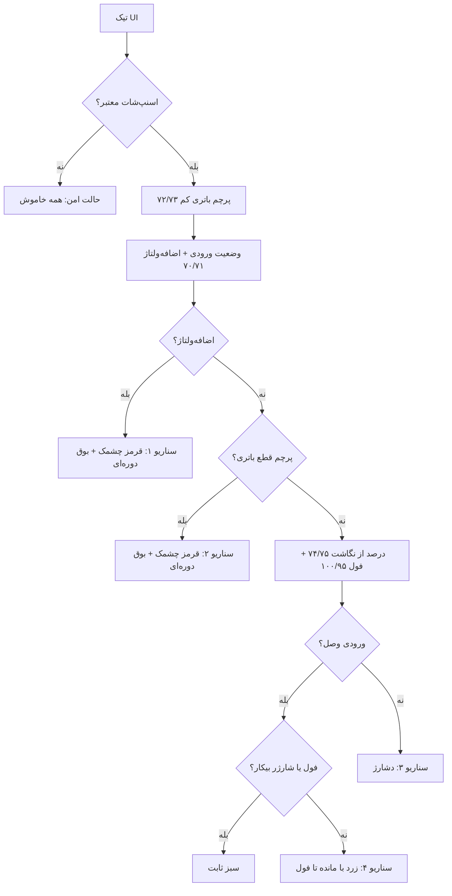
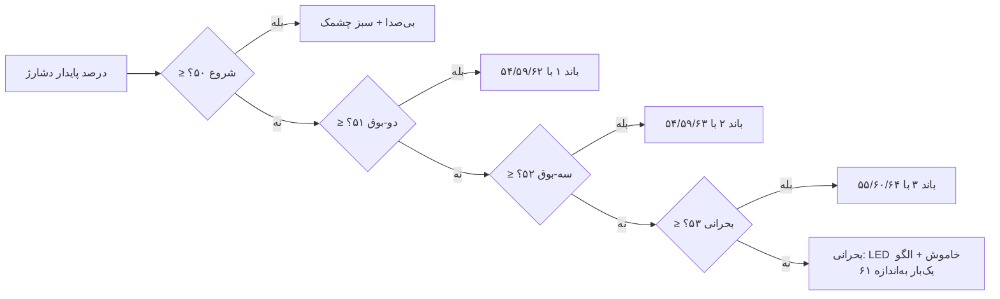

# پنل وب ESP

[EN] Single-file ESP web panel (`esp_link_panel.ino`): the HTML/JS page
lives in one `R"HTML(...)` raw string; the C++ below it serves HTTP +
talks the section-3 frame protocol to the STM32 over UART.
[FA] پنل وب ESP تک‌فایل است: کل صفحهٔ HTML/JS در یک رشتهٔ خام `R"HTML(`
و C++‎ پایین آن HTTP را سرو و با STM32 روی UART حرف می‌زند.

> قرارداد: با هر تغییری در پنل، این فایل هم به‌روز می‌شود (دستور کاربر ۲۰۲۶-۰۹-۲۶).

## تب‌ها

| تب | محتوا |
|---|---|
| پنل (۰) | ولتاژها، وضعیت لینک، دو کانال شارژر (مرحله/جریان/دیوتی)، فرمول‌ها، نمودار مراحل شارژ + کارت وضعیت زنده (انتها) |
| داده‌برداری بنچ (۱) | ویزارد دستی ثبت بنچ + ابزارها (همه دستی؛ هیچ ضریبی خودکار ارسال نمی‌شود) |
| تنظیمات (۲) | چهار زیرتب |

زیرتب‌های تنظیمات:

| زیرتب | محتوا |
|---|---|
| شارژ و فیلتر (s0) | پروفایل شارژ ۲۰..۲۶ + پنجره‌های فیلتر ۷/۸ + نمودار |
| سناریوها (s1) | هدر چسبان آینه + انتخاب‌گر ۵ سناریو (۳۸..۷۵) + نگهبان خودش + دکمهٔ پیش‌فرض سناریوها |
| نظارت و ایمنی (s2) | کارت‌های ۲۷..۳۷ (نظارت باتری، پنجرهٔ ورودی، سقف‌ها) + نگهبان خودش + دکمهٔ پیش‌فرض خودش |
| پشتیبان‌گیری (s3) | فقط کارت بکاپ سراسری ۷۱تایی |

کارت وضعیت زنده (۵ باکس: ورودی، باتری پایین/بالا، جریان هر کانال +
جعبه fault با LED جدا برای هر بیت + ۴ نوار آستانه) در انتهای تب پنل
است — همیشه روی هر draw به‌روز می‌شود، نه فقط در تنظیمات.

نام‌گذاری یکدست انتخاب‌گر سناریو: ۱ · اضافه‌ولتاژ، ۲ · قطع باتری،
۳ · دشارژ، ۴ · شارژ عادی، ۵ · باتری و درصد.

## آینهٔ LED و بازر

هدر چسبان بالای سناریوها (هر ۵۰ms): ۳ LED با دوره/دیوتیِ اعمال‌شدهٔ
برد (فاز محلی)، نماد بازر (کم‌نور = ساکت، روشن = در حال بوق، ✕ =
میوت)، نام سناریوی فعال، خوانش زندهٔ زمان‌بندی مؤثر (دوره/دیوتی/تعداد
بوق/آستانه‌ها از مقادیر اعمال‌شدهٔ برد) و دکمهٔ میوت. میوت فقط زمان کار
با پنل است (RAM؛ با ریست برد پاک می‌شود) و فیلد مخفی `q76` را دارد.

## روند سناریوها

هر تیک برد فقط یک سناریو برنده می‌شود (اولویت از بالا؛ جزئیات کامل:
بخش 5.10 اسپک):





آناتومی هر بوق: دوره + پنجره (دوره×دیوتی) + تعداد + گپ؛ شرط جا شدن:
`مدت×تعداد + گپ×(تعداد−۱) ≤ پنجره`. دوره/دیوتی/تعداد صفر همیشه سکوت
عمدی است. بوق بحرانی دیوتی مستقیم (۵۷) دارد و اگر الگو در پنجره جا
نشود، برد تعداد (۵۸) را کم می‌کند و پنل قرمز هشدار می‌دهد (v1.16e).

## بکاپ سراسری

یک کارت «پشتیبان‌گیری همهٔ تنظیمات» در زیرتب خودش (s3):
خروجی/ورودی JSON هر ۷۱ مقدار ماندگار (۰..۱۴، ۲۰..۷۵) در
`changeover-settings.json`. ورودی با تأیید، یکی‌یکی روی برد اعمال
می‌کند؛ گذراها (۱۵..۱۹ و میوت ۷۶) جزو بکاپ نیستند. شناسه‌های بدون
فیلد (کالیبراسیون/فعال‌سازی) بی‌صدا اعمال می‌شوند.

## قراردادهای پنل

- همه‌چیز با مقادیر **اعمال‌شدهٔ** برد کار می‌کند (`D.p`)؛ ماسک‌های
  pending در ‎/t‎‏: `q` برای ۰..۳۱، `q2` برای ۳۲..۶۳، `q3` برای ۶۴..۷۶.
- نگهبان‌ها (`qchk` پروفایل، `achk` آلارم/سناریو): ترکیب نامعتبر =
  هشدار قرمز + کادر قرمز + تأیید قبل از ارسال؛ برد همیشه گیره می‌زند.
  `achk` یکی است ولی خروجی‌اش دوشاخه است: `aw` در s2 (فقط ۲۷..۳۷) و
  `aw2` در s1 (فقط ۳۸..۷۶)؛ دکمه‌های پیش‌فرض هم جدا‌اند (`adef` برای
  ۲۷..۳۷، `sdef` برای ۳۸..۷۶).
- CSV بنچ ۱۲۸ ستون با بلوک‌های `[profile]` و `[alarms]` و `[uicad]`.
- شناسه‌ها نهایی‌اند و دوباره شماره نمی‌شوند (۰..۷۶).

## اندپوینت‌ها

| مسیر | جهت |
|---|---|
| `/` | صفحه (no-store) |
| `/f.css?v=2` | فونت وزیرمتن (کش نسخه‌دار) |
| `/t` (GET) | تله‌متری JSON: `{on,age,seq,fl,n,q,q2,q3,ka,t[20],p[77]}` |
| `/s?id&v` (POST) | ثبت یک پارامتر |
| `/m` (POST/GET) | ریست/خواندن پنجرهٔ آمار |
| `/benchlog`, `/benchlog/add`, `/benchlog/clear` | فایل ثبت بنچ (CSV) |

## پیش‌نمایش آفلاین

```sh
node tools/panel_preview_server.js   # http://localhost:3000
```

همان HTML واقعی را از ino بیرون می‌کشد و STM32 را شبیه‌سازی می‌کند
(۷۷ پارامتر + کلَمپ آینه + ماسک q3 + چرخهٔ نمایشی سناریوها برای آینه).
نکتهٔ تست: GET ساده ممکن است از کش میانی برگردد — با `?cb=` تصادفی
بخوانید؛ POST را با curl بزنید؛ بعد از هر POST حدود ۱۵۰ms صبر کنید
(تیکر ۱۰۰ms اسنپ‌شات).

## تاریخچه (خلاصهٔ پنل)

| نسخه | تغییر پنل |
|---|---|
| v1.16e | هر بوق با تعداد+گپ+محدوده در هر دو سمت (گیرهٔ برد برای پنجرهٔ بحرانی + هشدار پنل)؛ خط «روند» هر کارت؛ نمودار اولویت سناریوها |
| v1.16d | بازچینی: سناریوها / نظارت و ایمنی / پشتیبان‌گیری؛ وضعیت رفت ته تب پنل؛ نگهبان و پیش‌فرض جداگانه هر زیرتب؛ اصلاح باگ تودرتویی v1.16c |
| v1.16c | یک بکاپ سراسری ۷۱تایی در سطح تنظیمات؛ باکس+نوار جریان جدا برای هر دو باتری؛ انتخاب‌گر سناریو ۱..۵؛ زیرتب سوم «وضعیت»؛ این README ساخته شد |
| v1.16b | میوت فقط زمان پنل (۷۶ از بکاپ خارج شد)؛ تب آلارم فقط آلارم+سناریو؛ وضعیت/بکاپ در زیرتب سوم |
| v1.16 | ۵ کارت سناریو + انتخاب‌گر؛ هدر چسبان آینه با خوانش زمان‌بندی؛ LED جدا برای هر بیت fault؛ q3؛ CSV با `[uicad]` |
| v1.15b | آلارم‌ها زیرتب داخل تنظیمات؛ وضعیت گروهی بدون چشمک؛ توضیح هر بیت؛ بکاپ JSON |
| v1.15 | تب آلارم‌ها (۲۷..۳۷) با نگهبان و q2 |
| v1.14e/c/d | نمودار مراحل بلندتر، ناحیهٔ بالک هاشورخورده، نگهبان ترکیب پروفایل |
| v1.14b | تب «تنظیمات»؛ فیلترهای ۷/۸ به آن منتقل شدند |
| v1.12 | تب پروفایل شارژ (۲۰..۲۶) |
