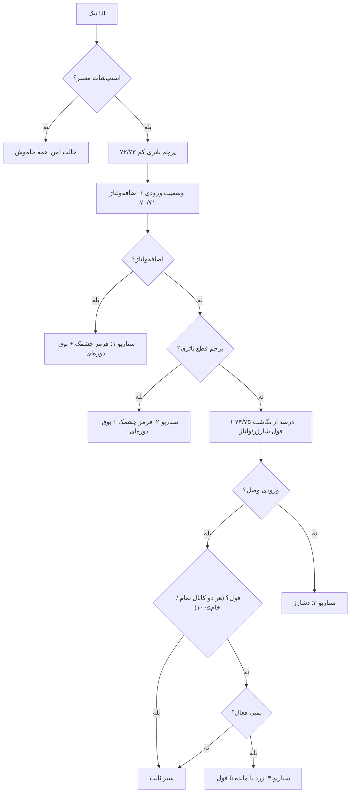
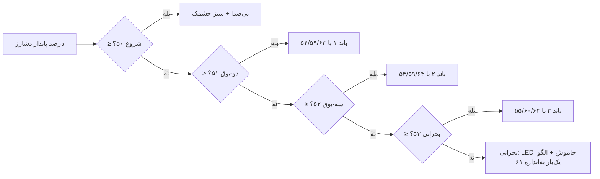

## نسخه ۱٫۹۰ — ممیزی نهایی کالیبراسیون، commit و reset

- هر پارامتر کالیبراسیون فقط بعد از تأیید کاربر، گزارش تازهٔ همان شناسه و تطبیق عددی readback موفق می‌شود؛ مقدار محاسبه‌شده، مقدار روی برد و pending از هم جدا هستند.
- ارسال LUT به readback واقعی جدول و پارامترهای لازم وابسته است؛ خطای ارتباط، timeout، clamp، mismatch یا رد شدن برد موفقیت نیست و reset فقط بعد از commit/readback کامل و handshake معتبر پیشنهاد می‌شود.
- commit صفرنقطه‌ای معتبر است؛ reset با magic و grant commit کنترل می‌شود و flush موفق NVM پیش از arm شدن لازم است. بعد از reset، `/t` و LUT readback تازه بررسی می‌شوند. Preview با ابزار رسمی بازسازی شد و audit انتقال زیر سقف ۴۱۰۰۰۰ بایت است.

## نسخه ۱٫۸۹ — انتخاب روشنِ SWEEP یا فهرست دستی بنچ

- کنترل `SWEEP` اکنون ابتدای ردیف انتخاب روش است؛ وقتی روشن باشد فقط سه کادر
  `از`، `تا` و `گام` دیده و فعال‌اند و فهرست duty دستی پنهان می‌شود.
- وقتی `SWEEP` خاموش باشد فقط کادر فهرست duty دستی دیده و فعال است؛ کادرهای
  `از`، `تا` و `گام` هم پنهان و هم غیرفعال هستند تا معلوم باشد کدام مسیر اجرا می‌شود.
- گام sweep قابل تنظیم و در بازهٔ ۱ تا ۵۰ درصد است و مستقیماً فهرست duty تولیدشده
  را کنترل می‌کند. ظاهر ردیف کنترل با تم کارت‌ها و کلیدهای پنل یکدست شده است.

## نسخه ۱٫۸۸ — پیش‌شرط کالیبراسیون و به‌روزرسانی مستقل باتری

- پیش از هر `POST /lut`، جدول فعال واقعی هر دو باتری با `LUT_READ/LUT_DATA` خوانده
  می‌شود و در کارت read-only با ستون‌های مستقل `chainMa` و `powerMw` دیده می‌شود؛
  این نمای فعلی با ستون‌های ممیزی تراکنش قاطی نمی‌شود.
- گین و آفست‌های پیشنهادیِ سازندهٔ LUT ابتدا با مسیر موجود `/s` اعمال و با
  readback دقیق تأیید می‌شوند. اگر حتی یک شناسه پاسخ ندهد یا مقدار متفاوت برگردد،
  `POST /lut` اصلاً اجرا نمی‌شود. پس از reset نیز یک `/t` تازه و سپس LUT readback
  انجام می‌شود و ماندگاری هر چهار شناسه و هر دو جدول بررسی می‌گردد.
- دکمه‌های «خواندن جدول فعلی»، «به‌روزرسانی باتری ۱»، «به‌روزرسانی باتری ۲» و
  «به‌روزرسانی هر دو» مستقل‌اند. در update تکی، جدول و گین/آفست باتری دیگر از
  readback همان تراکنش حفظ می‌شود؛ صفرنقطه همچنان فرمان معتبر حذف override است.
- تست DOM سناریوهای read-only، update تکی، عدم ارسال LUT هنگام خطای readback
  کالیبراسیون و readback تازهٔ پس از reset را پوشش می‌دهد؛ Preview با ابزار رسمی
  بازسازی شده است.

## نسخه ۱٫۸۷ — بازخوانی واقعی LUT و ممیزی before/after

- پیش از ارسال مستقیم، `POST /lut/read` جدول فعال واقعی STM32 را برای هر دو باتری
  می‌خواند؛ `LUT_DATA` دو فریم مستقل دارد و پنل هر جفت chain/power را عددبه‌عدد
  در ستون‌های «فعلی روی برد / پیشنهادی / پس از commit» مقایسه می‌کند. CRC و count
  فقط metadata هستند و جای مقدار نقطه را نمی‌گیرند.
- بعد از commit و بعد از reset دوباره readback انجام می‌شود. ردیف‌ها به‌صورت
  unchanged، تغییرکرده و تأییدشده، mismatch یا بازخوانی ناموفق دیده می‌شوند؛
  باتری ۲ نیز مسیر و وضعیت مستقل خودش را دارد. Reset سمت ESP هم بدون تطبیق کامل
  readback همین تراکنش پذیرفته نمی‌شود.
- سناریوهای Host برای before/after، تغییر باتری ۲، readback در دسترس نبودن و
  خطای readback ثبت شده‌اند؛ Preview پس از تغییرات با ابزار تولیدکننده بازسازی شده است.

## نسخه ۱٫۸۶ — سناریوی ۷ خطای فنی برد و ممیزی نهایی

- کارت RTL سناریوی ۷ با simulator مستقل اضافه شد: اتصال‌کوتاه/سوختن یعنی
  «رله باز + PWM صفر + JIT» و قطع‌شدن/سوختن یعنی «PWM بیشتر از ۲۰٪ + جریان صفر».
- lockout در سمت میکرو تا reset/power-cycle آزاد نمی‌شود؛ کارت فقط نمایش و
  تنظیمات است و نمی‌تواند قفل ایمنی را دور بزند.
- ids `137..142` به چهار تنظیم بوق مستقل و cadence مشترک سه LED اختصاص دارند؛
  سناریوی ۷ از count/gap سناریوهای ۵ و ۶ استفاده نمی‌کند.
- import/export، clamp، factory reset و simulator به `ESP_PARAM_COUNT=143`
  و `TxOrder` کامل تا id `142` همگام‌اند. هیچ ویرایش محلی تا زدن دکمهٔ
  «ارسال همهٔ تغییرات به برد» POST نمی‌شود.
- پس از اصلاح stamp، حجم و markup، audit سراسری و syntax/Host gate دوباره اجرا شد.

## نسخه ۱٫۸۵ — گزارش کامل ارسال گروهی و متن سناریوی بوق

- معرفی تکراری بالای چهار پارامتر بوق از سناریو حذف شد و خود توضیح پارامترها باقی ماند.
- پیام ارسال گروهی و اعمال کالیبراسیون حالا برای همهٔ شناسه‌های همان batch مقدار فرستاده‌شده، echo برد و وضعیت پذیرش/clamp را فهرست می‌کنند؛ دیگر فقط اولین مقدار دیده نمی‌شود.
- پیش از بررسی echo، پنل منتظر فریم telemetry با `seq` تازه می‌ماند تا مقدارهای قبلی با گزارش ارسال جدید اشتباه نشوند. اگر فریم تازه نرسد، همهٔ تغییرها در صف باقی می‌مانند.

## نسخه ۱٫۸۴ — فونت یکسان، نمایش لپ‌تاپ و حفظ جای کاربر

- همهٔ متن‌های رابط، ورودی‌ها، دکمه‌ها، SVG و پیش‌نمایش از Vazirmatn جاسازی‌شده استفاده می‌کنند؛ پیش‌نمایش مستقل و سرور شبیه‌ساز هم همان CSS فونت ESP را سرو می‌کنند و به فونت سیستم وابسته نیستند.
- برای پنجره‌های حدود ۷۶۰ پیکسل، کارت شارژر تک‌ستونه می‌شود، نوارهای چسبان کوتاه‌تر می‌شوند، عنوان‌های عددی و کنترل‌ها پیش از بیرون‌زدن wrap می‌شوند و جدول‌های عریض فقط داخل اسکرول افقی خودشان حرکت می‌کنند.
- تب اصلی، زیرتب تنظیمات، کارت سناریو، اسکرول صفحه، ورودی‌های دارای ذخیرهٔ محلی و صف تغییرات staged/pending پس از refresh حفظ می‌شوند؛ صفحه با همان جای کاری برمی‌گردد، نه از صفحهٔ اول. صف فقط بازسازی می‌شود و تا زدن دکمهٔ ارسال سراسری هیچ POST خودکاری ندارد.
- build Preview پس از این تغییرات دوباره تولید و ممیزی می‌شود؛ مسیر اجرای آن `tools/panel_preview_server.js` است.

## نسخه ۱٫۸۳ — ویرایش مستقیم سقف duty و پیام‌های قابل‌بستن

- پیام نارنجی/قرمز سلامت لینک در بالای پنل حالا کلید ضربدر دارد؛ بستن آن فقط همان پیام فعلی را پنهان می‌کند و با تغییر وضعیت لینک یا سالم‌شدن ارتباط، رفتار پیام از نو محاسبه می‌شود.
- سقف duty دیگر با کادر جدا و دکمهٔ ثبت مستقل ویرایش نمی‌شود: روی برچسب بزرگ «duty · سقف …» در کارت همان کانال کلیک کنید، مقدار ۰ تا ۵۰٪ را وارد کنید و با Enter ثبت کنید. مقدار در `PEND` می‌نشیند و ارسال واقعی همچنان فقط با «ارسال همهٔ تغییرات به برد» انجام می‌شود؛ Enter یا خروج از کادر ثبت می‌کند و Escape لغو می‌کند.
- «جریان باتری (iest)» و «duty · سقف …» در کارت شارژر با اندازه و وزن فونت عدد بزرگ کارت هم‌تراز شدند.

## نسخه ۱٫۸۲ — ساده‌سازی صفحهٔ پنل و یکپارچه‌سازی کنترل شارژر

- صفحهٔ اصلی پنل خلوت‌تر شد: توضیح‌های تکراری فیلتر جریان، توضیح «کارت زندهٔ همین کانال» و عنوان/شرح زنجیرهٔ اندازه‌گیری از نمای اصلی حذف شدند؛ کنترل واقعی فیلتر همچنان در زیرتب تنظیمات باقی است.
- وضعیت سیگنال‌ها یکدست شد: ورودی با «سالم/خارج از بازه» و پک ۲۴ ولت و نود ۱۲ ولت با برچسب متنی «سالم» نمایش داده می‌شوند؛ مقدارهای آن دو پیش‌تر فقط به‌صورت دایرهٔ سبز خالی دیده می‌شدند.
- کنترل هر شارژر حالا یک کادر واحد دارد: «حالت کار» (خودکار/دستی)، مقدار Duty دستی، «اعمال»، «صفر» و در انتهای همان کادر «سقف Duty» با دکمهٔ «ثبت» قرار گرفته‌اند. چیدمان و رنگ‌ها با تم تیرهٔ پنل هماهنگ و در عرض کم هم قابل‌استفاده‌اند.
- دکمهٔ قدیمی «فیکس» از رابط کاربری حذف شد چون با حالت‌های خودکار/دستی هم‌پوشانی داشت؛ پارامترهای قدیمی ۱۵/۱۷ و قرارداد سیمی فرم‌ور دست‌نخورده‌اند تا بردهای قبلی ناسازگار نشوند.
- پس از تغییرات، اسکچ Host، ممیزی سازگاری، بررسی RTL، استخراج Preview و syntax پنل دوباره اجرا شدند؛ Preview باید از `tools/panel_preview_server.js` باز شود.

## نسخه ۱٫۸۱ — پشتیبان با شناسنامهٔ واقعی پارامترها

- فایل تنظیمات از این پس فرمت ۳ دارد و برای هر پارامتر **شناسه، نام قابل‌خواندن، واحد، نوع، کمینه، بیشینه و گام** را ذخیره می‌کند؛ شناسه‌های بازنشستهٔ ۷۲/۷۳ و گذراهای ۱۵..۱۹ و ۷۶ وارد پشتیبان نمی‌شوند.
- هنگام بازگردانی، تغییر واقعی گزارش می‌شود: نام عوض شده، پارامتر در آن شناسه دیگر وجود ندارد، پارامتر تازه اضافه شده، واحد/نوع/محدوده/گام تغییر کرده یا ترتیب فهرست جابه‌جا شده است.
- بازگردانی مستقیماً روی برد نمی‌نویسد: مقدارهای متفاوت فقط در صف محلی پنل می‌نشینند و زرد می‌شوند. کاربر باید «ارسال همهٔ تغییرات به برد» را بزند.
- بعد از ارسال، پنل echo واقعی برد را بررسی می‌کند و صریح می‌گوید مقدارها پذیرفته و ذخیره شدند، برد کدام مقدار را clamp کرد، یا کدام ارسال به‌خاطر خطای ارتباطی/بدون پاسخ موفق نشد.
- مهر build دیگر معیار سازگاری پشتیبان نیست و در پیام بازگردانی نمایش داده نمی‌شود؛ فایل قدیمی فقط با هشدار «فاقد شمای پارامتر» و بر اساس شناسه‌ها خوانده می‌شود.
- نام فایل نیز دیگر به build وابسته نیست و فقط تاریخ ذخیره‌سازی را دارد.

## نسخه ۱٫۶۶ — ارسال مستقیم جدول به خود میکرو (روش قبلی هم سر جایش)

- **دیگر لازم نیست جدول را در کد بچسبانید و بیلد کنید** (ولی اگر بخواهید همچنان
  می‌توانید): دکمهٔ **«⇪ ارسال مستقیم جدول به برد»** جدول را همین حالا در فلش خود
  میکرو می‌نویسد. دکمه‌های «ساخت کد برای میکرو / کپی / دانلود calibration_generated.h»
  دست‌نخورده ماندند.
- **مسیر ذخیره‌سازی جدا** (خواستهٔ شما): جدول در دو صفحهٔ ۱ کیلوبایتی مخصوص خودش
  (`0x0800F000` و `0x0800F400`) می‌نشیند، نه کنار بقیهٔ پارامترها (`0x0800F800`).
  هر بلوک CRC و پینگ‌پنگ خودش را دارد، پس جابه‌جایی حجیم جدول هیچ خطری برای
  تنظیمات ذخیره‌شده ندارد. فلش برنامه ۶۲K ← ۶۰K شد (تصویر فعلی ~۴۲K).
- **دست‌دادن واقعی**: مرورگر CRC32 همان بایت‌هایی را که می‌فرستد حساب می‌کند، برد
  CRC «آنچه واقعاً گرفته و نوشته» را پس می‌فرستد و تا این دو برابر نباشند ارسال
  موفق اعلام نمی‌شود. هر شکست دلیل فارسی خودش را دارد (CRC، محور نزولی، تکهٔ
  گم‌شده، تعداد نقاط، خطای فلش) و **در هر شکست جدول قبلی دست‌نخورده می‌ماند**.
- **ریست بعد از تأیید**: بعد از دست‌دادن موفق، پنل می‌پرسد برد ریست شود تا همهٔ
  ماژول‌ها با جدول جدید بالا بیایند. ریست فقط بعد از یک کامیت تأییدشده پذیرفته
  می‌شود و چند اجرا تأخیر دارد تا پاسخ ACK از UART خارج شود و شارژر اول معلق شود.
- سقف این راه **۲۴ نقطه برای هر باتری** است (حافظهٔ یک صفحهٔ فلش)؛ جدول بزرگ‌تر
  همچنان از راه ساخت کد و بیلد می‌رود. برد نو یا رکورد خراب ⇐ خودبه‌خود به جدول
  کامپایل‌شده برمی‌گردد.

## نسخه ۱٫۶۵ — جدول تست ساده‌تر + کار با صفحه‌کلید

- ستون‌های جدول حین تست فقط اینها شد: duty، ولتاژ ورودی و دو باتری و جریان دو
  کانال **از نگاه برد**، و شش عددی که **خود کاربر** وارد می‌کند. شمارش خام،
  جریان فیلترشده/تخمینی و کمینه‌بیشینه‌ها از جدول حذف شدند ولی **در CSV پشت
  صحنه دست‌نخورده** ثبت می‌شوند. شمارهٔ ستون وضعیت هم دیگر عدد ثابت نیست.
- صفحه‌کلید: **Tab** بین خانه‌های همان ردیف، **Enter** ثبت و رفتن به duty بعدی،
  **Esc** بستن جدول و رفتن به مرحلهٔ ساخت جدول میکرو. همین راهنما بالای کادرها
  نوشته شده و بعد از بسته‌شدن جدول، مرحلهٔ بعد اعلام می‌شود (بدون پرش صفحه،
  چون پرش صفحه قبلاً باگ گزارش‌شده بود).

## نسخه ۱٫۶۴ — ساخت جدول در پنل اثبات می‌شود + دو یافتهٔ ممیزی خط‌به‌خط

- سازندهٔ جدول (`calbuild`) تنها جایی است که قانونی‌بودن جدول را ثابت می‌کند:
  **هم‌طولی دو محور** (چون از یک فهرست جفتی ساخته می‌شوند)، حداقل ۲ نقطه،
  **محور جریان اکیداً صعودی** و **محور توان بدون نزول**. میکرو هیچ کار اضافه‌ای
  نمی‌کند؛ گاردهای فرم‌ور زمان‌کامپایل‌اند و هزینهٔ اجرایی ندارند.
- یافتهٔ ۱ (مهم): فرم‌ور تفریق محور توان را **بدون علامت** انجام می‌دهد؛ یک نقطهٔ
  نویزی که توانش از نقطهٔ قبل کمتر باشد به‌جای عدد منفی کوچک به ~۴ میلیارد می‌پیچید
  و جریان گزارش‌شده منفجر می‌شد. حالا پنل چنین نقطه‌ای را کنار می‌گذارد و می‌گوید،
  و `audit_consistency.py` هم جدول دست‌ویرایش‌شدهٔ نزولی را رد می‌کند.
- یافتهٔ ۲: پیام‌های خطا/هشدار تولید کد با پیام موفقیت پایانی پاک می‌شدند؛ حالا جمع
  می‌شوند و همه با هم نمایش داده می‌شوند.
- یافتهٔ ۳: «اعمال کالیبراسیون» و «بازخوانی فایل پشتیبان» حالا وسط اجرای ویزارد بنچ
  مسدودند (برد در آن لحظه در اختیار ویزارد است و نوشتن، ردیف در حال ثبت را خراب می‌کرد).

## نسخه ۱٫۶۳ — تعداد نقاط جدول آزاد است (ممیزی شد)

- کل مسیر بررسی شد: در فرم‌ور همهٔ حلقه‌ها از روی `sizeof` تعداد نقاط را می‌گیرند،
  پس ۹ نقطه یا ۳۳ نقطه هم کار می‌کند. دو گارد زمان‌کامپایل اضافه شد تا تنها حالت
  خرابِ خاموش ممکن هم بسته شود: دو محور با **طول متفاوت** دیگر کامپایل نمی‌شود.
- تولیدکنندهٔ کد: جدول با کمتر از ۲ نقطه ساخته نمی‌شود (پیام روشن می‌دهد)، و اگر
  بیش از ۲۴ نقطه شد هشدار می‌دهد که هر نقطه ۸ بایت فلش می‌برد.
- بازپخش عددی: نازک‌کردن جدول ۱۷ نقطه‌ای به ۹ نقطه حداکثر ۱۲۳mW اختلاف می‌دهد
  (≈ ۹mA) و دوبرابرکردن نقاط به ۳۳ حداکثر ۱۰mW؛ یعنی تعداد نقطه فقط روی دقت
  اثر دارد، نه روی درستی اجرا.
- شیب ولتاژ: چون مقاومت‌ها ۱٪ هستند، خطای ضریبی تا ~۲٪ به‌عنوان تلرانس قطعه
  پذیرفته می‌شود و فقط بالاتر از آن هشدار داده می‌شود.

## نسخه ۱٫۶۲ب — ممیزی خودِ خروجی شیب

ممیزی نشان داد ریل ورودی (R46) و ریل پک (R47) دو مقاومت جدا هستند ولی امروز هر دو
به یک ثابت مشترک اشاره می‌کنند؛ پس خروجی قبلی دو خط متناقض برای یک ماکرو چاپ می‌کرد.
حالا هر ریل ماکروی خودش را دارد و اگر دو شیب اندازه‌گیری‌شده با هم نخوانند، خروجی
صریح هشدار می‌دهد که اول باید این اشتراک در `bsp_measurement.c` شکسته شود.
صحت فرمول هم دستی بررسی و تست شد: `مقاومت جدید = شیب × بالا + (شیب − ۱) × پایین`.

## نسخه ۱٫۶۲ — سنجش شیب ولتاژ

ولتاژ جدول نمی‌خواهد، چون مقسم مقاومتی یک خط صاف است: فقط «شیب» و «آفست».
برد امروز فقط آفست (۴/۵/۶) را قابل تنظیم کرده و شیب داخل مقدار مقاومت‌های
`bsp_measurement.c` است. پس پنل حالا شیب را از همان نمونه‌های بنچ اندازه می‌گیرد:
اگر ~۱٫۰۰۰ باشد می‌گوید آفست کافی است؛ اگر نباشد صریح می‌گوید چند درصد خطای
ضریبی هست، توضیح می‌دهد که آفست هرگز درستش نمی‌کند، و در «ساخت کد برای میکرو»
مقدار اصلاح‌شدهٔ مقاومت مقسم را چاپ می‌کند.

## نسخه ۱٫۶۱ — شرط‌ها روی صفحه + خروجی کد برای میکرو

- **فهرست شرط‌ها** در کارت کالیبراسیون: هر شرط با ✅ یا ⛔ و یک جملهٔ ساده که
  می‌گوید چه چیزی کم است و چه باید کرد (ارتباط با برد، حداقل ۴ نمونهٔ کامل برای
  هر باتری، پخش‌بودن duty، نبودن duty تکراری، وجود عددهای ولتاژ، وجود جریان
  مثبت). دیگر هیچ شرطی فقط داخل کد نیست.
- **ساخت کد برای میکرو**: دکمهٔ «ساخت کد برای میکرو» دو آرایهٔ C همان‌شکلی که
  `calibration.h` می‌خواهد (`CAL_CurrentNLutChainMa` و `CAL_CurrentNLutBatteryMw`)
  به‌علاوهٔ آفست/گین/آفست‌های ولتاژ متناظر را می‌سازد؛ با دکمه‌های «کپی کد» و
  «دانلود `calibration_generated.h`». با کپی‌کردن در فرم‌ور، هر بردی که با آن بیلد
  فلش شود جدول را از قبل دارد و لازم نیست چیزی رویش ریخته شود.

سقف اندازهٔ پنل با یک حرکت عمدی از ۲۸۸ به ۳۲۰ کیلوبایت رفت.

## نسخه ۱٫۶۰ — تفکیک نمونه‌ها بر اساس باتری + نام‌های درست

- نام سناریوها عوض شد: «فقط باتری ۱»، «فقط باتری ۲»، «هر دو باتری»
  (برچسب داخل CSV: `BAT1` / `BAT2` / `BOTH`). کلمهٔ SOLO از هر چیزی که کاربر
  می‌خواند حذف شد؛ در `ESP_AGENT_SPEC.md` و برگهٔ بنچ هم به‌روز شد و فقط در
  شرح ران‌های تاریخی گذشته باقی ماند.
- هر نمونهٔ کالیبراسیون حالا **سناریو و duty خودش** را به همراه دارد. در کارت
  کالیبراسیون یک فهرست نمونه‌ها اضافه شد: سناریو، duty، raw و جریان مولتی‌متر هر
  باتری، ولتاژ ورودی — و **تیک «استفاده»** برای هر ردیف. بالای همین فهرست یک
  تیک «انتخاب همهٔ نمونه‌ها» قرار دارد که با یک کلیک همهٔ ردیف‌ها را انتخاب یا
  از انتخاب خارج می‌کند؛ ردیف بدون تیک پاک نمی‌شود، فقط در محاسبه نمی‌آید.
- محاسبه هم خودش تفکیک می‌کند: برای برازش باتری ۱ فقط ردیف‌هایی که کانال ۱ در
  آن‌ها واقعاً کار می‌کرده (BAT1 یا BOTH) به‌کار می‌روند و برعکس.

## نسخه ۱٫۵۹ — ذخیره و بازیابی نمونه‌های بنچ

عددهای نهایی کالیبراسیون (شناسه‌های ۰ تا ۱۴) از قبل داخل فایل پشتیبان تنظیمات بودند.
حالا **نمونه‌های خام داده‌برداری** هم فایل مخصوص خودشان را دارند:
«⬇ ذخیرهٔ نمونه‌ها» و «⬆ بازخوانی نمونه‌ها» در کارت کالیبراسیون. با برگرداندن فایل
می‌شود دوباره محاسبه کرد، عددی را دستی اصلاح کرد و روی برد دیگری نشاند، بدون تکرار
کل تست. هنگام بازخوانی می‌پرسد نمونه‌های فعلی نگه داشته شوند یا جایگزین شوند.

تعداد نقطه‌های جدول LUT در فرم‌ور با `sizeof` حساب می‌شود (الان ۱۷ و ۱۴ نقطه)، پس هر
تعداد دیگری مثل ۲۰ نقطه هم کار می‌کند؛ فقط آینهٔ پنل (`LUT1X/LUT1Y/LUTX/LUTY`) باید
همان باشد — `audit_consistency.py` این را تضمین می‌کند.

## نسخه ۱٫۵۸ب — جدول کالیبراسیون قابل ویرایش + ممیزی حجم و لینک

- جدول کالیبراسیون حالا **قابل ویرایش** است: هر ردیف یک **تیک «اعمال»**، ستون
  **«الان روی برد»** و یک **کادر عددی قابل اصلاح** دارد؛ ستون «تفاوت» اختلاف عدد
  تایپ‌شده با عدد فعلی برد را زنده نشان می‌دهد و اگر عدد از بازهٔ مجاز بیرون بزند
  همان‌جا هشدار می‌دهد. ردیفی که برازشش مردود شده فقط تیکش برداشته می‌شود؛
  کاربر می‌تواند عددش را دستی بنویسد و تیک بزند. «اعمال روی برد» فقط ردیف‌های
  تیک‌خورده را، پس از تأیید و پشتیبان خودکار، می‌نویسد.
- ممیزی حجم (با `--gc-sections`): تصویر لینک‌شدهٔ STM32 حدود **۴۰٫۲ کیلوبایت**
  فلش و **۱۴٫۵ کیلوبایت** RAM (به‌علاوهٔ ۱٫۵ کیلوبایت heap/stack) است؛ روی
  F103C8 با ۶۲ کیلوبایت قابل‌استفاده (۲ کیلوبایت آخر NVM) جا می‌شود.
  برای اینکه این عدد اصلاً قابل اندازه‌گیری شود، استاب `__aeabi_uldivmod` به
  `tools/measure_support/libc_stubs.c` اضافه شد (فقط ابزار اندازه‌گیری).

## نسخه ۱٫۵۸ — پشتیبان کامل + کالیبراسیون مستقیم از داده‌برداری بنچ

**پشتیبان‌گیری**: قرارداد فعلی فایل JSON در نسخهٔ ۱٫۸۱ مستند شده است. فایل‌های قدیمی
که فقط نام برنامه/نسخهٔ قالب/بیلد/تعداد پارامترها را داشتند همچنان خوانده می‌شوند، اما
با هشدار روشن اعلام می‌شود که شمای نام، واحد و محدوده در دسترس نیست. فایل جدید برای
هر شناسه شمای واقعی پارامتر را ذخیره می‌کند و موقع بازخوانی اگر نام، جایگاه، واحد، نوع،
کمینه، بیشینه یا گام تغییر کرده باشد همان مورد را با شناسه و نام گزارش می‌دهد. شناسه‌های
ناشناخته کنار گذاشته می‌شوند؛ هر عدد به بازهٔ مجاز خودش محدود می‌شود و سپس از همان
`fixrules()` کلید ارسال رد می‌شود، و متن تأیید می‌گوید چند عدد جور شد.

**کالیبراسیون خودکار**: هر مرحلهٔ ثبت‌شدهٔ ویزارد بنچ یک نمونه هم ذخیره می‌کند
(در مرورگر می‌ماند). کارت تازهٔ «کالیبراسیون خودکار از همین جدول» با کمترین‌مربعات
شش عدد را درمی‌آورد: گین و آفست جریان هر دو کانال (۰/۱/۲/۳ از رابطهٔ
`I = (raw − offset) × 0٫8777 × gain/1000`) و سه آفست ولتاژ (۴ ورودی، ۵ پک ۲۴V،
۶ نود ۱۲V از میانگین اختلاف مولتی‌متر با برد). جدول پیش‌نمایش مقدار فعلی، پیشنهاد و
کیفیت برازش (تعداد نقطه، R²، خطای باقیمانده، پراکندگی) را نشان می‌دهد و دادهٔ ضعیف را
رد می‌کند. نوشتن فقط با دکمهٔ «اعمال روی برد» و تأیید صریح انجام می‌شود و درست پیش از
نوشتن یک پشتیبان کامل دانلود می‌شود.

سقف اندازهٔ پنل با یک حرکت عمدی از ۲۷۲ به ۲۸۸ کیلوبایت رفت.

## نسخه ۱٫۵۷ب — نوار چسبان سناریوها + آستانه در کارت اضافه‌ولتاژ

- نوار انتخاب سناریو (`.sbt`) حالا زیر نوار بالایی می‌چسبد و هنگام اسکرول همیشه دیده می‌شود.
- کارت ۱ (اضافه‌ولتاژ ورودی) اسلایدر «ولتاژ ورودی» گرفت: آژیر فقط بالاتر از آستانه (۷۰)
  شروع می‌شود و فقط زیر «آستانه − hysteresis (۷۱)» پاک می‌شود؛ هر دو عدد روی کارت نوشته می‌شوند.

## نسخه ۱٫۵۷ — شبیه‌ساز عدم‌توازن درست شد

۱) هر کارت حالا «ساعت مجازی» خودش را دارد: فقط وقتی کارت در حال اجراست جلو
می‌رود و دکمهٔ «توقف» واقعاً آن را نگه می‌دارد. کنار همان دکمه یک انتخاب سرعت
(×۱ تا ×۶۰۰) آمده تا تایمر ۳۰ ثانیه‌ای پایداری یا بوق ساعتی قفل را بشود در چند
ثانیه دید.

۲) کارت ۶ (عدم‌توازن) یک انتخاب «حالت کاری» گرفت: در حال شارژ / استراحت /
دشارژ روی باتری. دقیقاً مثل خود برد:
- دشارژ: پنجره همان لحظه باز است و حد دشارژ (۱۰۹) ملاک است.
- در حال شارژ: پنجره بعد از گیت ۱۱۱ از شروع شارژ باز می‌شود و حد استراحت
  (۱۰۸) ملاک است؛ گیت صفر یعنی حین شارژ هرگز اندازه گرفته نمی‌شود.
- استراحت: پنجره بعد از گیت ۱۱۰ از پایان شارژ باز می‌شود، با حد استراحت؛
  گیت صفر یعنی حین استراحت اندازه گرفته نمی‌شود.
یک خط متن همیشه می‌گوید پنجره باز است یا چقدر تا باز شدنش مانده، کدام حد
ملاک است، شمارش پایداری کجاست و چند رویداد از چند تا ثبت شده.

# پنل وب ESP

[EN] Single-file ESP web panel (`esp_link_panel.ino`): the HTML/JS page
lives in one `R"HTML(...)` raw string; the C++ below it serves HTTP +
talks the section-3 frame protocol to the STM32 over UART.
[FA] پنل وب ESP تک‌فایل است: کل صفحهٔ HTML/JS در یک رشتهٔ خام `R"HTML(`
و C++‎ پایین آن HTTP را سرو و با STM32 روی UART حرف می‌زند.

> قرارداد: با هر تغییری در پنل، این فایل هم به‌روز می‌شود (دستور کاربر ۲۰۲۶-۰۹-۲۶).

## قوانین مشترک از میکرو به پنل آمدند (v1.56)

تا پیش از این هر بار یک عدد روی برد ذخیره می‌شد، میکرو **کل مجموعه** را بازبینی
می‌کرد و اگر با هم جور نبودند بی‌صدا عدد دومی را جابه‌جا می‌کرد. آن کار حالا
کار پنل است (دستور کاربر):

- روی برد فقط **کمینه/بیشینهٔ هر فیلد به‌تنهایی** مانده است. این یکی می‌ماند
  چون پنل تنها نویسنده نیست: رکورد NVM نسخهٔ قدیمی یا فریمِ خراب نباید عدد
  خارج از بازه را به تیک‌ها برساند.
- پنل پیش از ارسال (`fixrules`) این قوانین را اعمال می‌کند و در پیام تأیید
  می‌نویسد چه چیزی را جور کرده: کف گپ ۱۰۰ms وقتی بیش از یک بوق هست، جا شدن
  مدت هر بوق در پنجره‌اش، ترتیب باندها (۵۰ ≥ ۵۱ ≥ ۵۲ ≥ ۵۳)، کوچک‌شدن تعداد
  بوق بحرانی تا جا شدن در پنجرهٔ duty، کمینهٔ خاموشی/روشنی زیر دوره، بالا
  کشیدن سطح پاک‌شدن آلارم باتری کم تا آستانه، پهنای دست‌کم ۱۰۰mV نردبان‌های
  درصد (۷۴/۷۵ و ۱۱۹/۱۲۰) و ماندن خروج فول زیر ورود فول.
- شبیه‌ساز سرور پیش‌نمایش هم همین تغییر را گرفت تا دروغ نگوید.
- صرفه‌جویی اندازه‌گیری‌شدهٔ فلش STM32: **۶۰۶ بایت** (۷۹۱۸۱ → ۷۸۵۷۵ با
  ابزار zig/LLVM؛ عدد نسبی معتبر است).

## چیدمان و رفتار کارت‌ها (v1.55)

- **شبیه‌ساز هر کارت رفت بالای همان کارت**، بلافاصله پیش از بخش ۱ تنظیمات؛ قبلاً
  جای بعضی‌ها وسط و بعضی‌ها آخر کارت بود.
- **کادر «فاصلهٔ بین بوق‌ها» با یک بوق خاموش می‌شود**: وقتی تعداد بوقِ آن باند ۱
  است، گپ معنا ندارد، پس کادر غیرفعال و کم‌رنگ می‌شود و نمی‌شود رویش نوشت.
  گپ مشترک (۶۵) تا وقتی یکی از باندهای ۱/۳/بحرانی بیش از یک بوق بخواهد روشن
  می‌ماند.
- **شبیه‌ساز عدم‌توازن دو ولوم گرفت**: ولتاژ نیم‌باتری بالا و پایین. اختلافشان با
  «حد اختلاف» سنجیده می‌شود، رویدادها شمرده می‌شوند و در شمارهٔ تعیین‌شده قفل
  می‌کند (قرمز ثابت + بوق دوره‌ای). دکمهٔ «شروع دوبارهٔ شمارش» شمارنده را صفر
  می‌کند. زمان باقی‌مانده تا رویداد بعدی هم نوشته می‌شود.
- **نوار توضیح بالای تب و دکمهٔ میوت حذف شدند** (دستور کاربر).

## وقتی کسی تماشا نمی‌کند، برد را بی‌خود مشغول نکن (v1.54)

ESP هر ۳۰ ثانیه یک `GET_PARAMS` می‌فرستاد و برد کل جدول ۱۲۳ مقداری را پاسخ
می‌داد — حتی وقتی هیچ مرورگری باز نبود. این نوسازی فقط برای «راست نگه داشتن
صفحه‌ای که کسی می‌بیند» وجود داشت، و حالا که چراغ‌های زندهٔ برد از پنل حذف
شده‌اند، بی‌مرورگر هیچ مصرفی ندارد. از v1.54 تا وقتی `/t` خوانده نشود
(`ESP_LINK_BROWSER_LOST_MS` = ۱۰ ثانیه) نوسازی انجام نمی‌شود؛ اولین poll بعد از
وقفه دوباره آن را مسلح می‌کند، پس هرکس صفحه را باز کند باز هم مقدار تازه
می‌بیند. نتیجه: در حالت عادی (پنل بسته) هیچ ترافیک پارامتری روی لینک نیست و
STM32 کاری برای آن انجام نمی‌دهد.

## حذف نوار چراغ‌های زندهٔ بالای صفحه (v1.53)

نوار چسبانِ بالای تب سناریوها که سه LED و بازر و زیرنویس زندهٔ برد را نشان
می‌داد حذف شد (دستور کاربر): شبیه‌ساز هر کارت کار آن را بهتر انجام می‌دهد و
این صفحه ابزار راه‌اندازی است، نه داشبورد. با آن، موتور `uview` که هر ۵۰ms
کل منطق تیک برد را از روی تله‌متری بازپخش می‌کرد هم رفت؛ آنچه ماند فقط آینهٔ
بیت‌های خطا و تازه‌سازی اعداد کارت‌ها با دورهٔ ۲۵۰ms است. دکمهٔ میوت سر جایش
ماند. نتیجه: حجم HTML پنل از ۲۶۴٫۶ به ۲۵۸٫۸ کیلوبایت و بار CPU مرورگر کمتر.

## یک کلید سراسری برای ارسال تنظیمات (v1.52)

تا پیش از این هر کادر به‌محض خروج از فوکوس خودش را روی برد می‌فرستاد؛ یعنی
ده‌ها ارسال تک‌تک و بدون هیچ تأییدی. حالا:

- ویرایش‌ها فقط **محلی صف** می‌شوند؛ کادر ویرایش‌شده حاشیهٔ نارنجی می‌گیرد و
  کنارش می‌نویسد «در صف». دکمه‌های «بازگردانی پیش‌فرض» هم به همین صف می‌روند.
- یک نوار ثابت پایین صفحه تعداد تغییرهای ارسال‌نشده را نشان می‌دهد با دو دکمه:
  **ارسال همهٔ تغییرات به برد** و **لغو و برگرداندن از برد**.
- بعد از ارسال، پنل منتظر فریم بعدی تله‌متری می‌ماند و مقدار برگشتی هر شناسه را
  با مقدار فرستاده‌شده می‌سنجد، سپس یکی از این پیام‌ها را می‌دهد:
  «✅ N تنظیم ارسال شد؛ برد همه را عیناً پذیرفت و ذخیره کرد»، یا «✅ N نشست، اما
  برد M مقدار را گیره زد: 39: 60→50»، یا «⛔ هیچ‌کدام ارسال نشد».
- کلیدهای آنی (قطع PWM، کالیبراسیون با مولتی‌متر، بی‌صداکردن) عمداً بیرون از صف
  ماندند، چون خودشان یک عمل فوری و آگاهانه‌اند.

### استقلال اعداد کارت دشارژ

هر ۲۵ عدد قابل‌نوشتن کارت دشارژ (۵۰..۶۷، ۷۴، ۷۵، ۸۰..۸۲، ۱۲۱، ۱۲۲) یک کلمهٔ
جداگانه در `ui_alarm_t` دارند، با همان شناسه روی لینک ست/گت می‌شوند، در NVM
ذخیره می‌شوند و همگی در `ui_led.c` واقعاً مصرف می‌شوند — هیچ‌کدام تزئینی یا
مشترک با دیگری نیست (ممیزی v1.52).

## شبیه‌ساز زندهٔ هر سناریو (v1.51)

سه LED و بازرِ بالای هر کارت دیگر از برد خوانده نمی‌شوند. این پنل ابزار
«راه‌اندازی اولیهٔ برد» است، نه داشبورد کاربر؛ پس چیزی که باید ببینید این است
که «با عددهایی که همین الان دارم تایپ می‌کنم، برد چه کار خواهد کرد».

- هر کارت یک جعبهٔ «شبیه‌ساز این سناریو» دارد: سه چراغ (قرمز/سبز/زرد)، یک
  نشانهٔ بازر و یک خط توضیح، به‌علاوهٔ دکمهٔ توقف/ادامه.
- همهٔ چهره‌ها با ساعت خود مرورگر (هر ۶۰ms) و با همان حساب فرمور ساخته
  می‌شوند: دوره × duty برای چشمک، و «تعداد × مدت + گپ» برای بوق.
- کارت‌های ۳ و ۴ یک اسلایدر درصد و کارت ۵ یک اسلایدر ولتاژ دارند تا بتوانید
  باندها و آستانه‌ها را بدون باتری واقعی جابه‌جا کنید.
- کارت ۵ چهرهٔ LED جدا ندارد؛ فقط پرچم آلارم را با بازهٔ ضدلرزش نشان می‌دهد.
- چون هیچ داده‌ای از برد لازم نیست، شبیه‌ساز آفلاین هم کار می‌کند.

## طراحی (v1.16f)

سیستم دیزاین یکدست تیره (تک‌فایل آفلاین، بدون وابستگی خارجی):
توکن‌های CSS (`--bg/--cd/--in/--rs/--ln/--tx/--mu` + آکسی `--ac` و
معنایی `--ok/--wa/--er`)؛ هدر شیشه‌ای چسبان با نشان وضعیت لینک؛ تب‌های
سگمنتی با قرص فعال؛ کارت‌ها با سایهٔ نرم و نوار آکسی کنار تیتر؛ دکمه‌ها
و ورودی‌ها هم‌ارتفاع (۳۶px) با حلقهٔ فوکوس؛ تگ‌های وضعیت نقطه‌دار؛ نوار
LED چسبان با پس‌زمینهٔ مات؛ نمودارها با بوردر و لجند خواناتر (ارتفاع
۱۶۰px). رنگ‌های هاردکد JS (خطوط canvas، نمودار SVG مراحل، نوارهای
آستانه، بوردر خطای نگهبان) با همین پالت یکدست شدند. رفتار/شناسه‌ها/
کلاس‌ها دست‌نخورده — فقط لایهٔ دیداری عوض شده است.

## تب‌ها

| تب | محتوا |
|---|---|
| پنل (۰) | ولتاژها، وضعیت لینک، دو کانال شارژر (مرحله/جریان/duty)، فرمول‌ها، نمودار مراحل شارژ + جدول یکی شده ولتاژ و وضعیت آلارم؛ تعداد نقاط هر نمودار جریان زیر همان نمودار قابل تنظیم است |
| داده‌برداری بنچ (۱) | ویزارد دستی ثبت بنچ + ابزارها (همه دستی؛ هیچ ضریبی خودکار ارسال نمی‌شود)؛ با تیک `SWEEP` فقط سه کادر از/تا/گام دیده می‌شود و بدون تیک فقط فهرست duty دستی دیده می‌شود؛ شروع با فایل قبلی = پنجره مودال «دانلود و ادامه» یا «پاک و تازه» |
| تنظیمات (۲) | پنج زیرتب |

زیرتب‌های تنظیمات:

| زیرتب | محتوا |
|---|---|
| شارژ و PID (s0) | نمودار مراحل شارژ با راهنمای رنگ بیرون از کادر + کارت PID دوحلقه‌ای (۱۷ ضریب ۷۷..۹۲ + به‌علاوهٔ فیلتر ولتاژ ۹۹) + ۱۳ تراشهٔ حد زیر نمودار در سه دستهٔ «رسیدن نرم به هدف» (duty step، hyst، V filter)، «ترمز اضطراری و حاشیهٔ امن» (Backstop gain I/V، margin) و «تصمیم‌های زمانی» (هفت تایمر ماشین حالت) + یک کلید بازگردانی کارخانه برای کل محدوده |
| سناریوها (s1) | هدر چسبان آینه + انتخاب‌گر ۶ کارت هم‌شکل (۲۷..۸۲ و ۱۰۸..۱۱۸) + نگهبان خودش + دکمهٔ پیش‌فرض سناریوها |
| نظارت و ایمنی (s2) | کارت‌های ۲۷..۳۷ (نظارت باتری، پنجرهٔ ورودی، سقف‌ها) + نگهبان خودش + دکمهٔ پیش‌فرض خودش |
| کالیبراسیون و فیلتر جریان (s3) | پنجره‌های فیلتر جریان ۷/۸ + کالیبراسیون جریان ۰..۳ و ۹..۱۰ |
| پشتیبان‌گیری (s4 — آخرین زیرتب) | فقط کارت بکاپ سراسری ۱۰۲تایی |

کارت یکی شده ولتاژها و وضعیت آلارم (v1.16k): یک جدول ثابت ۷ ردیفه (ورودی، پک، نود، دو باتری، دو جریان) که هر مقدار فقط یک بار با قرص وضعیت کنارش نشان داده می شود؛ چیدمان ثابت است و با تغییر متن به هم نمی ریزد. کالیبره مولتی متر هر سه ولتاژ اول در همان ردیف است. جعبه fault با LED جدا برای هر بیت + نقطه زنده سر جایشان هستند و هر فریم به روز می شوند.
هر ۴ نوار آستانه حذف شدند (ورودی در v1.16i، سه تای دیگر با عنوان هایشان در v1.16j)؛ فقط باکس ها ماندند.

نام‌گذاری یکدست انتخاب‌گر سناریو: ۱ · اضافه‌ولتاژ، ۲ · قطع باتری،
۳ · دشارژ، ۴ · شارژ عادی، ۵ · باتری کم، ۶ · عدم‌توازن.

### شش کارت سناریو — یک قالب مشترک (v1.43 برای شارژ، v1.44 برای بقیه)

هر شش کارت حالا یک شکل دارند و سه چیز را با هم می‌دهند:

1. **جعبهٔ «این سناریو کِی می‌آید؟»** — شرط ورود، شرط خروج (و اینکه هیسترزیس کجاست) و چهرهٔ LED/بوق.
2. **بخش‌های شماره‌دار تنظیم** — آستانه‌ها، چشمک و بوق هرکدام جدا، نه یک ردیف طولانی.
3. **خط‌های محاسبه‌شده زیر هر بخش** — همان عددی که برد به‌کار می‌برد، از مقدار «تایپ‌شده یا اعمال‌شده»، با همان ترتیب گام‌های فرمور. هیچ منطقی در پنل ساخته نشده است.

| کارت | چه چیزی اضافه شد |
|---|---|
| ۱ · اضافه‌ولتاژ | ورود/خروج بر حسب mV (آستانه و آستانه − hysteresis)، میلی‌ثانیهٔ روشن/خاموش قرمز از دوره×duty، پنجرهٔ بوق (مدت×تعداد+گپ‌ها) با سکوت بین دو الگو و هشدار «در دوره جا نمی‌شود» + نقطهٔ قرمز زنده |
| ۲ · قطع باتری | دو تشخیص جدا (قطع حین شارژ با دبانس، غیبت/بازگشت با دبانس‌ها) + فاصلهٔ mV غیبت تا بازگشت + اعداد چشمک و الگوی بوق + نقطهٔ قرمز زنده |
| ۳ · دشارژ (v1.45/v1.47) | **صاحب** حد پایین/بالای ولتاژ (بقیهٔ کارت‌ها فقط نمایش می‌دهند) + **یک بلوک برای هر باند**: سقف درصد، تعداد بوق، مدت، فاصلهٔ تکرار و گپِ همان باند کنار هم، و زیر هر بلوک بازهٔ درصد/ولتاژ، سبز روشن/خاموش در میانهٔ باند و پنجرهٔ بوق با «در فاصله جا می‌شود؟». بلوک بحرانی جدا و قرمزرنگ است + خط ترتیب باندها + نقطهٔ سبز زنده |
| ۴ · شارژ عادی | تعریف فول و جدول چشمک زرد (پایین‌تر) |
| ۵ · باتری کم | تصریح اینکه LED اختصاصی ندارد و فقط پرچم است + معادل درصدیِ آستانه و سطح پاک‌شدن روی نردبان ۷۴/۷۵ (تا با باندهای دشارژ هم‌تراز شود) + هشدار «پاک‌شدن زیر آستانه» |
| ۶ · عدم‌توازن | پنج گام روند (اندازه، گیت زمانی، رویداد، قفل، بعد از قفل) + خط گیت/پایداری و خط قفل با «کمترین زمان ممکن تا قفل = سقف رویداد × پایداری» |

### «پایداری درصد» یعنی چه (v1.47)

کارت حالا خودش با زبان ساده توضیح می‌دهد (v1.48: بازنویسی ساده‌تر به‌خواست کاربر): درصد خام هر تیک از ولتاژ حساب می‌شود و روی باتری
واقعی چند واحد بالا-پایین می‌پرد؛ برد به‌جای آن یک «درصد پایدار» نگه می‌دارد و
همهٔ تصمیم‌ها (چشمک سبز، باند بوق) را با آن می‌گیرد:

- **hysteresis (۸۰)** — پایدار فقط وقتی حرکت می‌کند که خام دست‌کم این مقدار از
  آن دور شود؛ متن کارت با همان عدد یک مثال عددی زنده می‌سازد. صفر = بدون
  ضدلرزش.
- **خروج از ۰٪ (۸۱)** — وقتی پایدار ۰ است تا خام به این عدد نرسد ۰ می‌ماند و
  بعد اول به ۱ می‌رود.
- **خروج از ۱٪ (۸۲)** — وقتی پایدار ۱ است، خام ۰ آن را به ۰ می‌برد و این عدد یا
  بیشتر به ۲.

این دو آستانهٔ آخر نمی‌گذارند ته باتری، بوق بحرانی مدام شروع و قطع شود (آینهٔ
`func__Ui_UpdateBatteryStablePercent`).

### گرد کردن ممنوع: درصد باید مثل برد کف‌گیری شود (v1.46)

`func__Ui_BatteryVoltageToPercent` تقسیم صحیح می‌کند؛ پس روی نردبان
۲۱۰۰۰..۲۹۰۰۰، ولتاژ ۲۱۲۰۰ برای برد **۲٪** است نه ۳٪. پنل در دو جا گرد می‌کرد
(آینهٔ LED و خط‌های محاسبه‌شدهٔ کارت‌ها) و همین نزدیک مرز باندها یک واحد جلوتر
از برد می‌افتاد. حالا:

- ولتاژ → درصد با `Math.floor`، دقیقاً مثل برد.
- درصد → ولتاژ با `Math.ceil`، یعنی «اولین mV که برد همان درصد را گزارش
  می‌کند» — این جهت در فرمور معادل ندارد و فقط نمایشی است.

### باند ۲ دشارژ صاحب شکل بوق خودش شد (v1.50 — شامل تغییر فرمور)

کاربر پرسید «فقط باند ۲ تکراری است؟» — بله: باند ۲ تنها باندی بود که **مدت هر
بوق (۵۹)** و **گپ (۶۵)** را از باند ۱ قرض می‌گرفت (باندهای ۳ و بحرانی فقط گپ را
مشترک دارند). به دستور کاربر این دو جدا شدند:

| چیز | قبل | حالا |
| --- | --- | --- |
| مدت هر بوق باند ۲ | ۵۹ (مشترک با باند ۱) | **۱۲۱ (مستقل)** |
| گپ باند ۲ | ۶۵ (مشترک همهٔ باندها) | **۱۲۲ (مستقل)** |
| فاصلهٔ تکرار باند ۲ | ۵۴ | ۵۴ — عمداً مشترک ماند (کاربر فقط آن دو را نام برد) |

پیامدها در فرمور: کف ۱۰۰ms گپ برای باند ۲ روی گپ خودش اعمال می‌شود، گیرهٔ مدت
باند ۱ دیگر مجبور نیست در تعداد باند ۲ جا شود، و باند ۲ با مدت/گپ خودش بوق
می‌زند. `ESPLINK_PARAM_COUNT` → ۱۲۳، `ESP_LINK_NVM_ENTRY_MAX` ۱۲۲ → ۱۲۴ (۱۲۰
ورودی؛ رکورد تعداد خودش را ذخیره می‌کند پس نسخهٔ NVM بالا نرفت و تنظیمات قبلی
حفظ می‌شود).

### سه پاک‌سازی ظاهری که کاربر خواست (v1.50)

- **باند بی‌صدا بلوک جدا ندارد**: تنها عددش (شناسهٔ ۵۰) داخل «باند ۱» نشست و
  جمله‌اش یک خط زیر همان باند است («بالاتر از N٪ هیچ بوقی نیست…»).
- **عدد تکراری زیر کادرها برداشته شد**: چیپ کنار هر فیلد فقط وقتی حرف می‌زند که
  مقدار برد با چیزی که در کادر است فرق داشته باشد («روی برد: N»)؛ وگرنه ساکت
  است و فقط «پیش‌فرض کارخانه» می‌ماند.
- بند «بیرون آمدن از ۱٪» از توضیح پایداری حذف شد.

### جدا شدن نردبان درصدِ شارژ از دشارژ (v1.49 — شامل تغییر فرمور)

به دستور کاربر، حد ولتاژ درصد دیگر یک رجیستر مشترک بین شارژ و دشارژ نیست:

| سمت | شناسه | مصرف‌کننده‌ها | صاحب در پنل |
| --- | --- | --- | --- |
| دشارژ | ۷۴/۷۵ | باندهای بوق BatteryRun، چشمک سبز، ترجمهٔ نمایشی آلارم باتری کم | کارت ۳ · دشارژ |
| شارژ | **۱۱۹/۱۲۰** | درصد حین شارژ، قفل فول‌شارژ ۷۷/۷۸ | کارت ۴ · شارژ عادی |

- شناسه‌ها ۱۱۹/۱۲۰ شدند چون فضای شناسه سراسری است و ۸۳..۱۱۸ قبلاً گرفته بودند.
- پیش‌فرض هر دو جفت یکی است (۲۱۰۰۰/۲۹۰۰۰)، پس بردِ دست‌نخورده دقیقاً مثل قبل
  رفتار می‌کند؛ فقط از این به بعد جابه‌جاکردن یک سمت، سمت دیگر را تکان نمی‌دهد.
- فرمور: `ui_alarm_t` دو کلمه در انتها گرفت، `func__Ui_VoltageToPercentMap` یک
  فرمول مشترک شد و `func__Ui_ChargeVoltageToPercent` سمت شارژ را تغذیه می‌کند.
  `ESPLINK_PARAM_COUNT` ۱۱۹ → ۱۲۱، `ESP_LINK_NVM_PERSISTED_ID_MAX_HIGH` ۱۱۸ →
  ۱۲۰ (۱۱۸ ورودی از ۱۲۲ جای رکورد؛ نسخهٔ رکورد عوض نشد، پس تنظیمات قبلی حفظ
  می‌شود و دو شناسهٔ جدید با پیش‌فرض بالا می‌آیند).

### مقدار مشترک: یک جای نوشتن، بقیه فقط نمایش (v1.47)

بعضی مقادیر به بیش از یک جا تعلق دارند: نردبان ۷۴/۷۵ در دشارژ، شارژ و آلارم
باتری کم به‌کار می‌رود، و مدت/فاصله/گپ بین باندهای دشارژ مشترک‌اند. قاعدهٔ
فعلی (دستور کاربر):

- هر پارامتر مشترک **دقیقاً یک فیلد قابل‌نوشتن** دارد. صاحب‌ها: نردبان ۷۴/۷۵ در
  کارت ۳ · دشارژ؛ مدت ۵۹، فاصله ۵۴ و گپ ۶۵ در «باند ۱».
- هر جای دیگر فقط یک بازتاب **فقط-خواندنی** است (`<b class="qmv" data-q="<id>">`)
  با برچسبی که می‌گوید صاحبش کجاست و دکمهٔ پرش به همان کارت.
- `qmfill()` بازتاب‌ها را از همان منبعی پر می‌کند که فیلد اصلی نشان می‌دهد
  (تایپ‌شده، وگرنه اعمال‌شدهٔ برد، وگرنه پیش‌فرض)؛ اگر عدد تایپ‌شده هنوز اعمال
  نشده باشد، بازتاب زردرنگ می‌شود.
- دلیل حذف نسخهٔ قابل‌نوشتنِ دوم (v1.45 → v1.47): دو فیلد روی یک رجیستر صادق
  نمی‌مانند — بازندهٔ آخرین ویرایش عددی را نشان می‌دهد که برد ندارد.

### پیش‌فرض کارخانه زیر هر فیلد و هم‌ترازی (v1.47)

- زیر هر فیلد عددی، «پیش‌فرض کارخانه: X» نوشته می‌شود. عدد از **همان جدولی**
  می‌آید که دکمه‌های بازگردانی استفاده می‌کنند (`ADEF`/`IDEF`/`PDEF`/`LDEF`)،
  پس پیش‌فرضِ نوشته‌شده هیچ‌وقت از دکمه‌اش جدا نمی‌افتد.
- فیلدها از ردیف flex به **گرید** تبدیل شدند و عنوانِ هر فیلد فضای خالی را
  می‌گیرد؛ قبلاً عنوان دوخطی ورودیِ خودش را پایین می‌انداخت و ردیف بالا-پایین
  می‌شد.

### کارت «۴ · شارژ عادی» — یک صفحهٔ کاربردی (v1.43)

دستهٔ کارت به چهار بخش شماره‌دار تقسیم شد و هر چیزی که برای تنظیم فول لازم
است داخل همین کارت آمد؛ دیگر لازم نیست بین دو کارت رفت‌وبرگشت شود:

| بخش | محتوا | شناسه |
|---|---|---|
| توضیح فول | «فول شارژری» (هر کانال فعال در FLOAT) در برابر «فول ولتاژی» (درصد ≥ ورود فول) و معنی دقیق ورود/خروج | — |
| ۱ · حد ولتاژ باتری | حد پایین = ۰٪ و حد بالا = ۱۰۰٪ + خط محاسبه‌شدهٔ «هر ۱٪ چند mV» | ۷۴، ۷۵ |
| ۲ · فول | ورود فول و خروج فول + معادل mV و پهنای هیسترزیس هر دو | ۷۷، ۷۸ |
| ۳ · چشمک زرد و پایداری | دوره، حداقل روشنی، هیسترزیس درصد شارژ | ۶۸، ۶۹، ۷۹ |
| ۴ · اعداد چشمک | فرمول گام‌به‌گام + جدول درصد → ولتاژ → مانده → روشن/خاموش (ms) + خط زنده و یک نقطهٔ زرد که با همان اعداد چشمک می‌زند | — |

حد ولتاژ (۷۴/۷۵) از کارت «باتری و درصد» به اینجا منتقل شد؛ کارت ۵ حالا فقط
آلارم باتری کم (۷۲/۷۳) است و یک دکمهٔ پرش به کارت ۴ دارد. نگاشت همچنان
سراسری است و درصد دشارژ و آلارم هم از همین دو عدد ساخته می‌شود.

حساب جدول دقیقاً آینهٔ `func__Ui_ScenarioCharging_Tick` است و منطق برد عوض
نشده: مانده = ۱۰۰ − درصد پایدار با کف ۲٪، گام = دوره ÷ ۱۰۰، روشن = مانده ×
گام با کف «حداقل روشنی» و سقف دوره، خاموش = دوره − روشن؛ درصد صفر یعنی زرد
ثابت روشن.

سقف اندازهٔ پنل (`ESP_PANEL_HTML_MAX_BYTES`) در دو حرکت عمدی از ۲۰۸ به ۲۲۴
(v1.43) و بعد ۲۵۶ کیلوبایت (v1.44) رفت — هر دو مستند در `plink_config.h`.

### ممیزی این کارت‌ها

`esp_link_panel/Tester/host_test_scenario_cards.js` صفحهٔ واقعیِ تولیدشده را در
DOM بار می‌کند، در ورودی‌های واقعی تایپ می‌کند و روی خط‌های محاسبه‌شده assert
می‌زند (۷۶ تست؛ شامل بلوک‌های باند و همگامی ورودی‌های آینه‌ای). مقدار انتظارشده دستی از فرمور درآمده، نه کپی از پنل؛ پس اگر
فرمول پنل از برد جدا بیفتد تست رد می‌شود. مثل تست کلیک، نبودن jsdom یعنی SKIP.

## آینهٔ LED و بازر

هدر چسبان بالای سناریوها (هر ۵۰ms): ۳ LED با دوره/dutyِ اعمال‌شدهٔ
برد (فاز محلی)، نماد بازر (کم‌نور = ساکت، روشن = در حال بوق، ✕ =
میوت)، نام سناریوی فعال، خوانش زندهٔ زمان‌بندی مؤثر (دوره/duty/تعداد
بوق/آستانه‌ها از مقادیر اعمال‌شدهٔ برد) و دکمهٔ میوت. میوت فقط زمان کار
با پنل است (RAM؛ با ریست برد پاک می‌شود) و فیلد مخفی `q76` را دارد.

## روند سناریوها

هر تیک برد فقط یک سناریو برنده می‌شود (اولویت از بالا؛ جزئیات کامل:
بخش 5.10 اسپک):


```mermaid
flowchart TD
    A["تیک UI"] --> B{"اسنپ‌شات معتبر؟"}
    B -- نه --> Z["حالت امن: همه خاموش"]
    B -- بله --> C["پرچم باتری کم ۷۲/۷۳"]
    C --> D["وضعیت ورودی + اضافه‌ولتاژ ۷۰/۷۱"]
    D --> E{"اضافه‌ولتاژ؟"}
    E -- بله --> S1["سناریو ۱: قرمز چشمک + بوق دوره‌ای"]
    E -- نه --> F{"پرچم قطع باتری؟"}
    F -- بله --> S2["سناریو ۲: قرمز چشمک + بوق دوره‌ای"]
    F -- نه --> G["درصد از نگاشت ۷۴/۷۵ + فول شارژر/ولتاژ"]
    G --> H{"ورودی وصل؟"}
    H -- بله --> I{"فول؟ (هر دو کانال تمام / خام≥۱۰۰)"}
    I -- بله --> S0["سبز ثابت"]
    I -- نه --> J{"پمپی فعال؟"}
    J -- بله --> S4["سناریو ۴: زرد با مانده تا فول"]
    J -- نه --> S0
    H -- نه --> S3["سناریو ۳: دشارژ"]
```


```mermaid
flowchart LR
    P["درصد پایدار دشارژ"] --> G1{"≥ شروع ۵۰؟"}
    G1 -- بله --> B0["بی‌صدا + سبز چشمک"]
    G1 -- نه --> G2{"≥ دو-بوق ۵۱؟"}
    G2 -- بله --> B1["باند ۱ با ۵۴/۵۹/۶۲"]
    G2 -- نه --> G3{"≥ سه-بوق ۵۲؟"}
    G3 -- بله --> B2["باند ۲ با ۵۴/۵۹/۶۳"]
    G3 -- نه --> G4{"≥ بحرانی ۵۳؟"}
    G4 -- بله --> B3["باند ۳ با ۵۵/۶۰/۶۴"]
    G4 -- نه --> BC["بحرانی: LED خاموش + الگو یک‌بار به‌اندازه ۶۱"]
```

آناتومی هر بوق: دوره + پنجره (دوره×duty) + تعداد + گپ؛ شرط جا شدن:
`مدت×تعداد + گپ×(تعداد−۱) ≤ پنجره`. دوره/duty/تعداد صفر همیشه سکوت
عمدی است. بوق بحرانی duty مستقیم (۵۷) دارد و اگر الگو در پنجره جا
نشود، برد تعداد (۵۸) را کم می‌کند و پنل قرمز هشدار می‌دهد (v1.16e).

## بکاپ سراسری

یک کارت «پشتیبان‌گیری همهٔ تنظیمات» در زیرتب خودش (s4، آخرین زیرتب تنظیمات از v1.42 به دستور کاربر):
خروجی/ورودی JSON هر ۱۰۲ مقدار ماندگار (۰..۱۴، ۲۰..۷۵، ۷۷..۱۰۷) در
`changeover-settings.json`. ورودی با تأیید، یکی‌یکی روی برد اعمال
می‌کند؛ گذراها (۱۵..۱۹ و میوت ۷۶) جزو بکاپ نیستند. شناسه‌های بدون
فیلد (کالیبراسیون/فعال‌سازی) بی‌صدا اعمال می‌شوند.

## قراردادهای پنل

- همه‌چیز با مقادیر **اعمال‌شدهٔ** برد کار می‌کند (`D.p`)؛ ماسک‌های
  pending در ‎/t‎‏: `q` برای ۰..۳۱، `q2` برای ۳۲..۶۳، `q3` برای ۶۴..۸۲.
- نگهبان‌ها (`qchk` profile، `achk` آلارم/سناریو): ترکیب نامعتبر =
  هشدار قرمز + کادر قرمز + تأیید قبل از ارسال؛ برد همیشه گیره می‌زند.
  `achk` یکی است ولی خروجی‌اش دوشاخه است: `aw` در s2 (فقط ۲۷..۳۷) و
  `aw2` در s1 (فقط ۳۸..۸۲)؛ دکمه‌های پیش‌فرض هم جدا‌اند (`adef` برای
  ۲۷..۳۷، `sdef` برای ۳۸..۸۲).
- CSV بنچ ۱۳۴ ستون با بلوک‌های `[profile]` و `[alarms]` و `[uicad]`.
- شناسه‌ها نهایی‌اند و دوباره شماره نمی‌شوند (۰..۹۲؛ تنها استثنا بلوک PID بود که هرگز روی سخت‌افزار نرفت: در v1.23 یکی پایین آمد چون پرچم فعال‌سازی v1.22 حذف شد، و در v1.24 پنج‌تا کوتاه‌تر شد چون ردیف ضریب سوم اندازه‌گیری شد و هیچ سودی نداشت).

## اندپوینت‌ها

| مسیر | جهت |
|---|---|
| `/` | صفحه (no-store) |
| `/f.css?v=2` | فونت وزیرمتن (کش نسخه‌دار) |
| `/t` (GET) | تله‌متری JSON: `{on,age,seq,fl,n,q,q2,q3,q4,q5,ka,t[20],p[143]}`؛ qها ماسک pending برای ids بالاتر هستند |
| `/s?id&v` (POST) | ثبت یک پارامتر |
| `/m` (POST/GET) | ریست/خواندن پنجرهٔ آمار |
| `/benchlog`, `/benchlog/add`, `/benchlog/clear` | فایل ثبت بنچ (CSV) |

## پیش‌نمایش آفلاین

```sh
node tools/panel_preview_server.js   # http://localhost:3000
```

همان HTML واقعی را از header پنل بیرون می‌کشد و STM32 را شبیه‌سازی می‌کند
(۱۴۳ پارامتر، clamp آینه، ماسک‌های q تا q5 و چرخهٔ نمایشی سناریوها؛ شامل
سناریوی ۷).
نکتهٔ تست: GET ساده ممکن است از کش میانی برگردد — با `?cb=` تصادفی
بخوانید؛ POST را با curl بزنید؛ بعد از هر POST حدود ۱۵۰ms صبر کنید
(تیکر ۱۰۰ms اسنپ‌شات).

## ساختار فایل‌ها (از v1.16o)

برنامه ESP از یک فایل ۲۴۷۰خطی به ۸ فایل در همین پوشه تقسیم شد؛ همه با `#include` در یک واحد ترجمه سر هم می‌شوند و ترتیبشان مهم است، پس رفتار هیچ فرقی نکرده است:

| فایل | چه دارد |
|---|---|
| `esp_link_panel.ino` | سرفصل + includeها + `setup`/`loop` |
| `plink_config.h` | ثابت‌های لینک/پیام/پارامتر، سرفصل CSV بنچ، وضعیت‌های پارسر |
| `plink_params.h` | پاکت‌های گیره سمت ESP + ترتیب ارسال |
| `plink_state.h` | بافرها، داده زنده، صف ارسال، آبجکت سرور |
| `plink_panel.h` | خود HTML پنل (PROGMEM) — برای ویرایش ظاهر فقط همین فایل |
| `plink_font.h` | فونت وزیرمتن (PROGMEM) |
| `plink_link.h` | ارسال/دریافت فریم UART، ذخیره TLM، پنجره آمار بنچ |
| `plink_http.h` | هندلرهای `/` `/t` `/s` `/m` `/benchlog` |

## تاریخچه (خلاصهٔ پنل)

| نسخه | تغییر پنل |
|---|---|
| v1.42 | تراشه‌های ۱۳تایی زیر نمودار در سه دستهٔ تعریف‌شدهٔ کاربر (رسیدن نرم / ترمز اضطراری و حاشیه / تصمیم‌های زمانی)؛ زیرتب پشتیبان‌گیری آخرین تب تنظیمات شد؛ حباب راهنمای نمودار با همان سه دسته و مثال عددی بازنویسی شد؛ قلم پایه و اندازه‌های متنی واکنش‌گرا (clamp/em) و شبکه‌های کارت خودجمع‌شونده با عرض صفحه |
| v1.41 | ممیزی درخواستی کاربر: چهار اشتباه تایپی/واژگانی تولتیپ‌ها اصلاح، ظرف مردهٔ ZL حذف (قید تستر به PL/LL به‌روز شد)، درصد واقعی در حباب PID یکدست شد |
| v1.40 | بازنویسی هر ۱۵ تولتیپ پارامترهای حد با الگوی «یک جملهٔ ساده + مثال عددی با اعداد کارخانه + اثر بیشتر/کمتر» |
| v1.39 | نام ناحیه‌ها از روی نمودار به «راهنمای رنگ‌ها» بیرون از کادر منتقل شد (یک فهرست واحد برای باندها و راهنما)؛ نمایش duty همه‌جا درصد واقعی شد (ردیف سقف duty درصد می‌خواند و درصد قبول می‌کند، سیم همان پرمیل؛ نمایش زنده و ورودی دستی از قبل درصد بود)؛ واحد hyst به‌صورت m‰ روی تراشه؛ «Arm» به «شروع شمارش / Count start» رسید با اشارهٔ فرموری برای ردیابی CHG_ABSORB_MAX_ARM_MA |
| v1.38 | برچسب فارسی خطوط نمودار فقط یک‌بار و زیر هر خط؛ نام ناحیه‌ها وسط باند؛ یک کلید بازگردانی کارخانه برای کل محدوده (به‌جای دو کلید)؛ واحد نرخ‌های Ki ساده‌نویسی شد (هزارمِ‌پرمیل در ثانیه) |
| v1.35 | زمان‌ها و گین‌ها از روی نمودار به نوار تراشهٔ زیر آن منتقل شدند |
| v1.34 | پنجمین زیرتب «کالیبراسیون و فیلتر جریان»؛ کارت‌های کالیبراسیون/فیلتر از زیرتب شارژ خارج شدند |
| v1.33 | کارت PID داخل زیرتب «شارژ و PID» نشست و زیرتب مستقلش حذف شد |
| v1.17b | فول واقعی از شارژر: کپشن «فول» آینه از فعال‌سازهای ۱۱/۱۲ + وضعیت FLOAT در TLM؛ تکه «شارژر بیکار» از کپشن و روند حذف؛ فرم ورود عدد بنچ بالای جدول (wF0) — ورود داده بدون اسکرول افقی، اسکرول خودکار فقط داخل جدول |
| v1.23 | حذف پرچم فعال‌سازی PID و شماره‌گذاری دوبارهٔ بلوک به ۸۳..۹۷ (۹۸ پارامتر)؛ پیش‌فرض‌های کالیبرهٔ کارخانه؛ اصلاح باگ `sdef()` که به شناسه‌های PID مقدار نامعتبر می‌فرستاد |
| v2 | قاب CRC-16 با بایت نسخه (اندازهٔ TLM ۸۴→۱۰۴، پنج فیلد شمارش خام)، بنر ناهم‌نسخگی روی صفحه، توضیح هر ۹۳ پارامتر در «!» هر بخش، تم با نردبان ارتفاع اندازه‌گیری‌شده، ارتفاع نمودار نصف، و لاگ بنچ با خط `# settings:` یک‌باره |
| v1.24 | حذف ردیف ضریب سوم (۹۳ پارامتر، ۸۳..۹۲)؛ کارت «PID دوحلقه‌ای CC/CV» با توضیح اینکه چرا یک PID تنها کافی نیست؛ حذف ماسک چهارم q4؛ Kp ولتاژ ۱۵۰→۵۰ و پیش‌فیلتر ۱۶→۳۲ برای آرام‌تر شدن duty زیر نویز |
| v1.22 | زیرتب «PID شارژ» با ۱۶ ضریب (۸۳..۹۸)؛ ماسک چهارم q4 برای ۹۶..۹۸؛ بافر JSON ۲۰۴۸→۲۵۶۰؛ CSV بنچ ۱۵۰ ستون با بلوک `[pid]`؛ بکاپ ۹۳تایی؛ نگهبان ترکیب PID (نرخ صعود Absorb باید از Bulk کندتر بماند) |
| v1.17 | شش پارامتر سناریوی عدد شارژ ۷۷..۸۲ (ورود/خروج فول ۱۰۰/۹۵، hysteresis شارژ ۵، hysteresis دشارژ ۲، خروج‌های ۰٪/۱٪ ۲/۳) + پیش‌فرض ۶۹ از ۱۰ به ۱۵۰؛ گارد ورود≥خروج+۱ (۷۷ مرجع)؛ کارت ucard4 میزبان q77..q79 و ucard3 میزبان q80..q82؛ ماسک q3 تا ۸۲؛ CSV بنچ ۱۳۴ ستون؛ بکاپ ۷۷تایی؛ آینه با مقادیر پیش‌فرض جدید |
| v1.16x | آینه LUT کانال ۱ با جدول توان v1.19 برد یکسان شد (۱۷ لنگر سوییپ SOLO1 با دروازه نویز (۵،۰)؛ نمایش tap بنچ حالا توان/جریان کانال ۱ را هم مثل برد نشان می‌دهد) |
| v1.16w | آینه LUT کانال ۲ با برازش سرتاسری v1.18 برد یکسان شد (۱۴ لنگر؛ لنگر (۳۹۰،۶۰۳۵) اضافه و ۵ لنگر میانی جابه‌جا شدند تا دریفت ‎-4..-8mA ناشی از فیت اعشاری از بین برود) |
| v1.16v | آینه LUT کانال ۲ با بازبرازش v1.17 برد یکسان شد (۱۳ لنگر: دروازه نویز (۲۰،۰) + نقاط (۲۵۳،۳۱۸۰) و (۳۱۲،۴۵۰۰) + جابه‌جایی (۲۸۳،۳۸۶۰) و (۳۵۳،۵۲۸۰))؛ نمایش tap بنچ حالا همان توان/جریان جدید برد را نشان می‌دهد |
| v1.16u | ممیزی رفتار نمایشی: آینه LED/بوق مثل برد شد (فقط BULK/ABSORB یعنی شارژ فعال نه FLOAT؛ درصد/باتری‌کم/فول از ولتاژ پک ۲۴V نه ماکس نیمه‌ها) |
| v1.16t | ممیزی برد و ESP: فرمول‌های زنجیره با برد یکسان شد (فیلتر روی شمارش خام بعد تبدیل، ثابت 8.7767، جبران V12، آینه جدول LUT کانال ۲) + هشدار ETA صفر کانال ۲ در کارت کالیبراسیون |
| v1.16s | ممیزی تنظیمات: کارت کالیبراسیون جریان (۰..۳ و ۹..۱۰) به زیرتب شارژ و فیلتر اضافه شد؛ دکمه فیکس کنار صفر هر کانال (duty ثابت با حفاظتها)؛ همه توضیحات طولانی رفتند پشت دکمه ! در سربرگ هر کارت؛ سقف q24 با برد یکسان شد (۱۴۰۰۰) |
| v1.16r | ردیف مود و ردیف duty دستی یکی شدند (مود + خودکار/دستی + duty + اعمال + صفر در یک ردیف)؛ عدد duty هم‌فونت جریان باتری شد (تگ b) |
| v1.16q | مرتب‌سازی کارت شارژر: جدول زنجیره سه‌ستونه شد (برچسب/عدد/واحد) تا اعداد زیر هم بیایند، لیبل جریان کوتاه شد، خط ثابت‌ها هم‌خانواده ۱۲px |
| v1.16p | کارت کنترل دستی پایین پنل حذف شد؛ هر کارت شارژر دکمه صفر کنار اعمال گرفت و دو مقدار جریان/duty کنار هم چیده شدند (هشدار ۱۰ ثانیه بستن پنل داخل کارت ماند) |
| v1.16o | سقف duty هر کانال هم رفت داخل کارت همان شارژر (زیر کادر duty دستی)؛ کارت کنترل دستی فقط هر دو صفر + وضعیت زنده ماند |
| v1.16m | فیکس ممیزی لینک: پاکت ESP برای بازگشت Float (۲۴) سقف ۱۳۲۰۰→۱۴۰۰۰ شد (شناور−۳۰۰ با Float حداکثر ۱۴۳۰۰)؛ هر ۷۷ پاکت با گیره برد چک شد |
| v1.16n | سوییچ مود از کارت کنترل دستی به داخل کارت هر شارژر رفت: دو دکمه خودکار/دستی زیر نوار duty (هر دو کارت یک مود سراسری را نشان میدهند)؛ کارت کنترل دستی فقط هر دو صفر + سقف ها + وضعیت زنده ماند |
| v1.16l | ورود duty دستی هر کانال رفت داخل کارت همان شارژر (زیر نوار duty)؛ کارت کنترل دستی فقط سوییچ مود + هر دو صفر + سقف ها ماند |
| v1.16k | بازنویسی کامل نمایش وضعیت: کارت ولتاژها و کارت آلارم یکی شدند؛ یک جدول ثابت که هر مقدار فقط یک بار است و دیگر کوچک و بزرگ نمی شود؛ قرص وضعیت و کالیبره در همان ردیف؛ جعبه fault و نقطه زنده ماندند |
| v1.16j | سوال فایل قبلی بنچ شد پنجره مودال وسط صفحه (دانلود+ادامه / پاک+تازه / انصراف)؛ کادر دستی و sweep بر اساس حالت خودکار غیرفعال می شوند تا معلوم باشد کدام اجرا می شود؛ حذف کامل هر ۳ نوار آستانه باقی مانده با عنوان هایشان |
| v1.16i | تب پنل: (۱) تعداد نقاط هر نمودار جریان با ورودی زیر همان نمودار (موجود/قابل‌تنظیم، جایگزین کنترل سراسری)؛ (۲) کارت وضعیت آلارم‌ها رفت زیر ولتاژها + نقطهٔ زندهٔ چشمک‌زن هر فریم؛ (۳) حذف نوار پروگرس ولتاژ ورودی (تکراری) |
| v1.16h | بنچ: sweep خودکار duty با گام ثابت ۱٪ (از..تا، پیش‌فرض ۱..۵۰ و روشن؛ فهرست دستی با خاموش‌کردن) + درصد پیشرفت هر مرحله؛ شروع با فایل قبلی = باکس انتخاب «دانلود قبلی و ادامه همان فایل» (پیش‌فرض) یا «پاک کردن و شروع تازه»؛ استاب پریویو هم فایل بنچ را حالت‌دار شبیه‌سازی می‌کند |
| v1.16g | فیکس هم‌پوشانی: چسبندگی فقط برای نوار اصلی زیرتب‌ها (`#sbt`)؛ انتخاب‌گر سناریو (`#usel`) مثل قبل با اسکرول می‌رود و دیگر روی نوار LED نمی‌افتد؛ زیرتب‌ها همیشه تک‌ردیفه + حاشیهٔ امن زیر نوار چسبان |
| v1.16f | بازطراحی دیداری کامل (دستور کاربر ۲۰۲۶-۰۹-۲۷): سیستم توکن CSS، هدر شیشه‌ای چسبان، تب‌های سگمنتی، دکمه/ورودی هم‌ارتفاع با فوکوس‌رینگ، تگ‌های نقطه‌دار، زیرتب چسبان، نمودار ۱۶۰px؛ رنگ‌های JS هم‌خانواده شد؛ بدون هیچ تغییر رفتاری |
| v1.16e | هر بوق با تعداد+گپ+محدوده در هر دو سمت (گیرهٔ برد برای پنجرهٔ بحرانی + هشدار پنل)؛ خط «روند» هر کارت؛ نمودار اولویت سناریوها |
| v1.16d | بازچینی: سناریوها / نظارت و ایمنی / پشتیبان‌گیری؛ وضعیت رفت ته تب پنل؛ نگهبان و پیش‌فرض جداگانه هر زیرتب؛ اصلاح باگ تودرتویی v1.16c |
| v1.16c | یک بکاپ سراسری ۷۱تایی در سطح تنظیمات؛ باکس+نوار جریان جدا برای هر دو باتری؛ انتخاب‌گر سناریو ۱..۵؛ زیرتب سوم «وضعیت»؛ این README ساخته شد |
| v1.16b | میوت فقط زمان پنل (۷۶ از بکاپ خارج شد)؛ تب آلارم فقط آلارم+سناریو؛ وضعیت/بکاپ در زیرتب سوم |
| v1.16 | ۵ کارت سناریو + انتخاب‌گر؛ هدر چسبان آینه با خوانش زمان‌بندی؛ LED جدا برای هر بیت fault؛ q3؛ CSV با `[uicad]` |
| v1.15b | آلارم‌ها زیرتب داخل تنظیمات؛ وضعیت گروهی بدون چشمک؛ توضیح هر بیت؛ بکاپ JSON |
| v1.15 | تب آلارم‌ها (۲۷..۳۷) با نگهبان و q2 |
| v1.14e/c/d | نمودار مراحل بلندتر، ناحیهٔ Bulk هاشورخورده، نگهبان ترکیب profile |
| v1.14b | تب «تنظیمات»؛ فیلترهای ۷/۸ به آن منتقل شدند |
| v1.12 | تب profile شارژ (۲۰..۲۶) |
