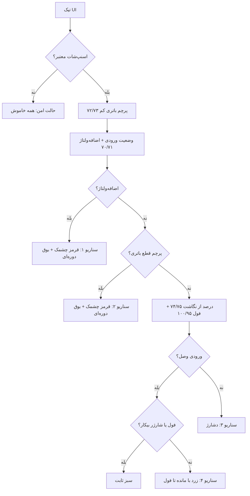
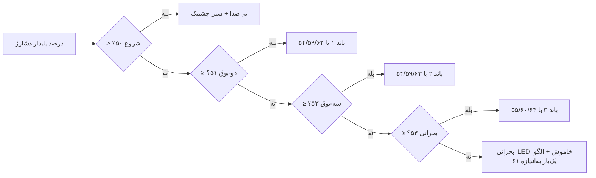

# پنل وب ESP

[EN] Single-file ESP web panel (`esp_link_panel.ino`): the HTML/JS page
lives in one `R"HTML(...)` raw string; the C++ below it serves HTTP +
talks the section-3 frame protocol to the STM32 over UART.
[FA] پنل وب ESP تک‌فایل است: کل صفحهٔ HTML/JS در یک رشتهٔ خام `R"HTML(`
و C++‎ پایین آن HTTP را سرو و با STM32 روی UART حرف می‌زند.

> قرارداد: با هر تغییری در پنل، این فایل هم به‌روز می‌شود (دستور کاربر ۲۰۲۶-۰۹-۲۶).

## طراحی (v1.16f)

سیستم دیزاین یکدست تیره (تک‌فایل آفلاین، بدون وابستگی خارجی):
توکن‌های CSS (`--bg/--cd/--in/--rs/--ln/--tx/--mu` + آکسی `--ac` و
معنایی `--ok/--wa/--er`)؛ هدر شیشه‌ای چسبان با نشان وضعیت لینک؛ تب‌های
سگمنتی با قرص فعال؛ کارت‌ها با سایهٔ نرم و نوار آکسی کنار تیتر؛ دکمه‌ها
و ورودی‌ها هم‌ارتفاع (۳۶px) با حلقهٔ فوکوس؛ تگ‌های وضعیت نقطه‌دار؛ نوار
LED چسبان با پس‌زمینهٔ مات؛ نمودارها با بوردر و لجند خواناتر (ارتفاع
۱۶۰px). رنگ‌های هاردکد JS (خطوط canvas، نمودار SVG مراحل، نوارهای
آستانه، بوردر خطای نگهبان) با همین پالت یکدست شدند. رفتار/شناسه‌ها/
کلاس‌ها دست‌نخورده — فقط لایهٔ دیداری عوض شده است.

## تب‌ها

| تب | محتوا |
|---|---|
| پنل (۰) | ولتاژها، وضعیت لینک، دو کانال شارژر (مرحله/جریان/دیوتی)، فرمول‌ها، نمودار مراحل شارژ + جدول یکی شده ولتاژ و وضعیت آلارم؛ تعداد نقاط هر نمودار جریان زیر همان نمودار قابل تنظیم است |
| داده‌برداری بنچ (۱) | ویزارد دستی ثبت بنچ + ابزارها (همه دستی؛ هیچ ضریبی خودکار ارسال نمی‌شود)؛ sweep خودکار duty با گام ۱٪ (پیش‌فرض روشن، از..تا) یا فهرست دستی؛ شروع با فایل قبلی = پنجره مودال «دانلود و ادامه» یا «پاک و تازه» |
| تنظیمات (۲) | چهار زیرتب |

زیرتب‌های تنظیمات:

| زیرتب | محتوا |
|---|---|
| شارژ و فیلتر (s0) | پروفایل شارژ ۲۰..۲۶ + پنجره‌های فیلتر ۷/۸ + نمودار |
| سناریوها (s1) | هدر چسبان آینه + انتخاب‌گر ۵ سناریو (۳۸..۷۵) + نگهبان خودش + دکمهٔ پیش‌فرض سناریوها |
| نظارت و ایمنی (s2) | کارت‌های ۲۷..۳۷ (نظارت باتری، پنجرهٔ ورودی، سقف‌ها) + نگهبان خودش + دکمهٔ پیش‌فرض خودش |
| پشتیبان‌گیری (s3) | فقط کارت بکاپ سراسری ۷۱تایی |

کارت یکی شده ولتاژها و وضعیت آلارم (v1.16k): یک جدول ثابت ۷ ردیفه (ورودی، پک، نود، دو باتری، دو جریان) که هر مقدار فقط یک بار با قرص وضعیت کنارش نشان داده می شود؛ چیدمان ثابت است و با تغییر متن به هم نمی ریزد. کالیبره مولتی متر هر سه ولتاژ اول در همان ردیف است. جعبه fault با LED جدا برای هر بیت + نقطه زنده سر جایشان هستند و هر فریم به روز می شوند.
هر ۴ نوار آستانه حذف شدند (ورودی در v1.16i، سه تای دیگر با عنوان هایشان در v1.16j)؛ فقط باکس ها ماندند.

نام‌گذاری یکدست انتخاب‌گر سناریو: ۱ · اضافه‌ولتاژ، ۲ · قطع باتری،
۳ · دشارژ، ۴ · شارژ عادی، ۵ · باتری و درصد.

## آینهٔ LED و بازر

هدر چسبان بالای سناریوها (هر ۵۰ms): ۳ LED با دوره/دیوتیِ اعمال‌شدهٔ
برد (فاز محلی)، نماد بازر (کم‌نور = ساکت، روشن = در حال بوق، ✕ =
میوت)، نام سناریوی فعال، خوانش زندهٔ زمان‌بندی مؤثر (دوره/دیوتی/تعداد
بوق/آستانه‌ها از مقادیر اعمال‌شدهٔ برد) و دکمهٔ میوت. میوت فقط زمان کار
با پنل است (RAM؛ با ریست برد پاک می‌شود) و فیلد مخفی `q76` را دارد.

## روند سناریوها

هر تیک برد فقط یک سناریو برنده می‌شود (اولویت از بالا؛ جزئیات کامل:
بخش 5.10 اسپک):


```mermaid
flowchart TD
    A["تیک UI"] --> B{"اسنپ‌شات معتبر؟"}
    B -- نه --> Z["حالت امن: همه خاموش"]
    B -- بله --> C["پرچم باتری کم ۷۲/۷۳"]
    C --> D["وضعیت ورودی + اضافه‌ولتاژ ۷۰/۷۱"]
    D --> E{"اضافه‌ولتاژ؟"}
    E -- بله --> S1["سناریو ۱: قرمز چشمک + بوق دوره‌ای"]
    E -- نه --> F{"پرچم قطع باتری؟"}
    F -- بله --> S2["سناریو ۲: قرمز چشمک + بوق دوره‌ای"]
    F -- نه --> G["درصد از نگاشت ۷۴/۷۵ + فول ۱۰۰/۹۵"]
    G --> H{"ورودی وصل؟"}
    H -- بله --> I{"فول یا شارژر بیکار؟"}
    I -- بله --> S0["سبز ثابت"]
    I -- نه --> S4["سناریو ۴: زرد با مانده تا فول"]
    H -- نه --> S3["سناریو ۳: دشارژ"]
```


```mermaid
flowchart LR
    P["درصد پایدار دشارژ"] --> G1{"≥ شروع ۵۰؟"}
    G1 -- بله --> B0["بی‌صدا + سبز چشمک"]
    G1 -- نه --> G2{"≥ دو-بوق ۵۱؟"}
    G2 -- بله --> B1["باند ۱ با ۵۴/۵۹/۶۲"]
    G2 -- نه --> G3{"≥ سه-بوق ۵۲؟"}
    G3 -- بله --> B2["باند ۲ با ۵۴/۵۹/۶۳"]
    G3 -- نه --> G4{"≥ بحرانی ۵۳؟"}
    G4 -- بله --> B3["باند ۳ با ۵۵/۶۰/۶۴"]
    G4 -- نه --> BC["بحرانی: LED خاموش + الگو یک‌بار به‌اندازه ۶۱"]
```

آناتومی هر بوق: دوره + پنجره (دوره×دیوتی) + تعداد + گپ؛ شرط جا شدن:
`مدت×تعداد + گپ×(تعداد−۱) ≤ پنجره`. دوره/دیوتی/تعداد صفر همیشه سکوت
عمدی است. بوق بحرانی دیوتی مستقیم (۵۷) دارد و اگر الگو در پنجره جا
نشود، برد تعداد (۵۸) را کم می‌کند و پنل قرمز هشدار می‌دهد (v1.16e).

## بکاپ سراسری

یک کارت «پشتیبان‌گیری همهٔ تنظیمات» در زیرتب خودش (s3):
خروجی/ورودی JSON هر ۷۱ مقدار ماندگار (۰..۱۴، ۲۰..۷۵) در
`changeover-settings.json`. ورودی با تأیید، یکی‌یکی روی برد اعمال
می‌کند؛ گذراها (۱۵..۱۹ و میوت ۷۶) جزو بکاپ نیستند. شناسه‌های بدون
فیلد (کالیبراسیون/فعال‌سازی) بی‌صدا اعمال می‌شوند.

## قراردادهای پنل

- همه‌چیز با مقادیر **اعمال‌شدهٔ** برد کار می‌کند (`D.p`)؛ ماسک‌های
  pending در ‎/t‎‏: `q` برای ۰..۳۱، `q2` برای ۳۲..۶۳، `q3` برای ۶۴..۷۶.
- نگهبان‌ها (`qchk` پروفایل، `achk` آلارم/سناریو): ترکیب نامعتبر =
  هشدار قرمز + کادر قرمز + تأیید قبل از ارسال؛ برد همیشه گیره می‌زند.
  `achk` یکی است ولی خروجی‌اش دوشاخه است: `aw` در s2 (فقط ۲۷..۳۷) و
  `aw2` در s1 (فقط ۳۸..۷۶)؛ دکمه‌های پیش‌فرض هم جدا‌اند (`adef` برای
  ۲۷..۳۷، `sdef` برای ۳۸..۷۶).
- CSV بنچ ۱۲۸ ستون با بلوک‌های `[profile]` و `[alarms]` و `[uicad]`.
- شناسه‌ها نهایی‌اند و دوباره شماره نمی‌شوند (۰..۷۶).

## اندپوینت‌ها

| مسیر | جهت |
|---|---|
| `/` | صفحه (no-store) |
| `/f.css?v=2` | فونت وزیرمتن (کش نسخه‌دار) |
| `/t` (GET) | تله‌متری JSON: `{on,age,seq,fl,n,q,q2,q3,ka,t[20],p[77]}` |
| `/s?id&v` (POST) | ثبت یک پارامتر |
| `/m` (POST/GET) | ریست/خواندن پنجرهٔ آمار |
| `/benchlog`, `/benchlog/add`, `/benchlog/clear` | فایل ثبت بنچ (CSV) |

## پیش‌نمایش آفلاین

```sh
node tools/panel_preview_server.js   # http://localhost:3000
```

همان HTML واقعی را از ino بیرون می‌کشد و STM32 را شبیه‌سازی می‌کند
(۷۷ پارامتر + کلَمپ آینه + ماسک q3 + چرخهٔ نمایشی سناریوها برای آینه).
نکتهٔ تست: GET ساده ممکن است از کش میانی برگردد — با `?cb=` تصادفی
بخوانید؛ POST را با curl بزنید؛ بعد از هر POST حدود ۱۵۰ms صبر کنید
(تیکر ۱۰۰ms اسنپ‌شات).

## ساختار فایل‌ها (از v1.16o)

برنامه ESP از یک فایل ۲۴۷۰خطی به ۸ فایل در همین پوشه تقسیم شد؛ همه با `#include` در یک واحد ترجمه سر هم می‌شوند و ترتیبشان مهم است، پس رفتار هیچ فرقی نکرده است:

| فایل | چه دارد |
|---|---|
| `esp_link_panel.ino` | سرفصل + includeها + `setup`/`loop` |
| `plink_config.h` | ثابت‌های لینک/پیام/پارامتر، سرفصل CSV بنچ، وضعیت‌های پارسر |
| `plink_params.h` | پاکت‌های گیره سمت ESP + ترتیب ارسال |
| `plink_state.h` | بافرها، داده زنده، صف ارسال، آبجکت سرور |
| `plink_panel.h` | خود HTML پنل (PROGMEM) — برای ویرایش ظاهر فقط همین فایل |
| `plink_font.h` | فونت وزیرمتن (PROGMEM) |
| `plink_link.h` | ارسال/دریافت فریم UART، ذخیره TLM، پنجره آمار بنچ |
| `plink_http.h` | هندلرهای `/` `/t` `/s` `/m` `/benchlog` |

## تاریخچه (خلاصهٔ پنل)

| نسخه | تغییر پنل |
|---|---|
| v1.16q | مرتب‌سازی کارت شارژر: جدول زنجیره سه‌ستونه شد (برچسب/عدد/واحد) تا اعداد زیر هم بیایند، لیبل جریان کوتاه شد، خط ثابت‌ها هم‌خانواده ۱۲px |
| v1.16p | کارت کنترل دستی پایین پنل حذف شد؛ هر کارت شارژر دکمه صفر کنار اعمال گرفت و دو مقدار جریان/دیوتی کنار هم چیده شدند (هشدار ۱۰ ثانیه بستن پنل داخل کارت ماند) |
| v1.16o | سقف دیوتی هر کانال هم رفت داخل کارت همان شارژر (زیر کادر دیوتی دستی)؛ کارت کنترل دستی فقط هر دو صفر + وضعیت زنده ماند |
| v1.16m | فیکس ممیزی لینک: پاکت ESP برای بازگشت شناور (۲۴) سقف ۱۳۲۰۰→۱۴۰۰۰ شد (شناور−۳۰۰ با شناور حداکثر ۱۴۳۰۰)؛ هر ۷۷ پاکت با گیره برد چک شد |
| v1.16n | سوییچ مود از کارت کنترل دستی به داخل کارت هر شارژر رفت: دو دکمه خودکار/دستی زیر نوار دیوتی (هر دو کارت یک مود سراسری را نشان میدهند)؛ کارت کنترل دستی فقط هر دو صفر + سقف ها + وضعیت زنده ماند |
| v1.16l | ورود دیوتی دستی هر کانال رفت داخل کارت همان شارژر (زیر نوار دیوتی)؛ کارت کنترل دستی فقط سوییچ مود + هر دو صفر + سقف ها ماند |
| v1.16k | بازنویسی کامل نمایش وضعیت: کارت ولتاژها و کارت آلارم یکی شدند؛ یک جدول ثابت که هر مقدار فقط یک بار است و دیگر کوچک و بزرگ نمی شود؛ قرص وضعیت و کالیبره در همان ردیف؛ جعبه fault و نقطه زنده ماندند |
| v1.16j | سوال فایل قبلی بنچ شد پنجره مودال وسط صفحه (دانلود+ادامه / پاک+تازه / انصراف)؛ کادر دستی و sweep بر اساس حالت خودکار غیرفعال می شوند تا معلوم باشد کدام اجرا می شود؛ حذف کامل هر ۳ نوار آستانه باقی مانده با عنوان هایشان |
| v1.16i | تب پنل: (۱) تعداد نقاط هر نمودار جریان با ورودی زیر همان نمودار (موجود/قابل‌تنظیم، جایگزین کنترل سراسری)؛ (۲) کارت وضعیت آلارم‌ها رفت زیر ولتاژها + نقطهٔ زندهٔ چشمک‌زن هر فریم؛ (۳) حذف نوار پروگرس ولتاژ ورودی (تکراری) |
| v1.16h | بنچ: sweep خودکار duty با گام ثابت ۱٪ (از..تا، پیش‌فرض ۱..۵۰ و روشن؛ فهرست دستی با خاموش‌کردن) + درصد پیشرفت هر مرحله؛ شروع با فایل قبلی = باکس انتخاب «دانلود قبلی و ادامه همان فایل» (پیش‌فرض) یا «پاک کردن و شروع تازه»؛ استاب پریویو هم فایل بنچ را حالت‌دار شبیه‌سازی می‌کند |
| v1.16g | فیکس هم‌پوشانی: چسبندگی فقط برای نوار اصلی زیرتب‌ها (`#sbt`)؛ انتخاب‌گر سناریو (`#usel`) مثل قبل با اسکرول می‌رود و دیگر روی نوار LED نمی‌افتد؛ زیرتب‌ها همیشه تک‌ردیفه + حاشیهٔ امن زیر نوار چسبان |
| v1.16f | بازطراحی دیداری کامل (دستور کاربر ۲۰۲۶-۰۹-۲۷): سیستم توکن CSS، هدر شیشه‌ای چسبان، تب‌های سگمنتی، دکمه/ورودی هم‌ارتفاع با فوکوس‌رینگ، تگ‌های نقطه‌دار، زیرتب چسبان، نمودار ۱۶۰px؛ رنگ‌های JS هم‌خانواده شد؛ بدون هیچ تغییر رفتاری |
| v1.16e | هر بوق با تعداد+گپ+محدوده در هر دو سمت (گیرهٔ برد برای پنجرهٔ بحرانی + هشدار پنل)؛ خط «روند» هر کارت؛ نمودار اولویت سناریوها |
| v1.16d | بازچینی: سناریوها / نظارت و ایمنی / پشتیبان‌گیری؛ وضعیت رفت ته تب پنل؛ نگهبان و پیش‌فرض جداگانه هر زیرتب؛ اصلاح باگ تودرتویی v1.16c |
| v1.16c | یک بکاپ سراسری ۷۱تایی در سطح تنظیمات؛ باکس+نوار جریان جدا برای هر دو باتری؛ انتخاب‌گر سناریو ۱..۵؛ زیرتب سوم «وضعیت»؛ این README ساخته شد |
| v1.16b | میوت فقط زمان پنل (۷۶ از بکاپ خارج شد)؛ تب آلارم فقط آلارم+سناریو؛ وضعیت/بکاپ در زیرتب سوم |
| v1.16 | ۵ کارت سناریو + انتخاب‌گر؛ هدر چسبان آینه با خوانش زمان‌بندی؛ LED جدا برای هر بیت fault؛ q3؛ CSV با `[uicad]` |
| v1.15b | آلارم‌ها زیرتب داخل تنظیمات؛ وضعیت گروهی بدون چشمک؛ توضیح هر بیت؛ بکاپ JSON |
| v1.15 | تب آلارم‌ها (۲۷..۳۷) با نگهبان و q2 |
| v1.14e/c/d | نمودار مراحل بلندتر، ناحیهٔ بالک هاشورخورده، نگهبان ترکیب پروفایل |
| v1.14b | تب «تنظیمات»؛ فیلترهای ۷/۸ به آن منتقل شدند |
| v1.12 | تب پروفایل شارژ (۲۰..۲۶) |
