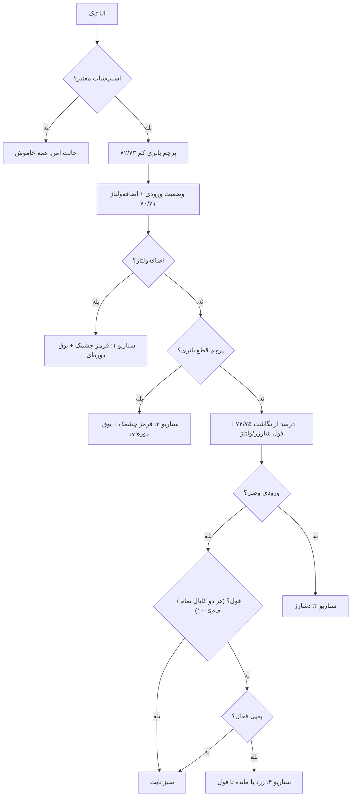
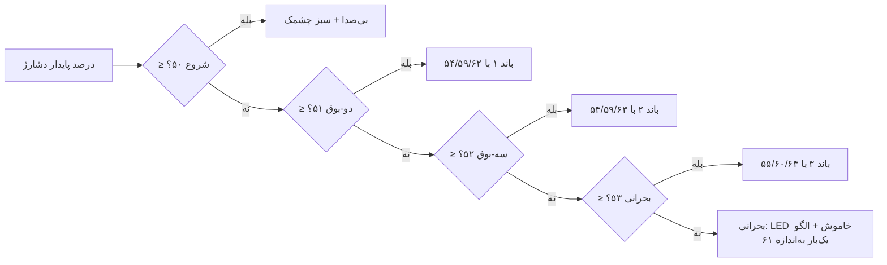

# پنل وب ESP

[EN] Single-file ESP web panel (`esp_link_panel.ino`): the HTML/JS page
lives in one `R"HTML(...)` raw string; the C++ below it serves HTTP +
talks the section-3 frame protocol to the STM32 over UART.
[FA] پنل وب ESP تک‌فایل است: کل صفحهٔ HTML/JS در یک رشتهٔ خام `R"HTML(`
و C++‎ پایین آن HTTP را سرو و با STM32 روی UART حرف می‌زند.

> قرارداد: با هر تغییری در پنل، این فایل هم به‌روز می‌شود (دستور کاربر ۲۰۲۶-۰۹-۲۶).

## چیدمان و رفتار کارت‌ها (v1.55)

- **شبیه‌ساز هر کارت رفت بالای همان کارت**، بلافاصله پیش از بخش ۱ تنظیمات؛ قبلاً
  جای بعضی‌ها وسط و بعضی‌ها آخر کارت بود.
- **کادر «فاصلهٔ بین بوق‌ها» با یک بوق خاموش می‌شود**: وقتی تعداد بوقِ آن باند ۱
  است، گپ معنا ندارد، پس کادر غیرفعال و کم‌رنگ می‌شود و نمی‌شود رویش نوشت.
  گپ مشترک (۶۵) تا وقتی یکی از باندهای ۱/۳/بحرانی بیش از یک بوق بخواهد روشن
  می‌ماند.
- **شبیه‌ساز عدم‌توازن دو ولوم گرفت**: ولتاژ نیم‌باتری بالا و پایین. اختلافشان با
  «حد اختلاف» سنجیده می‌شود، رویدادها شمرده می‌شوند و در شمارهٔ تعیین‌شده قفل
  می‌کند (قرمز ثابت + بوق دوره‌ای). دکمهٔ «شروع دوبارهٔ شمارش» شمارنده را صفر
  می‌کند. زمان باقی‌مانده تا رویداد بعدی هم نوشته می‌شود.
- **نوار توضیح بالای تب و دکمهٔ میوت حذف شدند** (دستور کاربر).

## وقتی کسی تماشا نمی‌کند، برد را بی‌خود مشغول نکن (v1.54)

ESP هر ۳۰ ثانیه یک `GET_PARAMS` می‌فرستاد و برد کل جدول ۱۲۳ مقداری را پاسخ
می‌داد — حتی وقتی هیچ مرورگری باز نبود. این نوسازی فقط برای «راست نگه داشتن
صفحه‌ای که کسی می‌بیند» وجود داشت، و حالا که چراغ‌های زندهٔ برد از پنل حذف
شده‌اند، بی‌مرورگر هیچ مصرفی ندارد. از v1.54 تا وقتی `/t` خوانده نشود
(`ESP_LINK_BROWSER_LOST_MS` = ۱۰ ثانیه) نوسازی انجام نمی‌شود؛ اولین poll بعد از
وقفه دوباره آن را مسلح می‌کند، پس هرکس صفحه را باز کند باز هم مقدار تازه
می‌بیند. نتیجه: در حالت عادی (پنل بسته) هیچ ترافیک پارامتری روی لینک نیست و
STM32 کاری برای آن انجام نمی‌دهد.

## حذف نوار چراغ‌های زندهٔ بالای صفحه (v1.53)

نوار چسبانِ بالای تب سناریوها که سه LED و بازر و زیرنویس زندهٔ برد را نشان
می‌داد حذف شد (دستور کاربر): شبیه‌ساز هر کارت کار آن را بهتر انجام می‌دهد و
این صفحه ابزار راه‌اندازی است، نه داشبورد. با آن، موتور `uview` که هر ۵۰ ms
کل منطق تیک برد را از روی تله‌متری بازپخش می‌کرد هم رفت؛ آنچه ماند فقط آینهٔ
بیت‌های خطا و تازه‌سازی اعداد کارت‌ها با دورهٔ ۲۵۰ ms است. دکمهٔ میوت سر جایش
ماند. نتیجه: حجم HTML پنل از ۲۶۴٫۶ به ۲۵۸٫۸ کیلوبایت و بار CPU مرورگر کمتر.

## یک کلید سراسری برای ارسال تنظیمات (v1.52)

تا پیش از این هر کادر به‌محض خروج از فوکوس خودش را روی برد می‌فرستاد؛ یعنی
ده‌ها ارسال تک‌تک و بدون هیچ تأییدی. حالا:

- ویرایش‌ها فقط **محلی صف** می‌شوند؛ کادر ویرایش‌شده حاشیهٔ نارنجی می‌گیرد و
  کنارش می‌نویسد «در صف». دکمه‌های «بازگردانی پیش‌فرض» هم به همین صف می‌روند.
- یک نوار ثابت پایین صفحه تعداد تغییرهای ارسال‌نشده را نشان می‌دهد با دو دکمه:
  **ارسال همهٔ تغییرات به برد** و **لغو و برگرداندن از برد**.
- بعد از ارسال، پنل منتظر فریم بعدی تله‌متری می‌ماند و مقدار برگشتی هر شناسه را
  با مقدار فرستاده‌شده می‌سنجد، سپس یکی از این پیام‌ها را می‌دهد:
  «✅ N تنظیم ارسال شد؛ برد همه را عیناً پذیرفت و ذخیره کرد»، یا «✅ N نشست، اما
  برد M مقدار را گیره زد: 39: 60→50»، یا «⛔ هیچ‌کدام ارسال نشد».
- کلیدهای آنی (قطع PWM، کالیبراسیون با مولتی‌متر، بی‌صداکردن) عمداً بیرون از صف
  ماندند، چون خودشان یک عمل فوری و آگاهانه‌اند.

### استقلال اعداد کارت دشارژ

هر ۲۵ عدد قابل‌نوشتن کارت دشارژ (۵۰..۶۷، ۷۴، ۷۵، ۸۰..۸۲، ۱۲۱، ۱۲۲) یک کلمهٔ
جداگانه در `ui_alarm_t` دارند، با همان شناسه روی لینک ست/گت می‌شوند، در NVM
ذخیره می‌شوند و همگی در `ui_led.c` واقعاً مصرف می‌شوند — هیچ‌کدام تزئینی یا
مشترک با دیگری نیست (ممیزی v1.52).

## شبیه‌ساز زندهٔ هر سناریو (v1.51)

سه LED و بازرِ بالای هر کارت دیگر از برد خوانده نمی‌شوند. این پنل ابزار
«راه‌اندازی اولیهٔ برد» است، نه داشبورد کاربر؛ پس چیزی که باید ببینید این است
که «با عددهایی که همین الان دارم تایپ می‌کنم، برد چه کار خواهد کرد».

- هر کارت یک جعبهٔ «شبیه‌ساز این سناریو» دارد: سه چراغ (قرمز/سبز/زرد)، یک
  نشانهٔ بازر و یک خط توضیح، به‌علاوهٔ دکمهٔ توقف/ادامه.
- همهٔ چهره‌ها با ساعت خود مرورگر (هر ۶۰ ms) و با همان حساب فرمور ساخته
  می‌شوند: دوره × duty برای چشمک، و «تعداد × مدت + گپ» برای بوق.
- کارت‌های ۳ و ۴ یک اسلایدر درصد و کارت ۵ یک اسلایدر ولتاژ دارند تا بتوانید
  باندها و آستانه‌ها را بدون باتری واقعی جابه‌جا کنید.
- کارت ۵ چهرهٔ LED جدا ندارد؛ فقط پرچم آلارم را با بازهٔ ضدلرزش نشان می‌دهد.
- چون هیچ داده‌ای از برد لازم نیست، شبیه‌ساز آفلاین هم کار می‌کند.

## طراحی (v1.16f)

سیستم دیزاین یکدست تیره (تک‌فایل آفلاین، بدون وابستگی خارجی):
توکن‌های CSS (`--bg/--cd/--in/--rs/--ln/--tx/--mu` + آکسی `--ac` و
معنایی `--ok/--wa/--er`)؛ هدر شیشه‌ای چسبان با نشان وضعیت لینک؛ تب‌های
سگمنتی با قرص فعال؛ کارت‌ها با سایهٔ نرم و نوار آکسی کنار تیتر؛ دکمه‌ها
و ورودی‌ها هم‌ارتفاع (۳۶px) با حلقهٔ فوکوس؛ تگ‌های وضعیت نقطه‌دار؛ نوار
LED چسبان با پس‌زمینهٔ مات؛ نمودارها با بوردر و لجند خواناتر (ارتفاع
۱۶۰px). رنگ‌های هاردکد JS (خطوط canvas، نمودار SVG مراحل، نوارهای
آستانه، بوردر خطای نگهبان) با همین پالت یکدست شدند. رفتار/شناسه‌ها/
کلاس‌ها دست‌نخورده — فقط لایهٔ دیداری عوض شده است.

## تب‌ها

| تب | محتوا |
|---|---|
| پنل (۰) | ولتاژها، وضعیت لینک، دو کانال شارژر (مرحله/جریان/duty)، فرمول‌ها، نمودار مراحل شارژ + جدول یکی شده ولتاژ و وضعیت آلارم؛ تعداد نقاط هر نمودار جریان زیر همان نمودار قابل تنظیم است |
| داده‌برداری بنچ (۱) | ویزارد دستی ثبت بنچ + ابزارها (همه دستی؛ هیچ ضریبی خودکار ارسال نمی‌شود)؛ sweep خودکار duty با گام ۱٪ (پیش‌فرض روشن، از..تا) یا فهرست دستی؛ شروع با فایل قبلی = پنجره مودال «دانلود و ادامه» یا «پاک و تازه» |
| تنظیمات (۲) | پنج زیرتب |

زیرتب‌های تنظیمات:

| زیرتب | محتوا |
|---|---|
| شارژ و PID (s0) | نمودار مراحل شارژ با راهنمای رنگ بیرون از کادر + کارت PID دوحلقه‌ای (۱۷ ضریب ۷۷..۹۲ + به‌علاوهٔ فیلتر ولتاژ ۹۹) + ۱۳ تراشهٔ حد زیر نمودار در سه دستهٔ «رسیدن نرم به هدف» (duty step، hyst، V filter)، «ترمز اضطراری و حاشیهٔ امن» (Backstop gain I/V، margin) و «تصمیم‌های زمانی» (هفت تایمر ماشین حالت) + یک کلید بازگردانی کارخانه برای کل محدوده |
| سناریوها (s1) | هدر چسبان آینه + انتخاب‌گر ۶ کارت هم‌شکل (۲۷..۸۲ و ۱۰۸..۱۱۸) + نگهبان خودش + دکمهٔ پیش‌فرض سناریوها |
| نظارت و ایمنی (s2) | کارت‌های ۲۷..۳۷ (نظارت باتری، پنجرهٔ ورودی، سقف‌ها) + نگهبان خودش + دکمهٔ پیش‌فرض خودش |
| کالیبراسیون و فیلتر جریان (s3) | پنجره‌های فیلتر جریان ۷/۸ + کالیبراسیون جریان ۰..۳ و ۹..۱۰ |
| پشتیبان‌گیری (s4 — آخرین زیرتب) | فقط کارت بکاپ سراسری ۱۰۲تایی |

کارت یکی شده ولتاژها و وضعیت آلارم (v1.16k): یک جدول ثابت ۷ ردیفه (ورودی، پک، نود، دو باتری، دو جریان) که هر مقدار فقط یک بار با قرص وضعیت کنارش نشان داده می شود؛ چیدمان ثابت است و با تغییر متن به هم نمی ریزد. کالیبره مولتی متر هر سه ولتاژ اول در همان ردیف است. جعبه fault با LED جدا برای هر بیت + نقطه زنده سر جایشان هستند و هر فریم به روز می شوند.
هر ۴ نوار آستانه حذف شدند (ورودی در v1.16i، سه تای دیگر با عنوان هایشان در v1.16j)؛ فقط باکس ها ماندند.

نام‌گذاری یکدست انتخاب‌گر سناریو: ۱ · اضافه‌ولتاژ، ۲ · قطع باتری،
۳ · دشارژ، ۴ · شارژ عادی، ۵ · باتری کم، ۶ · عدم‌توازن.

### شش کارت سناریو — یک قالب مشترک (v1.43 برای شارژ، v1.44 برای بقیه)

هر شش کارت حالا یک شکل دارند و سه چیز را با هم می‌دهند:

1. **جعبهٔ «این سناریو کِی می‌آید؟»** — شرط ورود، شرط خروج (و اینکه هیسترزیس کجاست) و چهرهٔ LED/بوق.
2. **بخش‌های شماره‌دار تنظیم** — آستانه‌ها، چشمک و بوق هرکدام جدا، نه یک ردیف طولانی.
3. **خط‌های محاسبه‌شده زیر هر بخش** — همان عددی که برد به‌کار می‌برد، از مقدار «تایپ‌شده یا اعمال‌شده»، با همان ترتیب گام‌های فرمور. هیچ منطقی در پنل ساخته نشده است.

| کارت | چه چیزی اضافه شد |
|---|---|
| ۱ · اضافه‌ولتاژ | ورود/خروج بر حسب mV (آستانه و آستانه − hysteresis)، میلی‌ثانیهٔ روشن/خاموش قرمز از دوره×duty، پنجرهٔ بوق (مدت×تعداد+گپ‌ها) با سکوت بین دو الگو و هشدار «در دوره جا نمی‌شود» + نقطهٔ قرمز زنده |
| ۲ · قطع باتری | دو تشخیص جدا (قطع حین شارژ با دبانس، غیبت/بازگشت با دبانس‌ها) + فاصلهٔ mV غیبت تا بازگشت + اعداد چشمک و الگوی بوق + نقطهٔ قرمز زنده |
| ۳ · دشارژ (v1.45/v1.47) | **صاحب** حد پایین/بالای ولتاژ (بقیهٔ کارت‌ها فقط نمایش می‌دهند) + **یک بلوک برای هر باند**: سقف درصد، تعداد بوق، مدت، فاصلهٔ تکرار و گپِ همان باند کنار هم، و زیر هر بلوک بازهٔ درصد/ولتاژ، سبز روشن/خاموش در میانهٔ باند و پنجرهٔ بوق با «در فاصله جا می‌شود؟». بلوک بحرانی جدا و قرمزرنگ است + خط ترتیب باندها + نقطهٔ سبز زنده |
| ۴ · شارژ عادی | تعریف فول و جدول چشمک زرد (پایین‌تر) |
| ۵ · باتری کم | تصریح اینکه LED اختصاصی ندارد و فقط پرچم است + معادل درصدیِ آستانه و سطح پاک‌شدن روی نردبان ۷۴/۷۵ (تا با باندهای دشارژ هم‌تراز شود) + هشدار «پاک‌شدن زیر آستانه» |
| ۶ · عدم‌توازن | پنج گام روند (اندازه، گیت زمانی، رویداد، قفل، بعد از قفل) + خط گیت/پایداری و خط قفل با «کمترین زمان ممکن تا قفل = سقف رویداد × پایداری» |

### «پایداری درصد» یعنی چه (v1.47)

کارت حالا خودش با زبان ساده توضیح می‌دهد (v1.48: بازنویسی ساده‌تر به‌خواست کاربر): درصد خام هر تیک از ولتاژ حساب می‌شود و روی باتری
واقعی چند واحد بالا-پایین می‌پرد؛ برد به‌جای آن یک «درصد پایدار» نگه می‌دارد و
همهٔ تصمیم‌ها (چشمک سبز، باند بوق) را با آن می‌گیرد:

- **hysteresis (۸۰)** — پایدار فقط وقتی حرکت می‌کند که خام دست‌کم این مقدار از
  آن دور شود؛ متن کارت با همان عدد یک مثال عددی زنده می‌سازد. صفر = بدون
  ضدلرزش.
- **خروج از ۰٪ (۸۱)** — وقتی پایدار ۰ است تا خام به این عدد نرسد ۰ می‌ماند و
  بعد اول به ۱ می‌رود.
- **خروج از ۱٪ (۸۲)** — وقتی پایدار ۱ است، خام ۰ آن را به ۰ می‌برد و این عدد یا
  بیشتر به ۲.

این دو آستانهٔ آخر نمی‌گذارند ته باتری، بوق بحرانی مدام شروع و قطع شود (آینهٔ
`func__Ui_UpdateBatteryStablePercent`).

### گرد کردن ممنوع: درصد باید مثل برد کف‌گیری شود (v1.46)

`func__Ui_BatteryVoltageToPercent` تقسیم صحیح می‌کند؛ پس روی نردبان
۲۱۰۰۰..۲۹۰۰۰، ولتاژ ۲۱۲۰۰ برای برد **۲٪** است نه ۳٪. پنل در دو جا گرد می‌کرد
(آینهٔ LED و خط‌های محاسبه‌شدهٔ کارت‌ها) و همین نزدیک مرز باندها یک واحد جلوتر
از برد می‌افتاد. حالا:

- ولتاژ → درصد با `Math.floor`، دقیقاً مثل برد.
- درصد → ولتاژ با `Math.ceil`، یعنی «اولین mV که برد همان درصد را گزارش
  می‌کند» — این جهت در فرمور معادل ندارد و فقط نمایشی است.

### باند ۲ دشارژ صاحب شکل بوق خودش شد (v1.50 — شامل تغییر فرمور)

کاربر پرسید «فقط باند ۲ تکراری است؟» — بله: باند ۲ تنها باندی بود که **مدت هر
بوق (۵۹)** و **گپ (۶۵)** را از باند ۱ قرض می‌گرفت (باندهای ۳ و بحرانی فقط گپ را
مشترک دارند). به دستور کاربر این دو جدا شدند:

| چیز | قبل | حالا |
| --- | --- | --- |
| مدت هر بوق باند ۲ | ۵۹ (مشترک با باند ۱) | **۱۲۱ (مستقل)** |
| گپ باند ۲ | ۶۵ (مشترک همهٔ باندها) | **۱۲۲ (مستقل)** |
| فاصلهٔ تکرار باند ۲ | ۵۴ | ۵۴ — عمداً مشترک ماند (کاربر فقط آن دو را نام برد) |

پیامدها در فرمور: کف ۱۰۰ms گپ برای باند ۲ روی گپ خودش اعمال می‌شود، گیرهٔ مدت
باند ۱ دیگر مجبور نیست در تعداد باند ۲ جا شود، و باند ۲ با مدت/گپ خودش بوق
می‌زند. `ESPLINK_PARAM_COUNT` → ۱۲۳، `ESP_LINK_NVM_ENTRY_MAX` ۱۲۲ → ۱۲۴ (۱۲۰
ورودی؛ رکورد تعداد خودش را ذخیره می‌کند پس نسخهٔ NVM بالا نرفت و تنظیمات قبلی
حفظ می‌شود).

### سه پاک‌سازی ظاهری که کاربر خواست (v1.50)

- **باند بی‌صدا بلوک جدا ندارد**: تنها عددش (شناسهٔ ۵۰) داخل «باند ۱» نشست و
  جمله‌اش یک خط زیر همان باند است («بالاتر از N٪ هیچ بوقی نیست…»).
- **عدد تکراری زیر کادرها برداشته شد**: چیپ کنار هر فیلد فقط وقتی حرف می‌زند که
  مقدار برد با چیزی که در کادر است فرق داشته باشد («روی برد: N»)؛ وگرنه ساکت
  است و فقط «پیش‌فرض کارخانه» می‌ماند.
- بند «بیرون آمدن از ۱٪» از توضیح پایداری حذف شد.

### جدا شدن نردبان درصدِ شارژ از دشارژ (v1.49 — شامل تغییر فرمور)

به دستور کاربر، حد ولتاژ درصد دیگر یک رجیستر مشترک بین شارژ و دشارژ نیست:

| سمت | شناسه | مصرف‌کننده‌ها | صاحب در پنل |
| --- | --- | --- | --- |
| دشارژ | ۷۴/۷۵ | باندهای بوق BatteryRun، چشمک سبز، ترجمهٔ نمایشی آلارم باتری کم | کارت ۳ · دشارژ |
| شارژ | **۱۱۹/۱۲۰** | درصد حین شارژ، قفل فول‌شارژ ۷۷/۷۸ | کارت ۴ · شارژ عادی |

- شناسه‌ها ۱۱۹/۱۲۰ شدند چون فضای شناسه سراسری است و ۸۳..۱۱۸ قبلاً گرفته بودند.
- پیش‌فرض هر دو جفت یکی است (۲۱۰۰۰/۲۹۰۰۰)، پس بردِ دست‌نخورده دقیقاً مثل قبل
  رفتار می‌کند؛ فقط از این به بعد جابه‌جاکردن یک سمت، سمت دیگر را تکان نمی‌دهد.
- فرمور: `ui_alarm_t` دو کلمه در انتها گرفت، `func__Ui_VoltageToPercentMap` یک
  فرمول مشترک شد و `func__Ui_ChargeVoltageToPercent` سمت شارژ را تغذیه می‌کند.
  `ESPLINK_PARAM_COUNT` ۱۱۹ → ۱۲۱، `ESP_LINK_NVM_PERSISTED_ID_MAX_HIGH` ۱۱۸ →
  ۱۲۰ (۱۱۸ ورودی از ۱۲۲ جای رکورد؛ نسخهٔ رکورد عوض نشد، پس تنظیمات قبلی حفظ
  می‌شود و دو شناسهٔ جدید با پیش‌فرض بالا می‌آیند).

### مقدار مشترک: یک جای نوشتن، بقیه فقط نمایش (v1.47)

بعضی مقادیر به بیش از یک جا تعلق دارند: نردبان ۷۴/۷۵ در دشارژ، شارژ و آلارم
باتری کم به‌کار می‌رود، و مدت/فاصله/گپ بین باندهای دشارژ مشترک‌اند. قاعدهٔ
فعلی (دستور کاربر):

- هر پارامتر مشترک **دقیقاً یک فیلد قابل‌نوشتن** دارد. صاحب‌ها: نردبان ۷۴/۷۵ در
  کارت ۳ · دشارژ؛ مدت ۵۹، فاصله ۵۴ و گپ ۶۵ در «باند ۱».
- هر جای دیگر فقط یک بازتاب **فقط-خواندنی** است (`<b class="qmv" data-q="<id>">`)
  با برچسبی که می‌گوید صاحبش کجاست و دکمهٔ پرش به همان کارت.
- `qmfill()` بازتاب‌ها را از همان منبعی پر می‌کند که فیلد اصلی نشان می‌دهد
  (تایپ‌شده، وگرنه اعمال‌شدهٔ برد، وگرنه پیش‌فرض)؛ اگر عدد تایپ‌شده هنوز اعمال
  نشده باشد، بازتاب زردرنگ می‌شود.
- دلیل حذف نسخهٔ قابل‌نوشتنِ دوم (v1.45 → v1.47): دو فیلد روی یک رجیستر صادق
  نمی‌مانند — بازندهٔ آخرین ویرایش عددی را نشان می‌دهد که برد ندارد.

### پیش‌فرض کارخانه زیر هر فیلد و هم‌ترازی (v1.47)

- زیر هر فیلد عددی، «پیش‌فرض کارخانه: X» نوشته می‌شود. عدد از **همان جدولی**
  می‌آید که دکمه‌های بازگردانی استفاده می‌کنند (`ADEF`/`IDEF`/`PDEF`/`LDEF`)،
  پس پیش‌فرضِ نوشته‌شده هیچ‌وقت از دکمه‌اش جدا نمی‌افتد.
- فیلدها از ردیف flex به **گرید** تبدیل شدند و عنوانِ هر فیلد فضای خالی را
  می‌گیرد؛ قبلاً عنوان دوخطی ورودیِ خودش را پایین می‌انداخت و ردیف بالا-پایین
  می‌شد.

### کارت «۴ · شارژ عادی» — یک صفحهٔ کاربردی (v1.43)

دستهٔ کارت به چهار بخش شماره‌دار تقسیم شد و هر چیزی که برای تنظیم فول لازم
است داخل همین کارت آمد؛ دیگر لازم نیست بین دو کارت رفت‌وبرگشت شود:

| بخش | محتوا | شناسه |
|---|---|---|
| توضیح فول | «فول شارژری» (هر کانال فعال در FLOAT) در برابر «فول ولتاژی» (درصد ≥ ورود فول) و معنی دقیق ورود/خروج | — |
| ۱ · حد ولتاژ باتری | حد پایین = ۰٪ و حد بالا = ۱۰۰٪ + خط محاسبه‌شدهٔ «هر ۱٪ چند mV» | ۷۴، ۷۵ |
| ۲ · فول | ورود فول و خروج فول + معادل mV و پهنای هیسترزیس هر دو | ۷۷، ۷۸ |
| ۳ · چشمک زرد و پایداری | دوره، حداقل روشنی، هیسترزیس درصد شارژ | ۶۸، ۶۹، ۷۹ |
| ۴ · اعداد چشمک | فرمول گام‌به‌گام + جدول درصد → ولتاژ → مانده → روشن/خاموش (ms) + خط زنده و یک نقطهٔ زرد که با همان اعداد چشمک می‌زند | — |

حد ولتاژ (۷۴/۷۵) از کارت «باتری و درصد» به اینجا منتقل شد؛ کارت ۵ حالا فقط
آلارم باتری کم (۷۲/۷۳) است و یک دکمهٔ پرش به کارت ۴ دارد. نگاشت همچنان
سراسری است و درصد دشارژ و آلارم هم از همین دو عدد ساخته می‌شود.

حساب جدول دقیقاً آینهٔ `func__Ui_ScenarioCharging_Tick` است و منطق برد عوض
نشده: مانده = ۱۰۰ − درصد پایدار با کف ۲٪، گام = دوره ÷ ۱۰۰، روشن = مانده ×
گام با کف «حداقل روشنی» و سقف دوره، خاموش = دوره − روشن؛ درصد صفر یعنی زرد
ثابت روشن.

سقف اندازهٔ پنل (`ESP_PANEL_HTML_MAX_BYTES`) در دو حرکت عمدی از ۲۰۸ به ۲۲۴
(v1.43) و بعد ۲۵۶ کیلوبایت (v1.44) رفت — هر دو مستند در `plink_config.h`.

### ممیزی این کارت‌ها

`esp_link_panel/Tester/host_test_scenario_cards.js` صفحهٔ واقعیِ تولیدشده را در
DOM بار می‌کند، در ورودی‌های واقعی تایپ می‌کند و روی خط‌های محاسبه‌شده assert
می‌زند (۷۶ تست؛ شامل بلوک‌های باند و همگامی ورودی‌های آینه‌ای). مقدار انتظارشده دستی از فرمور درآمده، نه کپی از پنل؛ پس اگر
فرمول پنل از برد جدا بیفتد تست رد می‌شود. مثل تست کلیک، نبودن jsdom یعنی SKIP.

## آینهٔ LED و بازر

هدر چسبان بالای سناریوها (هر ۵۰ms): ۳ LED با دوره/dutyِ اعمال‌شدهٔ
برد (فاز محلی)، نماد بازر (کم‌نور = ساکت، روشن = در حال بوق، ✕ =
میوت)، نام سناریوی فعال، خوانش زندهٔ زمان‌بندی مؤثر (دوره/duty/تعداد
بوق/آستانه‌ها از مقادیر اعمال‌شدهٔ برد) و دکمهٔ میوت. میوت فقط زمان کار
با پنل است (RAM؛ با ریست برد پاک می‌شود) و فیلد مخفی `q76` را دارد.

## روند سناریوها

هر تیک برد فقط یک سناریو برنده می‌شود (اولویت از بالا؛ جزئیات کامل:
بخش 5.10 اسپک):


```mermaid
flowchart TD
    A["تیک UI"] --> B{"اسنپ‌شات معتبر؟"}
    B -- نه --> Z["حالت امن: همه خاموش"]
    B -- بله --> C["پرچم باتری کم ۷۲/۷۳"]
    C --> D["وضعیت ورودی + اضافه‌ولتاژ ۷۰/۷۱"]
    D --> E{"اضافه‌ولتاژ؟"}
    E -- بله --> S1["سناریو ۱: قرمز چشمک + بوق دوره‌ای"]
    E -- نه --> F{"پرچم قطع باتری؟"}
    F -- بله --> S2["سناریو ۲: قرمز چشمک + بوق دوره‌ای"]
    F -- نه --> G["درصد از نگاشت ۷۴/۷۵ + فول شارژر/ولتاژ"]
    G --> H{"ورودی وصل؟"}
    H -- بله --> I{"فول؟ (هر دو کانال تمام / خام≥۱۰۰)"}
    I -- بله --> S0["سبز ثابت"]
    I -- نه --> J{"پمپی فعال؟"}
    J -- بله --> S4["سناریو ۴: زرد با مانده تا فول"]
    J -- نه --> S0
    H -- نه --> S3["سناریو ۳: دشارژ"]
```


```mermaid
flowchart LR
    P["درصد پایدار دشارژ"] --> G1{"≥ شروع ۵۰؟"}
    G1 -- بله --> B0["بی‌صدا + سبز چشمک"]
    G1 -- نه --> G2{"≥ دو-بوق ۵۱؟"}
    G2 -- بله --> B1["باند ۱ با ۵۴/۵۹/۶۲"]
    G2 -- نه --> G3{"≥ سه-بوق ۵۲؟"}
    G3 -- بله --> B2["باند ۲ با ۵۴/۵۹/۶۳"]
    G3 -- نه --> G4{"≥ بحرانی ۵۳؟"}
    G4 -- بله --> B3["باند ۳ با ۵۵/۶۰/۶۴"]
    G4 -- نه --> BC["بحرانی: LED خاموش + الگو یک‌بار به‌اندازه ۶۱"]
```

آناتومی هر بوق: دوره + پنجره (دوره×duty) + تعداد + گپ؛ شرط جا شدن:
`مدت×تعداد + گپ×(تعداد−۱) ≤ پنجره`. دوره/duty/تعداد صفر همیشه سکوت
عمدی است. بوق بحرانی duty مستقیم (۵۷) دارد و اگر الگو در پنجره جا
نشود، برد تعداد (۵۸) را کم می‌کند و پنل قرمز هشدار می‌دهد (v1.16e).

## بکاپ سراسری

یک کارت «پشتیبان‌گیری همهٔ تنظیمات» در زیرتب خودش (s4، آخرین زیرتب تنظیمات از v1.42 به دستور کاربر):
خروجی/ورودی JSON هر ۱۰۲ مقدار ماندگار (۰..۱۴، ۲۰..۷۵، ۷۷..۱۰۷) در
`changeover-settings.json`. ورودی با تأیید، یکی‌یکی روی برد اعمال
می‌کند؛ گذراها (۱۵..۱۹ و میوت ۷۶) جزو بکاپ نیستند. شناسه‌های بدون
فیلد (کالیبراسیون/فعال‌سازی) بی‌صدا اعمال می‌شوند.

## قراردادهای پنل

- همه‌چیز با مقادیر **اعمال‌شدهٔ** برد کار می‌کند (`D.p`)؛ ماسک‌های
  pending در ‎/t‎‏: `q` برای ۰..۳۱، `q2` برای ۳۲..۶۳، `q3` برای ۶۴..۸۲.
- نگهبان‌ها (`qchk` profile، `achk` آلارم/سناریو): ترکیب نامعتبر =
  هشدار قرمز + کادر قرمز + تأیید قبل از ارسال؛ برد همیشه گیره می‌زند.
  `achk` یکی است ولی خروجی‌اش دوشاخه است: `aw` در s2 (فقط ۲۷..۳۷) و
  `aw2` در s1 (فقط ۳۸..۸۲)؛ دکمه‌های پیش‌فرض هم جدا‌اند (`adef` برای
  ۲۷..۳۷، `sdef` برای ۳۸..۸۲).
- CSV بنچ ۱۳۴ ستون با بلوک‌های `[profile]` و `[alarms]` و `[uicad]`.
- شناسه‌ها نهایی‌اند و دوباره شماره نمی‌شوند (۰..۹۲؛ تنها استثنا بلوک PID بود که هرگز روی سخت‌افزار نرفت: در v1.23 یکی پایین آمد چون پرچم فعال‌سازی v1.22 حذف شد، و در v1.24 پنج‌تا کوتاه‌تر شد چون ردیف ضریب سوم اندازه‌گیری شد و هیچ سودی نداشت).

## اندپوینت‌ها

| مسیر | جهت |
|---|---|
| `/` | صفحه (no-store) |
| `/f.css?v=2` | فونت وزیرمتن (کش نسخه‌دار) |
| `/t` (GET) | تله‌متری JSON: `{on,age,seq,fl,n,q,q2,q3,ka,t[20],p[83]}` |
| `/s?id&v` (POST) | ثبت یک پارامتر |
| `/m` (POST/GET) | ریست/خواندن پنجرهٔ آمار |
| `/benchlog`, `/benchlog/add`, `/benchlog/clear` | فایل ثبت بنچ (CSV) |

## پیش‌نمایش آفلاین

```sh
node tools/panel_preview_server.js   # http://localhost:3000
```

همان HTML واقعی را از ino بیرون می‌کشد و STM32 را شبیه‌سازی می‌کند
(۹۳ پارامتر + کلَمپ آینه + ماسک q3 + چرخهٔ نمایشی سناریوها برای آینه).
نکتهٔ تست: GET ساده ممکن است از کش میانی برگردد — با `?cb=` تصادفی
بخوانید؛ POST را با curl بزنید؛ بعد از هر POST حدود ۱۵۰ms صبر کنید
(تیکر ۱۰۰ms اسنپ‌شات).

## ساختار فایل‌ها (از v1.16o)

برنامه ESP از یک فایل ۲۴۷۰خطی به ۸ فایل در همین پوشه تقسیم شد؛ همه با `#include` در یک واحد ترجمه سر هم می‌شوند و ترتیبشان مهم است، پس رفتار هیچ فرقی نکرده است:

| فایل | چه دارد |
|---|---|
| `esp_link_panel.ino` | سرفصل + includeها + `setup`/`loop` |
| `plink_config.h` | ثابت‌های لینک/پیام/پارامتر، سرفصل CSV بنچ، وضعیت‌های پارسر |
| `plink_params.h` | پاکت‌های گیره سمت ESP + ترتیب ارسال |
| `plink_state.h` | بافرها، داده زنده، صف ارسال، آبجکت سرور |
| `plink_panel.h` | خود HTML پنل (PROGMEM) — برای ویرایش ظاهر فقط همین فایل |
| `plink_font.h` | فونت وزیرمتن (PROGMEM) |
| `plink_link.h` | ارسال/دریافت فریم UART، ذخیره TLM، پنجره آمار بنچ |
| `plink_http.h` | هندلرهای `/` `/t` `/s` `/m` `/benchlog` |

## تاریخچه (خلاصهٔ پنل)

| نسخه | تغییر پنل |
|---|---|
| v1.42 | تراشه‌های ۱۳تایی زیر نمودار در سه دستهٔ تعریف‌شدهٔ کاربر (رسیدن نرم / ترمز اضطراری و حاشیه / تصمیم‌های زمانی)؛ زیرتب پشتیبان‌گیری آخرین تب تنظیمات شد؛ حباب راهنمای نمودار با همان سه دسته و مثال عددی بازنویسی شد؛ قلم پایه و اندازه‌های متنی واکنش‌گرا (clamp/em) و شبکه‌های کارت خودجمع‌شونده با عرض صفحه |
| v1.41 | ممیزی درخواستی کاربر: چهار اشتباه تایپی/واژگانی تولتیپ‌ها اصلاح، ظرف مردهٔ ZL حذف (قید تستر به PL/LL به‌روز شد)، درصد واقعی در حباب PID یکدست شد |
| v1.40 | بازنویسی هر ۱۵ تولتیپ پارامترهای حد با الگوی «یک جملهٔ ساده + مثال عددی با اعداد کارخانه + اثر بیشتر/کمتر» |
| v1.39 | نام ناحیه‌ها از روی نمودار به «راهنمای رنگ‌ها» بیرون از کادر منتقل شد (یک فهرست واحد برای باندها و راهنما)؛ نمایش duty همه‌جا درصد واقعی شد (ردیف سقف duty درصد می‌خواند و درصد قبول می‌کند، سیم همان پرمیل؛ نمایش زنده و ورودی دستی از قبل درصد بود)؛ واحد hyst به‌صورت m‰ روی تراشه؛ «Arm» به «شروع شمارش / Count start» رسید با اشارهٔ فرموری برای ردیابی CHG_ABSORB_MAX_ARM_MA |
| v1.38 | برچسب فارسی خطوط نمودار فقط یک‌بار و زیر هر خط؛ نام ناحیه‌ها وسط باند؛ یک کلید بازگردانی کارخانه برای کل محدوده (به‌جای دو کلید)؛ واحد نرخ‌های Ki ساده‌نویسی شد (هزارمِ‌پرمیل در ثانیه) |
| v1.35 | زمان‌ها و گین‌ها از روی نمودار به نوار تراشهٔ زیر آن منتقل شدند |
| v1.34 | پنجمین زیرتب «کالیبراسیون و فیلتر جریان»؛ کارت‌های کالیبراسیون/فیلتر از زیرتب شارژ خارج شدند |
| v1.33 | کارت PID داخل زیرتب «شارژ و PID» نشست و زیرتب مستقلش حذف شد |
| v1.17b | فول واقعی از شارژر: کپشن «فول» آینه از فعال‌سازهای ۱۱/۱۲ + وضعیت FLOAT در TLM؛ تکه «شارژر بیکار» از کپشن و روند حذف؛ فرم ورود عدد بنچ بالای جدول (wF0) — ورود داده بدون اسکرول افقی، اسکرول خودکار فقط داخل جدول |
| v1.23 | حذف پرچم فعال‌سازی PID و شماره‌گذاری دوبارهٔ بلوک به ۸۳..۹۷ (۹۸ پارامتر)؛ پیش‌فرض‌های کالیبرهٔ کارخانه؛ اصلاح باگ `sdef()` که به شناسه‌های PID مقدار نامعتبر می‌فرستاد |
| v2 | قاب CRC-16 با بایت نسخه (اندازهٔ TLM ۸۴→۱۰۴، پنج فیلد شمارش خام)، بنر ناهم‌نسخگی روی صفحه، توضیح هر ۹۳ پارامتر در «!» هر بخش، تم با نردبان ارتفاع اندازه‌گیری‌شده، ارتفاع نمودار نصف، و لاگ بنچ با خط `# settings:` یک‌باره |
| v1.24 | حذف ردیف ضریب سوم (۹۳ پارامتر، ۸۳..۹۲)؛ کارت «PID دوحلقه‌ای CC/CV» با توضیح اینکه چرا یک PID تنها کافی نیست؛ حذف ماسک چهارم q4؛ Kp ولتاژ ۱۵۰→۵۰ و پیش‌فیلتر ۱۶→۳۲ برای آرام‌تر شدن duty زیر نویز |
| v1.22 | زیرتب «PID شارژ» با ۱۶ ضریب (۸۳..۹۸)؛ ماسک چهارم q4 برای ۹۶..۹۸؛ بافر JSON ۲۰۴۸→۲۵۶۰؛ CSV بنچ ۱۵۰ ستون با بلوک `[pid]`؛ بکاپ ۹۳تایی؛ نگهبان ترکیب PID (نرخ صعود Absorb باید از Bulk کندتر بماند) |
| v1.17 | شش پارامتر سناریوی عدد شارژ ۷۷..۸۲ (ورود/خروج فول ۱۰۰/۹۵، hysteresis شارژ ۵، hysteresis دشارژ ۲، خروج‌های ۰٪/۱٪ ۲/۳) + پیش‌فرض ۶۹ از ۱۰ به ۱۵۰؛ گارد ورود≥خروج+۱ (۷۷ مرجع)؛ کارت ucard4 میزبان q77..q79 و ucard3 میزبان q80..q82؛ ماسک q3 تا ۸۲؛ CSV بنچ ۱۳۴ ستون؛ بکاپ ۷۷تایی؛ آینه با مقادیر پیش‌فرض جدید |
| v1.16x | آینه LUT کانال ۱ با جدول توان v1.19 برد یکسان شد (۱۷ لنگر سوییپ SOLO1 با دروازه نویز (۵،۰)؛ نمایش tap بنچ حالا توان/جریان کانال ۱ را هم مثل برد نشان می‌دهد) |
| v1.16w | آینه LUT کانال ۲ با برازش سرتاسری v1.18 برد یکسان شد (۱۴ لنگر؛ لنگر (۳۹۰،۶۰۳۵) اضافه و ۵ لنگر میانی جابه‌جا شدند تا دریفت ‎-4..-8mA ناشی از فیت اعشاری از بین برود) |
| v1.16v | آینه LUT کانال ۲ با بازبرازش v1.17 برد یکسان شد (۱۳ لنگر: دروازه نویز (۲۰،۰) + نقاط (۲۵۳،۳۱۸۰) و (۳۱۲،۴۵۰۰) + جابه‌جایی (۲۸۳،۳۸۶۰) و (۳۵۳،۵۲۸۰))؛ نمایش tap بنچ حالا همان توان/جریان جدید برد را نشان می‌دهد |
| v1.16u | ممیزی رفتار نمایشی: آینه LED/بوق مثل برد شد (فقط BULK/ABSORB یعنی شارژ فعال نه FLOAT؛ درصد/باتری‌کم/فول از ولتاژ پک ۲۴V نه ماکس نیمه‌ها) |
| v1.16t | ممیزی برد و ESP: فرمول‌های زنجیره با برد یکسان شد (فیلتر روی شمارش خام بعد تبدیل، ثابت 8.7767، جبران V12، آینه جدول LUT کانال ۲) + هشدار ETA صفر کانال ۲ در کارت کالیبراسیون |
| v1.16s | ممیزی تنظیمات: کارت کالیبراسیون جریان (۰..۳ و ۹..۱۰) به زیرتب شارژ و فیلتر اضافه شد؛ دکمه فیکس کنار صفر هر کانال (duty ثابت با حفاظتها)؛ همه توضیحات طولانی رفتند پشت دکمه ! در سربرگ هر کارت؛ سقف q24 با برد یکسان شد (۱۴۰۰۰) |
| v1.16r | ردیف مود و ردیف duty دستی یکی شدند (مود + خودکار/دستی + duty + اعمال + صفر در یک ردیف)؛ عدد duty هم‌فونت جریان باتری شد (تگ b) |
| v1.16q | مرتب‌سازی کارت شارژر: جدول زنجیره سه‌ستونه شد (برچسب/عدد/واحد) تا اعداد زیر هم بیایند، لیبل جریان کوتاه شد، خط ثابت‌ها هم‌خانواده ۱۲px |
| v1.16p | کارت کنترل دستی پایین پنل حذف شد؛ هر کارت شارژر دکمه صفر کنار اعمال گرفت و دو مقدار جریان/duty کنار هم چیده شدند (هشدار ۱۰ ثانیه بستن پنل داخل کارت ماند) |
| v1.16o | سقف duty هر کانال هم رفت داخل کارت همان شارژر (زیر کادر duty دستی)؛ کارت کنترل دستی فقط هر دو صفر + وضعیت زنده ماند |
| v1.16m | فیکس ممیزی لینک: پاکت ESP برای بازگشت Float (۲۴) سقف ۱۳۲۰۰→۱۴۰۰۰ شد (شناور−۳۰۰ با Float حداکثر ۱۴۳۰۰)؛ هر ۷۷ پاکت با گیره برد چک شد |
| v1.16n | سوییچ مود از کارت کنترل دستی به داخل کارت هر شارژر رفت: دو دکمه خودکار/دستی زیر نوار duty (هر دو کارت یک مود سراسری را نشان میدهند)؛ کارت کنترل دستی فقط هر دو صفر + سقف ها + وضعیت زنده ماند |
| v1.16l | ورود duty دستی هر کانال رفت داخل کارت همان شارژر (زیر نوار duty)؛ کارت کنترل دستی فقط سوییچ مود + هر دو صفر + سقف ها ماند |
| v1.16k | بازنویسی کامل نمایش وضعیت: کارت ولتاژها و کارت آلارم یکی شدند؛ یک جدول ثابت که هر مقدار فقط یک بار است و دیگر کوچک و بزرگ نمی شود؛ قرص وضعیت و کالیبره در همان ردیف؛ جعبه fault و نقطه زنده ماندند |
| v1.16j | سوال فایل قبلی بنچ شد پنجره مودال وسط صفحه (دانلود+ادامه / پاک+تازه / انصراف)؛ کادر دستی و sweep بر اساس حالت خودکار غیرفعال می شوند تا معلوم باشد کدام اجرا می شود؛ حذف کامل هر ۳ نوار آستانه باقی مانده با عنوان هایشان |
| v1.16i | تب پنل: (۱) تعداد نقاط هر نمودار جریان با ورودی زیر همان نمودار (موجود/قابل‌تنظیم، جایگزین کنترل سراسری)؛ (۲) کارت وضعیت آلارم‌ها رفت زیر ولتاژها + نقطهٔ زندهٔ چشمک‌زن هر فریم؛ (۳) حذف نوار پروگرس ولتاژ ورودی (تکراری) |
| v1.16h | بنچ: sweep خودکار duty با گام ثابت ۱٪ (از..تا، پیش‌فرض ۱..۵۰ و روشن؛ فهرست دستی با خاموش‌کردن) + درصد پیشرفت هر مرحله؛ شروع با فایل قبلی = باکس انتخاب «دانلود قبلی و ادامه همان فایل» (پیش‌فرض) یا «پاک کردن و شروع تازه»؛ استاب پریویو هم فایل بنچ را حالت‌دار شبیه‌سازی می‌کند |
| v1.16g | فیکس هم‌پوشانی: چسبندگی فقط برای نوار اصلی زیرتب‌ها (`#sbt`)؛ انتخاب‌گر سناریو (`#usel`) مثل قبل با اسکرول می‌رود و دیگر روی نوار LED نمی‌افتد؛ زیرتب‌ها همیشه تک‌ردیفه + حاشیهٔ امن زیر نوار چسبان |
| v1.16f | بازطراحی دیداری کامل (دستور کاربر ۲۰۲۶-۰۹-۲۷): سیستم توکن CSS، هدر شیشه‌ای چسبان، تب‌های سگمنتی، دکمه/ورودی هم‌ارتفاع با فوکوس‌رینگ، تگ‌های نقطه‌دار، زیرتب چسبان، نمودار ۱۶۰px؛ رنگ‌های JS هم‌خانواده شد؛ بدون هیچ تغییر رفتاری |
| v1.16e | هر بوق با تعداد+گپ+محدوده در هر دو سمت (گیرهٔ برد برای پنجرهٔ بحرانی + هشدار پنل)؛ خط «روند» هر کارت؛ نمودار اولویت سناریوها |
| v1.16d | بازچینی: سناریوها / نظارت و ایمنی / پشتیبان‌گیری؛ وضعیت رفت ته تب پنل؛ نگهبان و پیش‌فرض جداگانه هر زیرتب؛ اصلاح باگ تودرتویی v1.16c |
| v1.16c | یک بکاپ سراسری ۷۱تایی در سطح تنظیمات؛ باکس+نوار جریان جدا برای هر دو باتری؛ انتخاب‌گر سناریو ۱..۵؛ زیرتب سوم «وضعیت»؛ این README ساخته شد |
| v1.16b | میوت فقط زمان پنل (۷۶ از بکاپ خارج شد)؛ تب آلارم فقط آلارم+سناریو؛ وضعیت/بکاپ در زیرتب سوم |
| v1.16 | ۵ کارت سناریو + انتخاب‌گر؛ هدر چسبان آینه با خوانش زمان‌بندی؛ LED جدا برای هر بیت fault؛ q3؛ CSV با `[uicad]` |
| v1.15b | آلارم‌ها زیرتب داخل تنظیمات؛ وضعیت گروهی بدون چشمک؛ توضیح هر بیت؛ بکاپ JSON |
| v1.15 | تب آلارم‌ها (۲۷..۳۷) با نگهبان و q2 |
| v1.14e/c/d | نمودار مراحل بلندتر، ناحیهٔ Bulk هاشورخورده، نگهبان ترکیب profile |
| v1.14b | تب «تنظیمات»؛ فیلترهای ۷/۸ به آن منتقل شدند |
| v1.12 | تب profile شارژ (۲۰..۲۶) |
