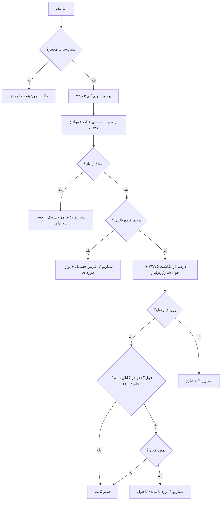
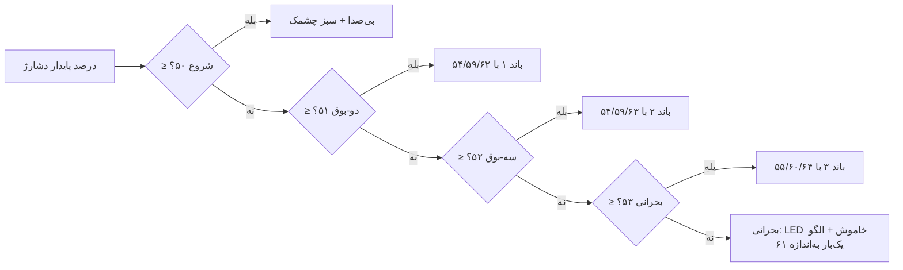

# پنل وب ESP

[EN] The ESP web panel. `esp_link_panel.ino` is the sketch; the page itself
lives in `plink_panel.h` as one `R"HTML(...)` raw string, with HTTP in
`plink_http.h` and state in `plink_state.h`. The sketch serves the page and
talks the v2 frame protocol to the STM32 over UART.
[FA] پنل وب ESP. اسکچ `esp_link_panel.ino` است؛ خود صفحه در `plink_panel.h`
داخل یک رشتهٔ خام `R"HTML(` است، HTTP در `plink_http.h` و وضعیت در
`plink_state.h`. اسکچ صفحه را سرو می‌کند و با قاب v2 روی UART با STM32 حرف می‌زند.

> قرارداد: با هر تغییری در پنل، این برگه و `panel_preview.html` هم به‌روز می‌شوند (دستور کاربر ۲۰۲۶-۰۹-۲۶، تأکید مجدد ۲۰۲۶-۱۰-۰۳).

## فایل‌ها

| فایل | چیست |
|---|---|
| `esp_link_panel.ino` | اسکچ ESP؛ `setup()`/`loop()`، HTTP، و قاب v2 روی UART |
| `plink_panel.h` | کل صفحهٔ HTML/CSS/JS در یک رشتهٔ خام (~۱۹۵KB) |
| `plink_http.h` | مسیرها و JSON؛ دو `static_assert` (اندازهٔ پنل، `ESP_PARAM_COUNT <= 128`) |
| `plink_state.h` | وضعیت و پارامترهای اعمال‌شده |
| `panel_preview.html` | کپی خودکفای آفلاین پنل؛ با `python3 tools/make_panel_preview.py` ساخته می‌شود |
| `Tester/` | هارنس هاست: ۷۹ تست اسکچ + ۱۷۲ تست کلیک پنل |

> **`static_assert` بنویسید، نه `_Static_assert`.** دومی کلیدواژهٔ C است و در ++C وجود ندارد؛ یک‌بار جلوی کامپایل کل اسکچ را گرفت و چون اسکچ build نمی‌شد، هیچ نسخهٔ تازه‌ای از پنل روی برد نمی‌رفت و به‌نظر می‌رسید پنل «عوض نمی‌شود». ممیزی خودکار حالا نامتغیر معکوسش را دارد.

## مُهر بیلد

بالای صفحه یک شناسهٔ کوتاه از محتوای پنل چاپ می‌شود (الان `build 5a14835`). با `python3 tools/stamp_panel.py` بازتولید می‌شود.

این برای حدس‌نزدن است: وقتی مرورگر یا برد نسخهٔ کهنه نشان می‌دهد، دقیقاً شبیه باگ به‌نظر می‌رسد. اگر عددی که روی صفحه می‌بینید با عدد سورس یکی نیست، نسخهٔ کهنه می‌بینید.

## تب‌ها

| تب | محتوا |
|---|---|
| **پنل** (`p0`) | چهار کارت به ترتیب: وضعیت لینک · ولتاژها و آلارم‌ها · شارژر ۱ و ۲ (مرحله/جریان/duty) · **دو جدول خلاصه** |
| **داده‌برداری بنچ** (`p1`) | ویزارد دستی ثبت بنچ + ابزارها (همه دستی؛ هیچ ضریبی خودکار ارسال نمی‌شود)؛ sweep خودکار duty یا فهرست دستی |
| **تنظیمات** (`p2`) | چهار زیرتب |

زیرتب‌های تنظیمات:

| زیرتب | محتوا |
|---|---|
| **شارژ، فیلتر و PID** (`s0`) | **نمودار مراحل شارژ** (تنها محل نصبش) + فیلتر جریان ۷/۸ + کالیبراسیون جریان + ۱۰ ضریب PID دوحلقه‌ای CC/CV (۸۳..۹۲) + بازگردانی پیش‌فرض کارخانه |
| **سناریوها** (`s1`) | هدر چسبان آینهٔ LED/بازر + انتخاب‌گر ۵ سناریو (۳۸..۸۲) + نگهبان خودش |
| **نظارت و ایمنی** (`s2`) | نظارت باتری، پنجرهٔ ورودی سالم، سقف‌های ایمنی شارژر |
| **پشتیبان‌گیری** (`s3`) | بکاپ همهٔ مقادیر اعمال‌شده |

### قواعد قفل‌شدهٔ چیدمان

این‌ها بارها جابه‌جا شدند و هر بار هزینه داد؛ حالا ممیزی خودکار نگهشان می‌دارد:

- **نمودار یک رندرکننده و یک محل نصب دارد: `s0`.** گیت فعلی `if(TAB==2&&STAB==0)qgraph();`. تب «پنل» هیچ نموداری ندارد.
- **جدول‌های عملکردی داخل خود صفحهٔ شارژرها هستند** (`#ctb` در `p0`).
- **نمودار جای ویرایش است؛ جدول فقط گزارش می‌دهد.** مقدارها با کلیک روی **خود عدد** ویرایش می‌شوند، نه در کادر یا فرم جدا.
- **ولتاژها و جریان‌ها روی خود نمودار می‌مانند؛ زمان‌ها و گین‌ها زیر نمودار** (تا شلوغ نشود).
- **اصطلاحاتی که انگلیسی‌اند فارسی نوشته نمی‌شوند.** ترانویسی ممنوع است (`ابزورب، تیپر، بالک، دیوتی، ددمن، هیسترزیس`)؛ الگوی «توضیح فارسی (English)» مجاز است.
- `.pgx` = `p0,p1,p2` و `.sgx` = `s0..s3`؛ سوئیچ با **اندیس** کار می‌کند، پس **توازن تگ‌ها الزامی است**. یک `</div>` جاافتاده یک‌بار همهٔ زیرتب‌های تنظیمات جز اولی را پنهان کرد.

### دو جدول صفحهٔ شارژرها

«الان با این اعداد شارژ می‌کند»: Bulk تا ۱۴٫۳۰V/۶۵۰mA · Absorb ۱۴٫۴۰V · پایان Absorb زیر ۵۰mA به مدت یک دقیقه · Float ۱۳٫۵۰V · برگشت با افت زیر ۱۲٫۸۰V.

«حدهای ایمنی»: ورود Absorb ۱۴٫۳۰ · Over ۱۴٫۶۰ · OV cutoff ۱۴٫۸۵ · Hard cutoff ۱۵٫۰۰ (ثابت) · Hard fault ۹۵۰mA · سقف duty ۵۰٪.

## پیش‌نمایش آفلاین

`python3 tools/make_panel_preview.py` فایل خودکفای `panel_preview.html` را می‌سازد (بدون برد، با دادهٔ شبیه‌سازی‌شده). قید دائمی کاربر: **با هر تغییر UI، شبیه‌ساز هم آپدیت و زنده باشد.**

شبیه‌سازها از خود قاب واقعی مشتق می‌شوند، نه بازنویسی دستی — چون نسخهٔ بازنویسی‌شده یک‌بار از قاب واقعی واگرا شد.

## آینهٔ LED و بازر

هدر چسبان بالای سناریوها (هر ۵۰ms): ۳ LED با دوره/dutyِ اعمال‌شدهٔ
برد (فاز محلی)، نماد بازر (کم‌نور = ساکت، روشن = در حال بوق، ✕ =
میوت)، نام سناریوی فعال، خوانش زندهٔ زمان‌بندی مؤثر (دوره/duty/تعداد
بوق/آستانه‌ها از مقادیر اعمال‌شدهٔ برد) و دکمهٔ میوت. میوت فقط زمان کار
با پنل است (RAM؛ با ریست برد پاک می‌شود) و فیلد مخفی `q76` را دارد.

## روند سناریوها

هر تیک برد فقط یک سناریو برنده می‌شود (اولویت از بالا؛ جزئیات کامل:
بخش 5.10 اسپک):


```mermaid
flowchart TD
    A["تیک UI"] --> B{"اسنپ‌شات معتبر؟"}
    B -- نه --> Z["حالت امن: همه خاموش"]
    B -- بله --> C["پرچم باتری کم ۷۲/۷۳"]
    C --> D["وضعیت ورودی + اضافه‌ولتاژ ۷۰/۷۱"]
    D --> E{"اضافه‌ولتاژ؟"}
    E -- بله --> S1["سناریو ۱: قرمز چشمک + بوق دوره‌ای"]
    E -- نه --> F{"پرچم قطع باتری؟"}
    F -- بله --> S2["سناریو ۲: قرمز چشمک + بوق دوره‌ای"]
    F -- نه --> G["درصد از نگاشت ۷۴/۷۵ + فول شارژر/ولتاژ"]
    G --> H{"ورودی وصل؟"}
    H -- بله --> I{"فول؟ (هر دو کانال تمام / خام≥۱۰۰)"}
    I -- بله --> S0["سبز ثابت"]
    I -- نه --> J{"پمپی فعال؟"}
    J -- بله --> S4["سناریو ۴: زرد با مانده تا فول"]
    J -- نه --> S0
    H -- نه --> S3["سناریو ۳: دشارژ"]
```


```mermaid
flowchart LR
    P["درصد پایدار دشارژ"] --> G1{"≥ شروع ۵۰؟"}
    G1 -- بله --> B0["بی‌صدا + سبز چشمک"]
    G1 -- نه --> G2{"≥ دو-بوق ۵۱؟"}
    G2 -- بله --> B1["باند ۱ با ۵۴/۵۹/۶۲"]
    G2 -- نه --> G3{"≥ سه-بوق ۵۲؟"}
    G3 -- بله --> B2["باند ۲ با ۵۴/۵۹/۶۳"]
    G3 -- نه --> G4{"≥ بحرانی ۵۳؟"}
    G4 -- بله --> B3["باند ۳ با ۵۵/۶۰/۶۴"]
    G4 -- نه --> BC["بحرانی: LED خاموش + الگو یک‌بار به‌اندازه ۶۱"]
```

آناتومی هر بوق: دوره + پنجره (دوره×duty) + تعداد + گپ؛ شرط جا شدن:
`مدت×تعداد + گپ×(تعداد−۱) ≤ پنجره`. دوره/duty/تعداد صفر همیشه سکوت
عمدی است. بوق بحرانی duty مستقیم (۵۷) دارد و اگر الگو در پنجره جا
نشود، برد تعداد (۵۸) را کم می‌کند و پنل قرمز هشدار می‌دهد (v1.16e).

## بکاپ سراسری

یک کارت «پشتیبان‌گیری همهٔ تنظیمات» در زیرتب خودش (s3):
خروجی/ورودی JSON هر ۹۲ مقدار ماندگار (۰..۱۴، ۲۰..۷۵، ۷۷..۹۷) در
`changeover-settings.json`. ورودی با تأیید، یکی‌یکی روی برد اعمال
می‌کند؛ گذراها (۱۵..۱۹ و میوت ۷۶) جزو بکاپ نیستند. شناسه‌های بدون
فیلد (کالیبراسیون/فعال‌سازی) بی‌صدا اعمال می‌شوند.

## قراردادهای پنل

- همه‌چیز با مقادیر **اعمال‌شدهٔ** برد کار می‌کند (`D.p`)؛ ماسک‌های
  pending در ‎/t‎‏: `q` برای ۰..۳۱، `q2` برای ۳۲..۶۳، `q3` برای ۶۴..۸۲.
- نگهبان‌ها (`qchk` profile، `achk` آلارم/سناریو): ترکیب نامعتبر =
  هشدار قرمز + کادر قرمز + تأیید قبل از ارسال؛ برد همیشه گیره می‌زند.
  `achk` یکی است ولی خروجی‌اش دوشاخه است: `aw` در s2 (فقط ۲۷..۳۷) و
  `aw2` در s1 (فقط ۳۸..۸۲)؛ دکمه‌های پیش‌فرض هم جدا‌اند (`adef` برای
  ۲۷..۳۷، `sdef` برای ۳۸..۸۲).
- CSV بنچ ۱۳۴ ستون با بلوک‌های `[profile]` و `[alarms]` و `[uicad]`.
- شناسه‌ها نهایی‌اند و دوباره شماره نمی‌شوند (۰..۹۲؛ تنها استثنا بلوک PID بود که هرگز روی سخت‌افزار نرفت: در v1.23 یکی پایین آمد چون پرچم فعال‌سازی v1.22 حذف شد، و در v1.24 پنج‌تا کوتاه‌تر شد چون ردیف ضریب سوم اندازه‌گیری شد و هیچ سودی نداشت).

## اندپوینت‌ها

| مسیر | جهت |
|---|---|
| `/` | صفحه (no-store) |
| `/f.css?v=2` | فونت وزیرمتن (کش نسخه‌دار) |
| `/t` (GET) | تله‌متری JSON: `{on,age,seq,fl,n,q,q2,q3,ka,t[20],p[83]}` |
| `/s?id&v` (POST) | ثبت یک پارامتر |
| `/m` (POST/GET) | ریست/خواندن پنجرهٔ آمار |
| `/benchlog`, `/benchlog/add`, `/benchlog/clear` | فایل ثبت بنچ (CSV) |

## پیش‌نمایش آفلاین

```sh
node tools/panel_preview_server.js   # http://localhost:3000
```

همان HTML واقعی را از ino بیرون می‌کشد و STM32 را شبیه‌سازی می‌کند
(۱۰۸ پارامتر + کلَمپ آینه + ماسک‌های q/q2/q3/q4 + چرخهٔ نمایشی سناریوها برای آینه).
نکتهٔ تست: GET ساده ممکن است از کش میانی برگردد — با `?cb=` تصادفی
بخوانید؛ POST را با curl بزنید؛ بعد از هر POST حدود ۱۵۰ms صبر کنید
(تیکر ۱۰۰ms اسنپ‌شات).

## ساختار فایل‌ها (از v1.16o)

برنامه ESP از یک فایل ۲۴۷۰خطی به ۸ فایل در همین پوشه تقسیم شد؛ همه با `#include` در یک واحد ترجمه سر هم می‌شوند و ترتیبشان مهم است، پس رفتار هیچ فرقی نکرده است:

| فایل | چه دارد |
|---|---|
| `esp_link_panel.ino` | سرفصل + includeها + `setup`/`loop` |
| `plink_config.h` | ثابت‌های لینک/پیام/پارامتر، سرفصل CSV بنچ، وضعیت‌های پارسر |
| `plink_params.h` | پاکت‌های گیره سمت ESP + ترتیب ارسال |
| `plink_state.h` | بافرها، داده زنده، صف ارسال، آبجکت سرور |
| `plink_panel.h` | خود HTML پنل (PROGMEM) — برای ویرایش ظاهر فقط همین فایل |
| `plink_font.h` | فونت وزیرمتن (PROGMEM) |
| `plink_link.h` | ارسال/دریافت فریم UART، ذخیره TLM، پنجره آمار بنچ |
| `plink_http.h` | هندلرهای `/` `/t` `/s` `/m` `/benchlog` |

## تاریخچه (خلاصهٔ پنل)

| نسخه | تغییر پنل |
|---|---|
| v1.17b | فول واقعی از شارژر: کپشن «فول» آینه از فعال‌سازهای ۱۱/۱۲ + وضعیت FLOAT در TLM؛ تکه «شارژر بیکار» از کپشن و روند حذف؛ فرم ورود عدد بنچ بالای جدول (wF0) — ورود داده بدون اسکرول افقی، اسکرول خودکار فقط داخل جدول |
| v1.23 | حذف پرچم فعال‌سازی PID و شماره‌گذاری دوبارهٔ بلوک به ۸۳..۹۷ (۹۸ پارامتر)؛ پیش‌فرض‌های کالیبرهٔ کارخانه؛ اصلاح باگ `sdef()` که به شناسه‌های PID مقدار نامعتبر می‌فرستاد |
| v2 | قاب CRC-16 با بایت نسخه (اندازهٔ TLM ۸۴→۱۰۴، پنج فیلد شمارش خام)، بنر ناهم‌نسخگی روی صفحه، توضیح هر ۹۳ پارامتر در «!» هر بخش، تم با نردبان ارتفاع اندازه‌گیری‌شده، ارتفاع نمودار نصف، و لاگ بنچ با خط `# settings:` یک‌باره |
| v1.24 | حذف ردیف ضریب سوم (۹۳ پارامتر، ۸۳..۹۲)؛ کارت «PID دوحلقه‌ای CC/CV» با توضیح اینکه چرا یک PID تنها کافی نیست؛ حذف ماسک چهارم q4؛ Kp ولتاژ ۱۵۰→۵۰ و پیش‌فیلتر ۱۶→۳۲ برای آرام‌تر شدن duty زیر نویز |
| v1.22 | زیرتب «PID شارژ» با ۱۶ ضریب (۸۳..۹۸)؛ ماسک چهارم q4 برای ۹۶..۹۸؛ بافر JSON ۲۰۴۸→۲۵۶۰؛ CSV بنچ ۱۵۰ ستون با بلوک `[pid]`؛ بکاپ ۹۳تایی؛ نگهبان ترکیب PID (نرخ صعود Absorb باید از Bulk کندتر بماند) |
| v1.17 | شش پارامتر سناریوی عدد شارژ ۷۷..۸۲ (ورود/خروج فول ۱۰۰/۹۵، hysteresis شارژ ۵، hysteresis دشارژ ۲، خروج‌های ۰٪/۱٪ ۲/۳) + پیش‌فرض ۶۹ از ۱۰ به ۱۵۰؛ گارد ورود≥خروج+۱ (۷۷ مرجع)؛ کارت ucard4 میزبان q77..q79 و ucard3 میزبان q80..q82؛ ماسک q3 تا ۸۲؛ CSV بنچ ۱۳۴ ستون؛ بکاپ ۷۷تایی؛ آینه با مقادیر پیش‌فرض جدید |
| v1.16x | آینه LUT کانال ۱ با جدول توان v1.19 برد یکسان شد (۱۷ لنگر سوییپ SOLO1 با دروازه نویز (۵،۰)؛ نمایش tap بنچ حالا توان/جریان کانال ۱ را هم مثل برد نشان می‌دهد) |
| v1.16w | آینه LUT کانال ۲ با برازش سرتاسری v1.18 برد یکسان شد (۱۴ لنگر؛ لنگر (۳۹۰،۶۰۳۵) اضافه و ۵ لنگر میانی جابه‌جا شدند تا دریفت ‎-4..-8mA ناشی از فیت اعشاری از بین برود) |
| v1.16v | آینه LUT کانال ۲ با بازبرازش v1.17 برد یکسان شد (۱۳ لنگر: دروازه نویز (۲۰،۰) + نقاط (۲۵۳،۳۱۸۰) و (۳۱۲،۴۵۰۰) + جابه‌جایی (۲۸۳،۳۸۶۰) و (۳۵۳،۵۲۸۰))؛ نمایش tap بنچ حالا همان توان/جریان جدید برد را نشان می‌دهد |
| v1.16u | ممیزی رفتار نمایشی: آینه LED/بوق مثل برد شد (فقط BULK/ABSORB یعنی شارژ فعال نه FLOAT؛ درصد/باتری‌کم/فول از ولتاژ پک ۲۴V نه ماکس نیمه‌ها) |
| v1.16t | ممیزی برد و ESP: فرمول‌های زنجیره با برد یکسان شد (فیلتر روی شمارش خام بعد تبدیل، ثابت 8.7767، جبران V12، آینه جدول LUT کانال ۲) + هشدار ETA صفر کانال ۲ در کارت کالیبراسیون |
| v1.16s | ممیزی تنظیمات: کارت کالیبراسیون جریان (۰..۳ و ۹..۱۰) به زیرتب شارژ و فیلتر اضافه شد؛ دکمه فیکس کنار صفر هر کانال (duty ثابت با حفاظتها)؛ همه توضیحات طولانی رفتند پشت دکمه ! در سربرگ هر کارت؛ سقف q24 با برد یکسان شد (۱۴۰۰۰) |
| v1.16r | ردیف مود و ردیف duty دستی یکی شدند (مود + خودکار/دستی + duty + اعمال + صفر در یک ردیف)؛ عدد duty هم‌فونت جریان باتری شد (تگ b) |
| v1.16q | مرتب‌سازی کارت شارژر: جدول زنجیره سه‌ستونه شد (برچسب/عدد/واحد) تا اعداد زیر هم بیایند، لیبل جریان کوتاه شد، خط ثابت‌ها هم‌خانواده ۱۲px |
| v1.16p | کارت کنترل دستی پایین پنل حذف شد؛ هر کارت شارژر دکمه صفر کنار اعمال گرفت و دو مقدار جریان/duty کنار هم چیده شدند (هشدار ۱۰ ثانیه بستن پنل داخل کارت ماند) |
| v1.16o | سقف duty هر کانال هم رفت داخل کارت همان شارژر (زیر کادر duty دستی)؛ کارت کنترل دستی فقط هر دو صفر + وضعیت زنده ماند |
| v1.16m | فیکس ممیزی لینک: پاکت ESP برای بازگشت Float (۲۴) سقف ۱۳۲۰۰→۱۴۰۰۰ شد (شناور−۳۰۰ با Float حداکثر ۱۴۳۰۰)؛ هر ۷۷ پاکت با گیره برد چک شد |
| v1.16n | سوییچ مود از کارت کنترل دستی به داخل کارت هر شارژر رفت: دو دکمه خودکار/دستی زیر نوار duty (هر دو کارت یک مود سراسری را نشان میدهند)؛ کارت کنترل دستی فقط هر دو صفر + سقف ها + وضعیت زنده ماند |
| v1.16l | ورود duty دستی هر کانال رفت داخل کارت همان شارژر (زیر نوار duty)؛ کارت کنترل دستی فقط سوییچ مود + هر دو صفر + سقف ها ماند |
| v1.16k | بازنویسی کامل نمایش وضعیت: کارت ولتاژها و کارت آلارم یکی شدند؛ یک جدول ثابت که هر مقدار فقط یک بار است و دیگر کوچک و بزرگ نمی شود؛ قرص وضعیت و کالیبره در همان ردیف؛ جعبه fault و نقطه زنده ماندند |
| v1.16j | سوال فایل قبلی بنچ شد پنجره مودال وسط صفحه (دانلود+ادامه / پاک+تازه / انصراف)؛ کادر دستی و sweep بر اساس حالت خودکار غیرفعال می شوند تا معلوم باشد کدام اجرا می شود؛ حذف کامل هر ۳ نوار آستانه باقی مانده با عنوان هایشان |
| v1.16i | تب پنل: (۱) تعداد نقاط هر نمودار جریان با ورودی زیر همان نمودار (موجود/قابل‌تنظیم، جایگزین کنترل سراسری)؛ (۲) کارت وضعیت آلارم‌ها رفت زیر ولتاژها + نقطهٔ زندهٔ چشمک‌زن هر فریم؛ (۳) حذف نوار پروگرس ولتاژ ورودی (تکراری) |
| v1.16h | بنچ: sweep خودکار duty با گام ثابت ۱٪ (از..تا، پیش‌فرض ۱..۵۰ و روشن؛ فهرست دستی با خاموش‌کردن) + درصد پیشرفت هر مرحله؛ شروع با فایل قبلی = باکس انتخاب «دانلود قبلی و ادامه همان فایل» (پیش‌فرض) یا «پاک کردن و شروع تازه»؛ استاب پریویو هم فایل بنچ را حالت‌دار شبیه‌سازی می‌کند |
| v1.16g | فیکس هم‌پوشانی: چسبندگی فقط برای نوار اصلی زیرتب‌ها (`#sbt`)؛ انتخاب‌گر سناریو (`#usel`) مثل قبل با اسکرول می‌رود و دیگر روی نوار LED نمی‌افتد؛ زیرتب‌ها همیشه تک‌ردیفه + حاشیهٔ امن زیر نوار چسبان |
| v1.16f | بازطراحی دیداری کامل (دستور کاربر ۲۰۲۶-۰۹-۲۷): سیستم توکن CSS، هدر شیشه‌ای چسبان، تب‌های سگمنتی، دکمه/ورودی هم‌ارتفاع با فوکوس‌رینگ، تگ‌های نقطه‌دار، زیرتب چسبان، نمودار ۱۶۰px؛ رنگ‌های JS هم‌خانواده شد؛ بدون هیچ تغییر رفتاری |
| v1.16e | هر بوق با تعداد+گپ+محدوده در هر دو سمت (گیرهٔ برد برای پنجرهٔ بحرانی + هشدار پنل)؛ خط «روند» هر کارت؛ نمودار اولویت سناریوها |
| v1.16d | بازچینی: سناریوها / نظارت و ایمنی / پشتیبان‌گیری؛ وضعیت رفت ته تب پنل؛ نگهبان و پیش‌فرض جداگانه هر زیرتب؛ اصلاح باگ تودرتویی v1.16c |
| v1.16c | یک بکاپ سراسری ۷۱تایی در سطح تنظیمات؛ باکس+نوار جریان جدا برای هر دو باتری؛ انتخاب‌گر سناریو ۱..۵؛ زیرتب سوم «وضعیت»؛ این README ساخته شد |
| v1.16b | میوت فقط زمان پنل (۷۶ از بکاپ خارج شد)؛ تب آلارم فقط آلارم+سناریو؛ وضعیت/بکاپ در زیرتب سوم |
| v1.16 | ۵ کارت سناریو + انتخاب‌گر؛ هدر چسبان آینه با خوانش زمان‌بندی؛ LED جدا برای هر بیت fault؛ q3؛ CSV با `[uicad]` |
| v1.15b | آلارم‌ها زیرتب داخل تنظیمات؛ وضعیت گروهی بدون چشمک؛ توضیح هر بیت؛ بکاپ JSON |
| v1.15 | تب آلارم‌ها (۲۷..۳۷) با نگهبان و q2 |
| v1.14e/c/d | نمودار مراحل بلندتر، ناحیهٔ Bulk هاشورخورده، نگهبان ترکیب profile |
| v1.14b | تب «تنظیمات»؛ فیلترهای ۷/۸ به آن منتقل شدند |
| v1.12 | تب profile شارژ (۲۰..۲۶) |
